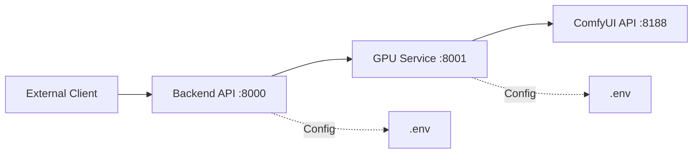

# Backend FastAPI Setup - Minimal MVP Framework

## Objective

Establish a minimal, clean FastAPI-based backend infrastructure on RunPod POD with clear separation between application logic (Backend API) and GPU processing (GPU Service). This is a foundational framework without ML models, authentication, or advanced features.

## System Context

**Environment**: RunPod Linux POD with pre-configured ComfyUI template

**Working Directory**: `/workspace`

**Existing Structure**:
- `/workspace/ComfyUI` - ComfyUI installation
- `/workspace/backend` - Application backend (to be created)
- `/workspace/gpu_server` - GPU processing service (to be created)
- `/workspace/models` - Model storage (empty for MVP)
- `/workspace/workflows` - Workflow definitions (empty for MVP)
- `/workspace/logs` - Service logs
- `/workspace/venv` - Python virtual environment

## Architecture Overview



**Two-Service Architecture**:

1. **Backend API** (Port 8000)
   - Request validation and routing
   - Client-facing REST API
   - No ML dependencies
   
2. **GPU Service** (Port 8001)
   - ComfyUI integration
   - Workflow execution
   - Image generation processing

## Backend API Structure

### Directory Layout

```
backend/
├── main.py                      # FastAPI application entry point
├── config.py                    # Environment-based configuration
├── requirements.txt             # Python dependencies
├── .env.template                # Environment template
├── routers/
│   ├── __init__.py
│   ├── health.py               # Health check endpoint
│   └── generate.py             # Generation endpoint (stub)
├── schemas/
│   ├── __init__.py
│   ├── request_generate.py     # Generation request models
│   └── response_generate.py    # Response models
├── services/
│   ├── __init__.py
│   └── generation_router.py    # Request routing logic (stub)
├── clients/
│   ├── __init__.py
│   └── gpu_client.py           # HTTP client for GPU service
└── utils/
    ├── __init__.py
    └── logging.py              # Logging configuration
```

### Core Components

#### Application Entry Point

**File**: `main.py`

**Responsibilities**:
- Initialize FastAPI application
- Configure CORS middleware for cross-origin requests
- Register routers for health and generation endpoints
- Setup logging on startup
- Display configuration summary

**Startup Behavior**:
- Log API title and version
- Log GPU service URL
- Log operational mode (MVP with stub endpoints)

**Shutdown Behavior**:
- Graceful cleanup
- Log shutdown event

#### Configuration Management

**File**: `config.py`

**Configuration Parameters**:

| Parameter | Type | Default | Description |
|-----------|------|---------|-------------|
| backend_host | string | 0.0.0.0 | Server bind address |
| backend_port | integer | 8000 | Server port |
| gpu_service_url | string | http://localhost:8001 | GPU service endpoint |
| request_timeout | integer | 180 | HTTP timeout (seconds) |
| log_level | string | INFO | Logging verbosity |
| log_format | string | standard | Log message format |
| max_face_images | integer | 5 | Validation limit (future use) |
| max_image_size_mb | integer | 10 | Validation limit (future use) |
| api_title | string | AI Image Generation API | API metadata |
| api_version | string | 1.0.0 | API version |

**Implementation Pattern**:
- Use Pydantic BaseSettings for type-safe configuration
- Load from environment variables with fallback to defaults
- Support `.env` file loading
- Cache settings instance with `lru_cache`

#### Health Check Router

**File**: `routers/health.py`

**Endpoint**: `GET /health`

**Response Model**:
```
{
  "status": "healthy" | "degraded" | "unhealthy",
  "gpu_available": boolean,
  "version": string
}
```

**Logic Flow**:
1. Attempt connection to GPU service health endpoint
2. If GPU responds with 200 → status="healthy", gpu_available=true
3. If GPU unreachable → status="degraded", gpu_available=false
4. If health check throws exception → status="unhealthy", gpu_available=false
5. Always return 200 OK (service itself is running)

#### Generation Router (Stub)

**File**: `routers/generate.py`

**Endpoint**: `POST /generate`

**Request Schema** (`schemas/request_generate.py`):

| Field | Type | Required | Description |
|-------|------|----------|-------------|
| mode | string | Yes | Generation mode (stub accepts any) |
| prompt | string | No | Text prompt |
| style | string | No | Style identifier |
| face_images | array[string] | No | Base64 face images |
| target_image | string | No | Base64 target image |
| extra_params | object | No | Additional parameters |

**Response Schema** (`schemas/response_generate.py`):

| Field | Type | Description |
|-------|------|-------------|
| task_id | string | UUID for tracking |
| status | string | "queued" \| "done" \| "failed" |
| image | string | Base64 image (null for MVP) |
| error | string | Error message if failed |

**MVP Stub Behavior**:
1. Accept any valid JSON matching schema
2. Generate fake UUID for task_id
3. Return status="queued" immediately
4. Log request parameters
5. No actual processing or GPU communication

#### GPU Client

**File**: `clients/gpu_client.py`

**Purpose**: HTTP client abstraction for GPU service communication

**Interface Methods**:

**check_health()**
- Sends GET request to GPU service `/health`
- Returns boolean (true if 200 response)
- 5-second timeout
- Catches all exceptions and returns false

**generate(workflow: string, params: dict)**
- Sends POST request to GPU service `/generate`
- Payload: `{"workflow": workflow_name, "params": parameters}`
- Returns JSON response
- Configurable timeout (default 180s)
- Raises exception on timeout or HTTP error

**MVP Implementation**:
- Interface defined
- Methods callable but GPU service may return stub data
- Error handling and logging in place

#### Request Routing Service

**File**: `services/generation_router.py`

**Purpose**: Route generation requests to appropriate workflow handler

**MVP Stub Logic**:
- Accept request object
- Extract mode field
- Log mode and parameters
- Return echo response without processing
- No GPU client invocation

**Future Design**:
- Map mode → workflow name
- Call GPU client with workflow and params
- Handle response and errors
- Return processed result

#### Logging Utility

**File**: `utils/logging.py`

**Responsibilities**:
- Configure Python logging module
- Set log level from configuration
- Define log format (timestamp, logger name, level, message)
- Apply to all modules

**Configuration**:
- Use structured format for parsability
- Write to stdout (captured by startup.sh)
- Support log level override via environment

### Dependencies

**File**: `requirements.txt`

**Core Dependencies**:
- `fastapi` - Web framework
- `uvicorn[standard]` - ASGI server with websocket support
- `httpx` - Async HTTP client for GPU service
- `python-dotenv` - Environment variable loading
- `pydantic` - Data validation
- `pydantic-settings` - Settings management

**Version Pinning**: Use compatible release specifiers (e.g., `fastapi~=0.104.0`) for stability

## GPU Service Structure

### Directory Layout

```
gpu_server/
├── main.py                      # FastAPI application
├── server.py                    # Alternative entry point
├── config.py                    # Configuration
├── comfy_client.py             # ComfyUI API client (stub)
├── requirements.txt            # Dependencies
├── .env.template               # Environment template
├── workflows/
│   ├── __init__.py
│   └── loader.py               # Workflow loading (stub)
├── schemas/
│   ├── __init__.py
│   ├── generate_request.py    # Request model
│   └── generate_response.py   # Response model
└── services/
    ├── __init__.py
    └── generation.py          # Generation logic (stub)
```

### Core Components

#### Application Entry Point

**File**: `main.py` or `server.py`

**Responsibilities**:
- Initialize FastAPI application
- Register health and generation endpoints
- Configure logging
- Initialize ComfyUI client (stub)

**Startup Behavior**:
- Log service name and version
- Log ComfyUI URL
- Log workflows and models paths
- Attempt ComfyUI health check (warn if unavailable)

#### Configuration

**File**: `config.py`

**Configuration Parameters**:

| Parameter | Type | Default | Description |
|-----------|------|---------|-------------|
| gpu_server_host | string | 0.0.0.0 | Server bind address |
| gpu_server_port | integer | 8001 | Server port |
| comfyui_api_url | string | http://localhost:8188 | ComfyUI endpoint |
| models_path | string | /workspace/models | Model storage location |
| workflows_path | string | /workspace/gpu_server/workflows | Workflow JSON location |
| log_level | string | INFO | Logging verbosity |
| max_concurrent_tasks | integer | 1 | Concurrent execution limit (MVP) |

#### Health Check Endpoint

**Endpoint**: `GET /health`

**Response**:
```
{
  "status": "healthy" | "degraded" | "unhealthy",
  "comfyui_available": boolean,
  "service": "gpu_server",
  "version": string
}
```

**Logic**:
1. Check ComfyUI availability via client
2. Return status based on ComfyUI health
3. Return 503 if unhealthy, 200 otherwise

#### Generation Endpoint (Stub)

**Endpoint**: `POST /generate`

**Request Schema**:
```
{
  "workflow": string,
  "params": object
}
```

**Response Schema**:
```
{
  "status": "done" | "failed",
  "image": string,
  "error": string
}
```

**MVP Stub Behavior**:
1. Validate workflow name (accept any for MVP)
2. Log request details
3. Return dummy response:
   - status: "done"
   - image: "dummy_base64_placeholder"
   - error: null
4. No actual ComfyUI communication

#### ComfyUI Client (Stub)

**File**: `comfy_client.py`

**Purpose**: Abstract ComfyUI API communication

**Interface Methods**:

**check_health()**
- Attempt GET to ComfyUI `/system_stats` or similar
- Return boolean availability status
- 5-second timeout

**load_workflow(name: string)**
- Load workflow JSON from workflows_path
- Return workflow definition as dict
- Raise FileNotFoundError if missing (MVP: return empty dict)

**execute_workflow(name: string, params: dict)**
- Future: Load workflow, inject params, submit to ComfyUI, poll for result
- MVP: Return dummy base64 string immediately
- Log execution request

**MVP Stub Implementation**:
- Methods defined with correct signatures
- Minimal logic without ComfyUI dependency
- Return placeholder data
- Enable testing without GPU/models

#### Workflow Loader (Stub)

**File**: `workflows/loader.py`

**Purpose**: Load and validate workflow JSON files

**MVP Functions**:

**load_workflow(name: string)**
- Check if file exists: `workflows_path / {name}.json`
- If exists: read and parse JSON
- If not exists: return empty workflow template
- No validation for MVP

### Dependencies

**File**: `requirements.txt`

**Core Dependencies**:
- `fastapi` - Web framework
- `uvicorn[standard]` - ASGI server
- `httpx` - Async HTTP for ComfyUI communication
- `python-dotenv` - Environment loading
- `pydantic` - Data validation
- `pydantic-settings` - Settings management

## Startup Management

### Unified Startup Script

**File**: `/workspace/startup.sh`

**Purpose**: Automated service initialization on POD boot

**Execution Flow**:

1. **Environment Setup**
   - Create logs directory if missing
   - Check virtual environment existence
   - If venv missing → create with `python3 -m venv /workspace/venv`
   - Activate venv: `source /workspace/venv/bin/activate`

2. **Service Launch Sequence**
   - Start GPU Service first (dependency for Backend)
   - Wait 5 seconds for GPU service initialization
   - Check GPU service health (warn if not ready)
   - Start Backend API
   - Wait 5 seconds for Backend initialization
   - Check Backend health (warn if not ready)

3. **Process Management**
   - Use `nohup` for background execution
   - Redirect stdout/stderr to `/workspace/logs/{service}.log`
   - Store PID in `/workspace/{service}.pid`
   - Check for existing PID before starting (prevent duplicates)

4. **Health Verification**
   - Curl health endpoints to confirm service availability
   - Log success or warning messages
   - Display final status summary

**Service Start Commands**:

**GPU Service**:
```
cd /workspace/gpu_server
nohup python server.py > /workspace/logs/gpu_server.log 2>&1 &
```

**Backend**:
```
cd /workspace/backend
nohup uvicorn main:app --host 0.0.0.0 --port 8000 > /workspace/logs/backend.log 2>&1 &
```

**Script Features**:
- Color-coded output (green for info, yellow for warnings, red for errors)
- Timestamp logging
- PID file management for service control
- Graceful handling of already-running services
- Optional Telegram bot startup (if configured)

### Environment Configuration Templates

**Backend Template** (`backend/.env.template`):
```
BACKEND_HOST=0.0.0.0
BACKEND_PORT=8000
GPU_SERVICE_URL=http://localhost:8001
REQUEST_TIMEOUT=180
LOG_LEVEL=INFO
```

**GPU Service Template** (`gpu_server/.env.template`):
```
GPU_SERVER_HOST=0.0.0.0
GPU_SERVER_PORT=8001
COMFYUI_API_URL=http://localhost:8188
MODELS_PATH=/workspace/models
WORKFLOWS_PATH=/workspace/gpu_server/workflows
LOG_LEVEL=INFO
```

**Usage**:
- Copy template to `.env` before first run
- Modify values as needed for environment
- Never commit `.env` with secrets to version control

## Installation and Deployment

### Initial Setup Sequence

**Prerequisites Verification**:
1. RunPod POD running with ComfyUI template
2. SSH access configured
3. `/workspace` directory accessible
4. Python 3.10+ available

**Installation Steps**:

1. **Create Virtual Environment** (if not exists)
   ```
   cd /workspace
   python3 -m venv venv
   source venv/bin/activate
   ```

2. **Install Backend Dependencies**
   ```
   cd /workspace/backend
   pip install -r requirements.txt
   ```

3. **Install GPU Service Dependencies**
   ```
   cd /workspace/gpu_server
   pip install -r requirements.txt
   ```

4. **Configure Environment**
   ```
   cp backend/.env.template backend/.env
   cp gpu_server/.env.template gpu_server/.env
   # Edit .env files as needed
   ```

5. **Make Startup Script Executable**
   ```
   chmod +x /workspace/startup.sh
   ```

6. **Launch Services**
   ```
   /workspace/startup.sh
   ```

### Service Control Commands

**Start All Services**:
```
/workspace/startup.sh
```

**Stop Services**:
```
kill $(cat /workspace/backend.pid)
kill $(cat /workspace/gpu_server.pid)
```

**Restart Service**:
```
kill $(cat /workspace/backend.pid)
cd /workspace/backend
nohup uvicorn main:app --host 0.0.0.0 --port 8000 > /workspace/logs/backend.log 2>&1 &
```

**View Logs**:
```
tail -f /workspace/logs/backend.log
tail -f /workspace/logs/gpu_server.log
```

**Check Status**:
```
curl http://localhost:8000/health
curl http://localhost:8001/health
```

## API Specifications

### Backend API Endpoints

#### Health Check

**Request**:
```
GET /health
```

**Response** (200 OK):
```json
{
  "status": "healthy",
  "gpu_available": true,
  "version": "1.0.0"
}
```

#### Generate Image (Stub)

**Request**:
```
POST /generate
Content-Type: application/json

{
  "mode": "free",
  "prompt": "test prompt",
  "style": "realistic",
  "extra_params": {}
}
```

**Response** (200 OK):
```json
{
  "task_id": "550e8400-e29b-41d4-a716-446655440000",
  "status": "queued",
  "image": null,
  "error": null
}
```

### GPU Service Endpoints

#### Health Check

**Request**:
```
GET /health
```

**Response** (200 OK):
```json
{
  "status": "healthy",
  "comfyui_available": false,
  "service": "gpu_server",
  "version": "1.0.0"
}
```

Note: `comfyui_available` will be `false` in MVP without actual ComfyUI integration

#### Generate (Stub)

**Request**:
```
POST /generate
Content-Type: application/json

{
  "workflow": "free_generation",
  "params": {
    "prompt": "test",
    "steps": 20
  }
}
```

**Response** (200 OK):
```json
{
  "status": "done",
  "image": "dummy_base64_placeholder",
  "error": null
}
```

## MVP Limitations and Future Considerations

### Current MVP Scope

**What is Included**:
- Clean FastAPI application structure
- Health check endpoints with basic monitoring
- Request/response schema definitions
- Configuration management via environment variables
- Logging infrastructure
- Service startup automation
- HTTP client abstractions

**What is NOT Included (Stub/Placeholder)**:
- Actual image generation (returns dummy data)
- ComfyUI integration (client methods stubbed)
- Model loading and management
- Workflow execution
- Face detection and processing
- LoRA selection
- ControlNet usage
- Authentication and authorization
- Rate limiting
- Request queuing
- Database for task persistence
- WebSocket for progress updates

### Future Extension Points

**Phase 2 - ComfyUI Integration**:
- Implement real ComfyUI client methods
- Load and parse workflow JSON files
- Parameter injection into workflows
- Workflow submission and polling
- Image result retrieval

**Phase 3 - Advanced Features**:
- Face detection with InsightFace
- LoRA model selection logic
- ControlNet integration
- Multi-step workflow orchestration

**Phase 4 - Production Readiness**:
- Task queue (Redis/Celery)
- Database for task tracking
- Authentication (API keys or JWT)
- Rate limiting and abuse prevention
- Monitoring and alerting
- Horizontal scaling support

## Validation and Testing

### Health Check Validation

**Backend Health**:
1. Start Backend without GPU service running
   - Expected: status="degraded", gpu_available=false
2. Start GPU service
   - Expected: Backend health now shows gpu_available=true

**GPU Service Health**:
1. Check health without ComfyUI
   - Expected: status="degraded", comfyui_available=false

### Generation Endpoint Testing

**Backend /generate**:
1. Send POST with valid JSON
   - Expected: 200 OK with task_id and status="queued"
2. Send POST with invalid JSON
   - Expected: 422 Unprocessable Entity with validation errors

**GPU Service /generate**:
1. Send POST with any workflow name
   - Expected: 200 OK with status="done" and dummy image

### Service Integration Testing

1. Start both services via startup.sh
2. Verify both health endpoints return 200
3. Send generation request to Backend
4. Verify request is logged in backend.log
5. Verify dummy response returned

## Security Considerations

**MVP Security Posture** (Development Only):
- No authentication required
- CORS allows all origins
- No input sanitization beyond Pydantic validation
- No rate limiting
- Logs may contain sensitive data

**Production Security Checklist** (Future):
- Implement API key authentication
- Restrict CORS to known domains
- Add request size limits
- Sanitize user inputs (prompt injection prevention)
- Enable HTTPS/TLS
- Implement rate limiting per client
- Sanitize logs (remove PII/secrets)
- Add request signing for GPU service communication
- Environment variable encryption

## Operational Procedures

### Log Management

**Log Locations**:
- Startup log: `/workspace/logs/startup.log`
- Backend log: `/workspace/logs/backend.log`
- GPU service log: `/workspace/logs/gpu_server.log`

**Log Rotation** (Future):
- Implement logrotate configuration
- Compress old logs
- Retention policy (e.g., 7 days)

### Troubleshooting Guide

**Backend Not Starting**:
1. Check venv activation: `which python`
2. Verify dependencies: `pip list | grep fastapi`
3. Check port availability: `lsof -i :8000`
4. Review backend.log for errors

**GPU Service Not Starting**:
1. Check port 8001: `lsof -i :8001`
2. Review gpu_server.log
3. Verify workflows_path exists

**Health Check Fails**:
1. Verify service PID: `ps -p $(cat backend.pid)`
2. Test direct curl: `curl localhost:8000/health`
3. Check firewall rules
4. Verify network connectivity between services

**Generation Returns Error**:
- MVP: Should not happen (stub always returns success)
- Future: Check workflow file exists, ComfyUI available, params valid

## Configuration Reference

### Environment Variables Summary

**Backend Service**:
- `BACKEND_HOST` - Server bind address (default: 0.0.0.0)
- `BACKEND_PORT` - Server port (default: 8000)
- `GPU_SERVICE_URL` - GPU service endpoint (default: http://localhost:8001)
- `REQUEST_TIMEOUT` - HTTP timeout seconds (default: 180)
- `LOG_LEVEL` - Logging level (default: INFO)

**GPU Service**:
- `GPU_SERVER_HOST` - Server bind address (default: 0.0.0.0)
- `GPU_SERVER_PORT` - Server port (default: 8001)
- `COMFYUI_API_URL` - ComfyUI endpoint (default: http://localhost:8188)
- `MODELS_PATH` - Model directory (default: /workspace/models)
- `WORKFLOWS_PATH` - Workflow directory (default: /workspace/gpu_server/workflows)
- `LOG_LEVEL` - Logging level (default: INFO)

### Port Assignments

| Service | Port | Protocol | Description |
|---------|------|----------|-------------|
| Backend API | 8000 | HTTP | Client-facing API |
| GPU Service | 8001 | HTTP | Internal processing service |
| ComfyUI | 8188 | HTTP | ML framework API |

### File System Paths

| Path | Purpose | Created By |
|------|---------|------------|
| /workspace/backend | Backend code | Developer |
| /workspace/gpu_server | GPU service code | Developer |
| /workspace/venv | Python environment | startup.sh |
| /workspace/logs | Service logs | startup.sh |
| /workspace/models | Model storage | Pre-existing |
| /workspace/workflows | Workflow JSONs | Pre-existing |
| /workspace/ComfyUI | ComfyUI installation | RunPod template |

## Success Criteria

**MVP Completion Checklist**:

- [ ] Backend service starts successfully on port 8000
- [ ] GPU service starts successfully on port 8001
- [ ] GET /health returns 200 on both services
- [ ] Backend can check GPU service availability
- [ ] POST /generate accepts valid requests and returns task_id
- [ ] Services log to /workspace/logs
- [ ] startup.sh launches both services automatically
- [ ] Virtual environment contains all dependencies
- [ ] Configuration loads from .env files
- [ ] No crashes or unhandled exceptions in normal operation

**Validation Tests**:
1. Execute startup.sh → both services running
2. Curl both health endpoints → 200 responses
3. Send generation request → receive stub response
4. Check logs → structured messages present
5. Kill and restart → services recover correctly

## Next Steps After MVP

1. **Workflow Implementation**
   - Create actual workflow JSON files for free_generation and clothes_removal
   - Implement parameter injection in comfy_client.py
   - Test workflow execution with real ComfyUI

2. **Model Integration**
   - Download required models to /workspace/models
   - Update workflows with correct model paths
   - Verify model loading in ComfyUI

3. **Request Processing**
   - Implement generation_router.py logic to call GPU client
   - Handle GPU service responses
   - Return actual base64 images

4. **Error Handling**
   - Add comprehensive error cases
   - Implement retry logic for transient failures
   - Add request validation beyond schema

5. **Monitoring**
   - Add metrics endpoints
   - Implement structured logging
   - Set up alerting for failures
