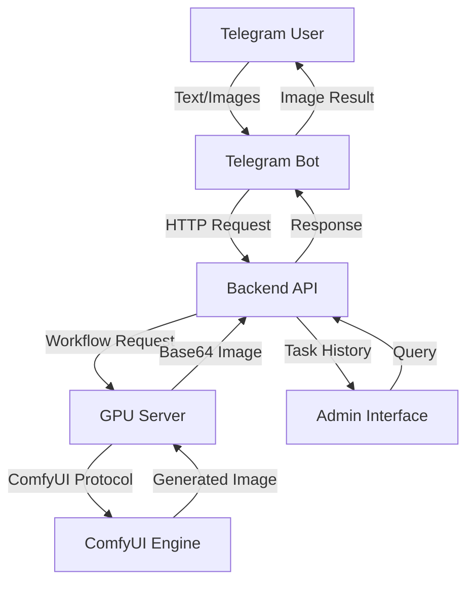
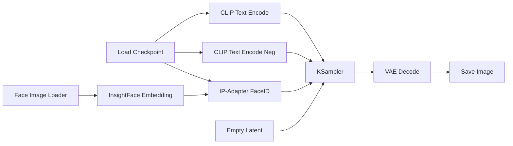
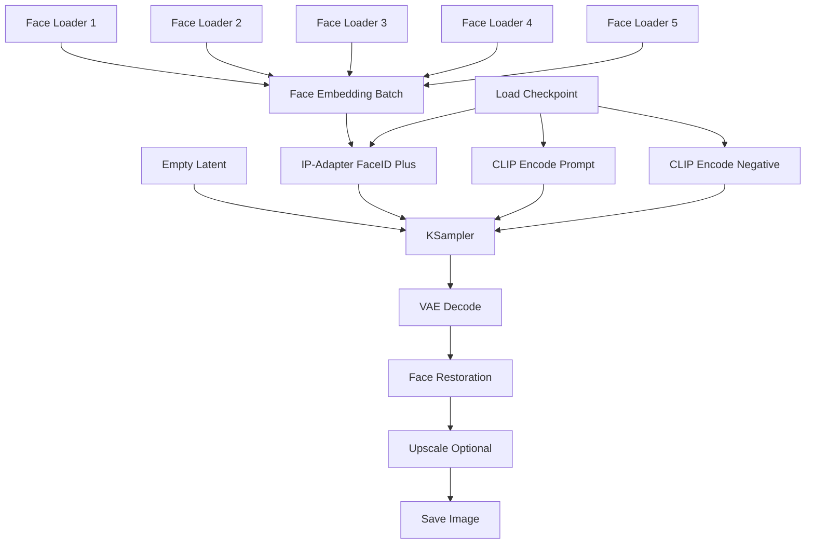
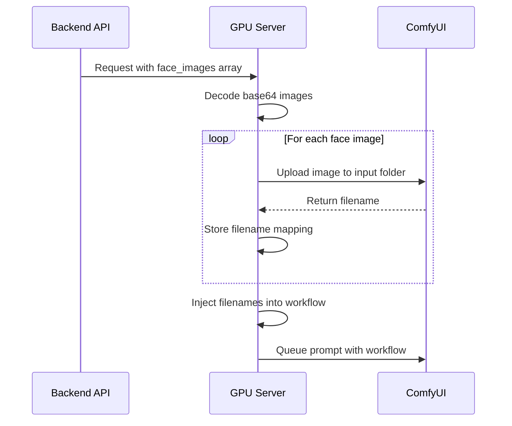
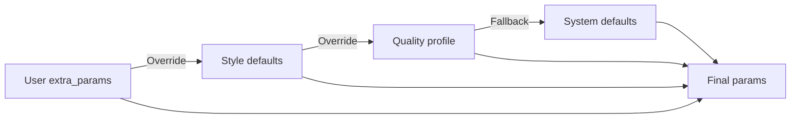
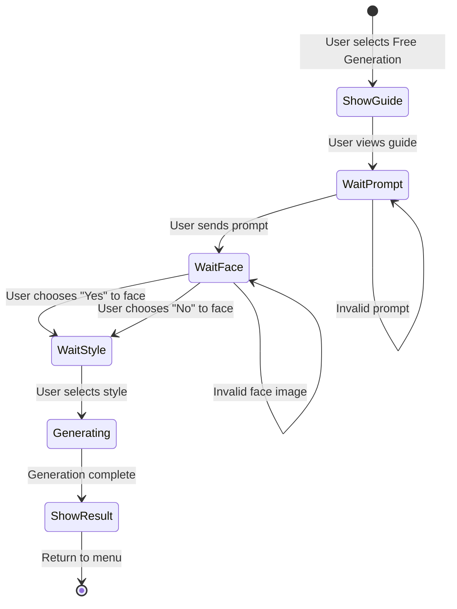
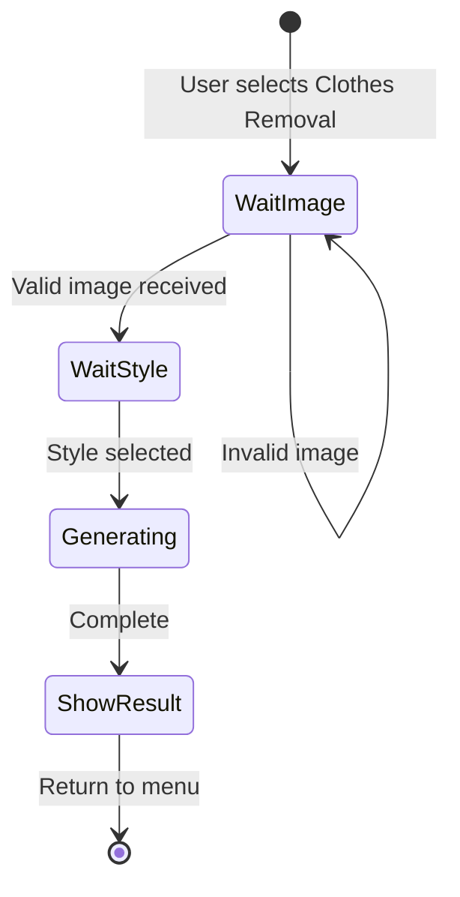
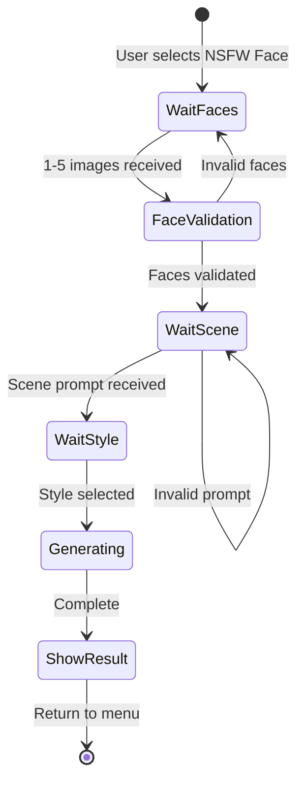
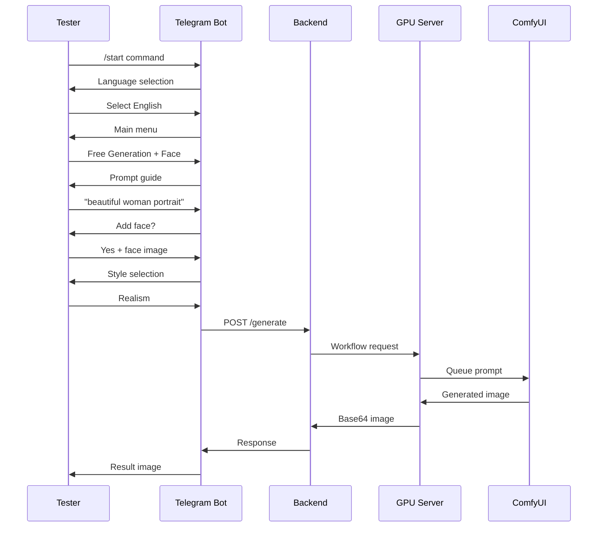

# Face-Integrated Generation Modes Design

## Overview

This design defines the implementation of three advanced generation modes that extend the existing AI image generation system with face-aware capabilities:

1. **Free Generation with Face** - Text-to-image generation enhanced with face embedding using IP-Adapter FaceID
2. **Remove Clothes** - Enhanced version with ControlNet-based pose preservation and segmentation
3. **NSFW with Face** - Face-consistent adult content generation supporting multiple reference faces

The implementation spans multiple system layers: ComfyUI workflow definitions, GPU server workflow processing, backend API routing, Telegram bot user experience, structured logging, and administrative tracking.

## Business Context

### Problem Statement

The current system supports basic text-to-image generation but lacks:
- Face consistency in generated content
- Advanced pose-preserving clothing manipulation
- Multi-face reference support for character consistency
- Complete user flows for complex generation scenarios

### Solution Value

- Enhanced creative control through face embedding technology
- Professional-grade image manipulation with pose preservation
- Consistent character generation across multiple images
- Improved user experience with guided workflows

## System Architecture

### Component Interaction Flow



### Layer Responsibilities

| Layer | Responsibility |
|-------|---------------|
| ComfyUI Workflows | Define node graphs for image generation pipelines |
| GPU Server | Load workflows, inject parameters, manage ComfyUI communication |
| Backend API | Route requests, apply business logic, parameter resolution |
| Telegram Bot | User interaction, input validation, localization |
| Logging System | Structured event capture for monitoring and debugging |
| Admin Interface | Task tracking, history queries, system monitoring |

## ComfyUI Workflow Specifications

### 1. Free Generation with Face Workflow

**File**: `gpu_server/workflows/free_generation_face.json`

**Purpose**: Extend base free_generation.json with IP-Adapter FaceID nodes for face-guided generation

**Node Architecture**:



**Node Configuration Table**:

| Node ID | Type | Purpose | Key Parameters |
|---------|------|---------|----------------|
| 4 | CheckpointLoaderSimple | Load base model | ckpt_name (injected) |
| 5 | EmptyLatentImage | Create latent canvas | width, height, batch_size |
| 6 | CLIPTextEncode | Positive prompt | text (injected) |
| 7 | CLIPTextEncode | Negative prompt | text (injected) |
| 20 | LoadImage | Face reference input | image (1-5 faces) |
| 21 | InsightFaceEmbedding | Extract face features | model: buffalo_l |
| 22 | IPAdapterFaceID | Apply face guidance | weight (face_strength param) |
| 3 | KSampler | Generation | seed, steps, cfg, sampler_name |
| 8 | VAEDecode | Latent to image | - |
| 9 | SaveImage | Output | filename_prefix |

**Parameter Injection Requirements**:

- `face_images`: Array of base64 encoded face reference images (1-5 images)
- `face_strength`: Float 0.0-1.0, controls face influence (default: 0.75)
- `prompt`: Text prompt combined with face guidance
- `negative_prompt`: Standard negative prompt
- `steps`, `cfg`, `seed`, `width`, `height`: Standard generation parameters

### 2. Clothes Removal Workflow

**File**: `gpu_server/workflows/clothes_removal.json`

**Purpose**: Remove clothing while preserving pose, anatomy, and scene composition using multi-ControlNet approach

**Node Architecture**:

```mermaid
graph TD
    A[Load Input Image] --> B[Person Segmentation]
    A --> C[OpenPose Detection]
    A --> D[Depth Estimation]
    A --> E[Canny Edge Detection]
    
    F[Load Checkpoint] --> G[ControlNet OpenPose]
    F --> H[ControlNet Depth]
    F --> I[ControlNet Canny]
    
    C --> G
    D --> H
    E --> I
    
    B --> J[Mask Generation]
    J --> K[VAE Encode Masked]
    
    G --> L[KSampler Inpaint]
    H --> L
    I --> L
    K --> L
    
    M[CLIP Text Encode] --> L
    N[CLIP Text Encode Neg] → L
    
    L --> O[VAE Decode]
    O --> P[Save Image]
```

**Node Configuration Table**:

| Node ID | Type | Purpose | Key Parameters |
|---------|------|---------|----------------|
| 1 | LoadImage | Input photo | image (base64) |
| 10 | PersonSegmentation | Isolate person | threshold: 0.7 |
| 11 | MaskGeneration | Create inpaint mask | expand: 10px, blur: 5 |
| 12 | OpenPoseDetector | Extract pose | detect_hand, detect_face: true |
| 13 | DepthEstimator | Scene depth | model: midas |
| 14 | CannyEdgeDetector | Edge detection | low_threshold: 100, high: 200 |
| 4 | CheckpointLoaderSimple | Base model | ckpt_name (style-based) |
| 15 | ControlNetLoader | OpenPose control | control_net_name: openpose |
| 16 | ControlNetApply | Apply pose | strength (controlnet_strength) |
| 17 | ControlNetLoader | Depth control | control_net_name: depth |
| 18 | ControlNetApply | Apply depth | strength (controlnet_strength) |
| 19 | ControlNetLoader | Canny control | control_net_name: canny |
| 20 | ControlNetApply | Apply edges | strength (controlnet_strength) |
| 5 | VAEEncode | Encode masked | pixels, mask |
| 6 | CLIPTextEncode | Positive prompt | Generated: "nude, natural skin, realistic anatomy" |
| 7 | CLIPTextEncode | Negative prompt | "clothes, clothing, dressed, censored" |
| 3 | KSampler | Inpainting generation | denoise: inpaint_denoise param |
| 8 | VAEDecode | Decode result | - |
| 9 | SaveImage | Output | filename_prefix: clothes_removal |

**Parameter Injection Requirements**:

- `target_image`: Base64 encoded input image
- `style`: Style preset (realism/lux/anime) - determines checkpoint model
- `controlnet_strength`: Float 0.0-1.5, controls pose adherence (default: 0.8)
- `inpaint_denoise`: Float 0.5-1.0, controls modification strength (default: 0.75)
- `segmentation_threshold`: Float 0.5-0.9 (default: 0.7)

### 3. NSFW with Face Workflow

**File**: `gpu_server/workflows/nsfw_face.json`

**Purpose**: Generate adult content with consistent face characteristics from multiple reference images

**Node Architecture**:



**Node Configuration Table**:

| Node ID | Type | Purpose | Key Parameters |
|---------|------|---------|----------------|
| 20-24 | LoadImage | Face references | image (1-5 faces) |
| 25 | InsightFaceBatch | Multi-face embedding | model: buffalo_l, merge_mode: average |
| 26 | IPAdapterFaceIDPlus | Advanced face apply | weight, combine_method |
| 4 | CheckpointLoaderSimple | NSFW model | ckpt_name (style-based) |
| 5 | EmptyLatentImage | Canvas | width, height, batch_size |
| 6 | CLIPTextEncode | Scene prompt | text (injected) |
| 7 | CLIPTextEncode | Negative prompt | text (injected) |
| 3 | KSampler | Generation | seed, steps, cfg, sampler |
| 8 | VAEDecode | Decode | - |
| 27 | FaceRestoration | Enhance faces | model: codeformer, fidelity: 0.8 |
| 28 | UpscaleModelLoader | Optional upscale | model: RealESRGAN_x2 |
| 29 | ImageUpscaleWithModel | Apply upscale | - |
| 9 | SaveImage | Output | filename_prefix: nsfw_face |

**Parameter Injection Requirements**:

- `face_images`: Array of 1-5 base64 encoded face images
- `scene_prompt`: Text describing scene/pose/setting
- `style`: Style preset (realism/lux/anime)
- `face_strength`: Float 0.6-1.0 (default: 0.8)
- `face_merge_mode`: "average" or "weighted"
- `enable_upscale`: Boolean (default: false)
- `steps`, `cfg`, `seed`, `width`, `height`: Standard parameters

## GPU Server Integration

### Workflow Adapter Enhancement

**Location**: `gpu_server/workflow_adapter.py`

**New Workflow Support**:

The workflow adapter system must be extended to recognize three new workflow types:

| Workflow Name | Template File | Adapter Class |
|---------------|---------------|---------------|
| free_generation_face | free_generation_face.json | FreeGenerationFaceAdapter |
| clothes_removal | clothes_removal.json | ClothesRemovalAdapter |
| nsfw_face | nsfw_face.json | NSFWFaceAdapter |

**Adapter Responsibilities**:

Each adapter class inherits from BaseWorkflowAdapter and implements:

1. **load_workflow()**: Load JSON template from workflows directory
2. **inject_parameters(params)**: Map API parameters to workflow node inputs
3. **validate_parameters(params)**: Ensure required inputs are present and valid

### Parameter Injection Logic

**Face Embedding Processing**:

For workflows with face inputs (free_generation_face, nsfw_face):

1. Receive face_images array from backend
2. Validate each image (format, size, face detection)
3. Upload images to ComfyUI input directory with unique filenames
4. Inject filenames into LoadImage nodes (IDs 20-24)
5. Set face_strength parameter on IP-Adapter node

**ControlNet Parameter Mapping**:

For clothes_removal workflow:

| API Parameter | Target Node(s) | Node Field |
|---------------|----------------|------------|
| controlnet_strength | 16, 18, 20 | strength |
| inpaint_denoise | 3 | denoise |
| target_image | 1 | image |
| style → model | 4 | ckpt_name |

**Style to Model Mapping**:

```
Style Preset → Checkpoint Model Configuration

realism → cyberrealisticPony_v14.safetensors
lux → chilloutmix_v2.safetensors  
anime → animeNSFW_v3.safetensors
noir → cinematic_noir_v1.safetensors
super_realism → ultraRealistic_v5.safetensors
```

### ComfyUI Service Updates

**Location**: `gpu_server/comfyui_service.py`

**Image Upload Enhancement**:

The _prepare_parameters method must handle new image field types:

- `face_images`: Array of images requiring multiple uploads
- `target_image`: Single image for clothes removal
- Validate face detection in uploaded images using InsightFace preview
- Return upload status for each image

**Multi-Image Upload Flow**:



## Backend Service Layer

### Generation Mode Routing

**Location**: `backend/routers/generate.py`

**Enhanced Request Routing Logic**:

The generate endpoint must implement mode detection and routing:

| Request Conditions | Target Workflow | Service Class |
|-------------------|-----------------|---------------|
| mode="free" AND add_face=false | free_generation | FreeGenerationService |
| mode="free" AND add_face=true | free_generation_face | FreeGenerationFaceService |
| mode="clothes_removal" | clothes_removal | ClothesRemovalService |
| mode="nsfw_face" | nsfw_face | NSFWFaceService |

**Request Schema Extension**:

Existing FreeGenerationRequest must be extended or new schemas created:

- `add_face`: Boolean flag for free generation
- `face_images`: Array of base64 strings
- `scene_prompt`: Text for NSFW scenarios
- `controlnet_strength`, `inpaint_denoise`: Numeric parameters

### Style Configuration System

**Location**: `backend/services/param_resolver.py`

**Complete Style Configuration**:

The STYLE_CONFIG dictionary must include all style presets with comprehensive parameters:

```
Style Configuration Structure:

{
  "style_name": {
    "model": "checkpoint_filename.safetensors",
    "quality_profile": "balanced" | "fast" | "high_quality",
    "prompt_enhancement": {
      "prefix": "style-specific prefix",
      "suffix": "quality tags",
      "negative_additions": "style-specific negative"
    },
    "default_params": {
      "steps": 30,
      "cfg": 7.5,
      "sampler": "dpmpp_2m_sde",
      "scheduler": "karras"
    }
  }
}
```

**Supported Styles**:

| Style Name | Model | Use Case | Prompt Enhancement |
|------------|-------|----------|-------------------|
| realism | cyberrealisticPony_v14 | Photorealistic images | "photorealistic, detailed, 8k" |
| lux | chilloutmix_v2 | High-end aesthetic | "luxury, elegant, professional photography" |
| anime | animeNSFW_v3 | Anime/manga style | "anime style, detailed illustration" |
| noir | cinematic_noir_v1 | Dark, dramatic | "noir style, dramatic lighting, monochrome" |
| super_realism | ultraRealistic_v5 | Ultra-detailed realism | "hyperrealistic, ultra detailed, 16k" |
| chatgpt | Same as realism | General purpose | No enhancement |

### Quality Profile System

**Quality Profiles**:

| Profile | Steps | CFG | Sampler | Scheduler | Use Case |
|---------|-------|-----|---------|-----------|----------|
| fast | 15 | 6.5 | euler_a | normal | Quick previews |
| balanced | 30 | 7.5 | dpmpp_2m_sde | karras | Default quality |
| high_quality | 50 | 8.0 | dpmpp_2m_sde | karras | Final renders |

**Parameter Priority Resolution**:



### Parameter Conversion

**CFG Scale Normalization**:

The system must handle both naming conventions:
- API accepts `cfg_scale` (user-friendly)
- ComfyUI requires `cfg` (technical)
- Conversion happens in param_resolver.resolve_params()

**Conversion Rules**:

- If extra_params contains `cfg_scale`, map to `cfg`
- If both present, `cfg` takes precedence
- Validate range: 1.0 ≤ cfg ≤ 20.0

## Telegram Bot User Experience

### User Flow Scenarios

#### Mode 1: Free Generation with Optional Face

**State Machine**:



**Step-by-Step Flow**:

| Step | Bot Message | User Action | Validation |
|------|-------------|-------------|------------|
| 1 | Prompt guide with examples | View guide or send prompt | Prompt length ≥ 3 chars |
| 2 | "Add face to generation?" (Yes/No buttons) | Choose option | - |
| 3a | If Yes: "Send 1-5 face photos" | Upload images | Face detection check |
| 3b | If No: Skip to style | - | - |
| 4 | Style selection menu | Choose style | - |
| 5 | "Generating your image..." | Wait | - |
| 6 | Result image with details | View/download | - |

**Prompt Guide Content**:

The bot should provide:
- Tips for effective prompts (describe subject, setting, mood, details)
- 5 example prompts across different categories
- Formatting suggestions (comma-separated descriptors)
- What to avoid (vague terms, contradictions)

#### Mode 2: Remove Clothes

**State Machine**:



**Step-by-Step Flow**:

| Step | Bot Message | User Action | Validation |
|------|-------------|-------------|------------|
| 1 | Instructions + requirements | Read | - |
| 2 | "Upload photo" | Send image | Format (JPG/PNG), size ≤ 10MB, person detected |
| 3 | Style selection | Choose style | - |
| 4 | Processing message | Wait | - |
| 5 | Result image | View/download | - |

**Image Requirements Display**:

- Accepted formats: JPG, PNG
- Max size: 10 MB
- Content: Clear photo with visible person
- Quality: Good lighting, not blurry

#### Mode 3: NSFW with Face

**State Machine**:



**Step-by-Step Flow**:

| Step | Bot Message | User Action | Validation |
|------|-------------|-------------|------------|
| 1 | Age verification + consent | Confirm 18+ | Required |
| 2 | "Send 1-5 face photos" | Upload images | Face detection, min 1 face per image |
| 3 | Face validation feedback | Review detected faces | - |
| 4 | "Describe scene/pose" | Send prompt | Length ≥ 5 chars |
| 5 | Style selection | Choose style | - |
| 6 | "Generating (may take 60-90s)" | Wait | - |
| 7 | Result image (private) | View/download | - |

**Safety Measures**:

- Age verification confirmation required
- Explicit content warning before mode access
- Results sent only to user (no group chats)
- Automatic message deletion option

### Localization System

**Supported Languages**:

- English (en)
- Russian (ru)
- German (de)
- Turkish (tr)
- Spanish (es)
- French (fr)
- Arabic (ar)

**Localization Architecture**:

Each language has a JSON file in `telegram_bot/locales/{lang}.json` containing:

```
Translation Structure:

{
  "free_generation": {
    "start": "Welcome message",
    "guide_title": "Prompt guide title",
    "guide_body": "Guide text",
    "examples_title": "Examples heading",
    "example_1": "First example",
    "ask_face": "Add face question",
    "choose_style": "Style selection prompt",
    "generating": "Processing message",
    "success": "Success message"
  },
  "clothes_removal": {
    "start": "Mode introduction",
    "requirements": "Image requirements",
    "wait_image": "Upload prompt",
    "processing": "Processing message",
    "success": "Result message"
  },
  "nsfw_face": {
    "age_verify": "18+ confirmation",
    "consent_warning": "Consent text",
    "upload_faces": "Face upload prompt",
    "face_detected": "Detection confirmation",
    "scene_prompt": "Scene description request",
    "generating_long": "Long wait message",
    "success": "Result message"
  },
  "common": {
    "back": "Back button",
    "cancel": "Cancel button",
    "main_menu": "Main menu button"
  },
  "errors": {
    "prompt_too_short": "Prompt length error",
    "invalid_image": "Image validation error",
    "no_face_detected": "Face detection error",
    "timeout": "Timeout message",
    "generation_failed": "Generic error",
    "generic": "Fallback error"
  }
}
```

**Language Selection**:

- On first /start, bot asks user to select language
- Language stored in user_data or database
- User can change language via /language command
- All subsequent messages use selected language

### Menu Structure

**Main Menu**:

```
🎨 Main Menu

Choose generation mode:

[Free Generation] - Text to image
[Remove Clothes] - Photo editing
[NSFW with Face] - Adult content
[Settings] - Language, preferences
[Help] - Instructions
```

**Mode-Specific Menus**:

Each mode has sub-menus for:
- Style selection (realism, lux, anime, noir, super_realism)
- Quality selection (fast, balanced, high_quality) - optional advanced settings
- Back to main menu

## Logging Infrastructure

### Telegram Bot Logging

**Log File Location**: `/workspace/logs/tg_bot.log`

**Log Format**: Structured JSON with the following schema:

```
JSON Log Entry Structure:

{
  "timestamp": "ISO 8601 datetime",
  "level": "INFO | WARNING | ERROR",
  "event_type": "event name",
  "user_id": "telegram user ID",
  "username": "telegram username",
  "message": "human-readable description",
  "context": {
    // Event-specific fields
  }
}
```

### Event Types

#### user_message

**When**: User sends message/command to bot

**Fields**:
- user_id, username, message_type (text/photo/command)
- content_length, language

#### start_generation

**When**: Generation request begins

**Fields**:
- user_id, mode, style, prompt (truncated to 100 chars)
- has_face, face_count, request_id

#### backend_request

**When**: Bot calls backend API

**Fields**:
- request_id, endpoint, method, payload_size
- timeout_seconds

#### backend_response

**When**: Backend responds

**Fields**:
- request_id, status_code, response_time_ms
- result_status (done/error), error_message

#### send_result

**When**: Bot sends result to user

**Fields**:
- request_id, user_id, result_type (photo/error)
- file_size

#### error_user_visible

**When**: Error shown to user

**Fields**:
- user_id, error_type, error_message (localized)
- recovery_action

#### error_internal

**When**: Internal error occurs

**Fields**:
- error_type, error_message, stack_trace
- context (relevant state information)

### Log Rotation

**Configuration**:
- Max file size: 100 MB
- Backup count: 10 files
- Compression: gzip for rotated logs
- Retention: 30 days

## Administrative Interface

### Task Tracking System

**Purpose**: Record all generation requests for monitoring, analytics, and user history

**Data Model**:

| Field | Type | Description |
|-------|------|-------------|
| task_id | UUID | Unique identifier |
| user_id | String | Telegram user ID |
| mode | String | Generation mode (free/clothes_removal/nsfw_face) |
| style | String | Selected style preset |
| prompt | Text | User prompt (encrypted for NSFW) |
| negative_prompt | Text | Negative prompt used |
| params | JSON | Full parameter set |
| status | Enum | queued / processing / done / error |
| created_at | Timestamp | Request creation time |
| started_at | Timestamp | Processing start time |
| completed_at | Timestamp | Completion time |
| result_image_path | String | Path to generated image |
| error_message | Text | Error details if failed |

### API Endpoints

#### GET /admin/tasks

**Purpose**: List generation tasks with filtering and pagination

**Query Parameters**:

| Parameter | Type | Default | Description |
|-----------|------|---------|-------------|
| user_id | String | None | Filter by user |
| mode | String | None | Filter by mode |
| status | String | None | Filter by status |
| from_date | ISO Date | None | Start date filter |
| to_date | ISO Date | None | End date filter |
| page | Integer | 1 | Page number |
| page_size | Integer | 20 | Items per page |
| sort_by | String | created_at | Sort field |
| sort_order | String | desc | asc or desc |

**Response Schema**:

```
Response Structure:

{
  "total": 1234,
  "page": 1,
  "page_size": 20,
  "tasks": [
    {
      "task_id": "uuid",
      "user_id": "12345",
      "mode": "free",
      "style": "realism",
      "prompt": "prompt text",
      "status": "done",
      "created_at": "2024-01-15T10:30:00Z",
      "completed_at": "2024-01-15T10:31:23Z",
      "execution_time_seconds": 83
    },
    // ... more tasks
  ]
}
```

#### GET /admin/tasks/{task_id}

**Purpose**: Retrieve detailed information for specific task

**Path Parameters**:
- task_id: UUID of the task

**Response Schema**:

```
Detailed Task Response:

{
  "task_id": "uuid",
  "user_id": "12345",
  "mode": "nsfw_face",
  "style": "lux",
  "prompt": "full prompt text",
  "negative_prompt": "negative prompt",
  "params": {
    "steps": 30,
    "cfg": 7.5,
    "seed": 42,
    "width": 1024,
    "height": 1024,
    "face_strength": 0.8
  },
  "status": "done",
  "created_at": "2024-01-15T10:30:00Z",
  "started_at": "2024-01-15T10:30:05Z",
  "completed_at": "2024-01-15T10:31:23Z",
  "result_image_path": "/outputs/result_abc123.png",
  "result_image_url": "https://cdn.example.com/result_abc123.png",
  "logs": [
    {
      "timestamp": "2024-01-15T10:30:05Z",
      "message": "Workflow loaded"
    },
    // ... execution logs
  ]
}
```

### Security Considerations

**Access Control**:
- Admin endpoints protected by authentication token
- Role-based access (admin, viewer)
- IP whitelist for sensitive operations

**Data Privacy**:
- NSFW prompts stored encrypted
- Image paths obfuscated
- User IDs anonymized in analytics

## Implementation Dependencies

### Required ComfyUI Custom Nodes

| Node Package | Purpose | Installation |
|--------------|---------|--------------|
| ComfyUI-InsightFace | Face detection and embedding | Via ComfyUI Manager |
| ComfyUI-IPAdapter-plus | IP-Adapter FaceID implementation | Via ComfyUI Manager |
| comfyui_controlnet_aux | ControlNet preprocessors (OpenPose, Depth, Canny) | Via ComfyUI Manager |
| comfyui-segmentation | Person segmentation | Via ComfyUI Manager |
| ComfyUI-FaceRestoration | Face enhancement (CodeFormer) | Via ComfyUI Manager |

### Model Requirements

**Checkpoints**:
- cyberrealisticPony_v14.safetensors
- chilloutmix_v2.safetensors
- animeNSFW_v3.safetensors
- cinematic_noir_v1.safetensors
- ultraRealistic_v5.safetensors

**ControlNet Models**:
- control_sd15_openpose.pth
- control_sd15_depth.pth
- control_sd15_canny.pth

**Face Models**:
- buffalo_l (InsightFace)
- ip-adapter-faceid-plus_sd15.bin
- codeformer-v0.1.0.pth

**VAE**:
- vae-ft-mse-840000-ema-pruned.safetensors

## Testing Strategy

### Component Testing

**Workflow Testing**:

Each workflow must be tested in isolation:

1. Load workflow JSON in ComfyUI interface
2. Manually inject test parameters
3. Execute and verify node connections
4. Validate output image generation
5. Test edge cases (missing inputs, invalid parameters)

**GPU Server Testing**:

Test workflow loading and parameter injection:

1. Direct API call to `/execute` endpoint
2. Provide sample parameters for each mode
3. Verify parameter mapping to workflow nodes
4. Check image upload functionality
5. Validate response format

**Backend Testing**:

Test mode routing and parameter resolution:

1. Send requests to `/generate` with different modes
2. Verify correct workflow selection
3. Test style configuration application
4. Validate parameter priority resolution
5. Test error handling

**Telegram Bot Testing**:

Test user flows end-to-end:

1. Simulate user interactions via Telegram
2. Test each mode's conversation flow
3. Verify input validation
4. Test localization for each language
5. Verify result delivery

### Integration Testing Flow



### Test Cases

#### Free Generation with Face

| Test Case | Input | Expected Result |
|-----------|-------|-----------------|
| Valid request | Prompt + 1 face + realism style | Image with face resemblance |
| Multiple faces | Prompt + 5 faces | Image with averaged face features |
| No face | Prompt only (add_face=false) | Standard free generation |
| Invalid face | Non-face image | Error: "No face detected" |

#### Clothes Removal

| Test Case | Input | Expected Result |
|-----------|-------|-----------------|
| Full body photo | Clear person image + realism | Pose-preserved result |
| Close-up | Portrait photo | Error: "Full body required" |
| Multiple people | Group photo | Error: "Single person required" |
| Low quality | Blurry image | Error: "Image quality too low" |

#### NSFW with Face

| Test Case | Input | Expected Result |
|-----------|-------|-----------------|
| Valid NSFW | 2 faces + scene prompt + lux | Consistent face result |
| Single face | 1 face + prompt | Result with single face |
| Invalid scene | Empty prompt | Error: "Scene description required" |

## Performance Considerations

### Resource Requirements

**GPU Memory**:
- Free Generation with Face: 6-8 GB VRAM
- Clothes Removal: 10-12 GB VRAM (ControlNet overhead)
- NSFW with Face: 8-10 GB VRAM

**Generation Time Estimates**:

| Mode | Steps | Resolution | Time (A100) |
|------|-------|------------|-------------|
| Free + Face | 30 | 1024x1024 | 15-25s |
| Clothes Removal | 30 | 1024x1024 | 45-60s |
| NSFW Face | 30 | 1024x1024 | 20-30s |

### Optimization Strategies

**Model Loading**:
- Keep frequently used checkpoints in VRAM
- Lazy load ControlNet models only for clothes_removal
- Cache InsightFace embeddings

**Queue Management**:
- Separate queue priorities for different modes
- Batch similar requests when possible
- Timeout protection (max 120s per request)

**Image Processing**:
- Resize uploaded images to max 2048px before processing
- Use JPEG compression for face uploads (quality 95)
- Cache preprocessed ControlNet maps

## Risk Mitigation

### Technical Risks

| Risk | Impact | Mitigation |
|------|--------|------------|
| ComfyUI node compatibility | High | Pin node versions, test before deploy |
| VRAM overflow | High | Implement memory monitoring, request queuing |
| Face detection failure | Medium | Fallback to standard generation |
| Workflow loading errors | High | Validate JSON schema, comprehensive testing |

### Content Safety Risks

| Risk | Impact | Mitigation |
|------|--------|------------|
| Inappropriate NSFW generation | High | Age verification, user consent, logging |
| Misuse of face swapping | Medium | Rate limiting, user reporting system |
| Copyright concerns | Medium | Disclaimer, user responsibility agreement |

### Operational Risks

| Risk | Impact | Mitigation |
|------|--------|------------|
| Long queue times | Medium | Auto-scaling, queue position feedback |
| Storage overflow | Medium | Auto-cleanup old images, user quotas |
| API rate limiting | Low | Token bucket, user limits |

## Deployment Sequence

### Phase 1: Workflow Creation

1. Create three workflow JSON files in `gpu_server/workflows/`
2. Test each workflow in ComfyUI interface manually
3. Validate node IDs match specification
4. Commit workflow files to repository

### Phase 2: GPU Server Updates

1. Extend workflow_adapter.py with three new adapter classes
2. Implement parameter injection logic for face images, ControlNet
3. Update comfyui_service.py image upload handling
4. Test via direct API calls to GPU server

### Phase 3: Backend Integration

1. Extend API schemas for new modes and parameters
2. Implement mode routing in generate.py
3. Add complete STYLE_CONFIG to param_resolver.py
4. Add quality profile system
5. Test API endpoints with various requests

### Phase 4: Telegram Bot Implementation

1. Create conversation handlers for three modes
2. Implement localization JSON files for all languages
3. Add menu structure and navigation
4. Implement input validation
5. Test user flows

### Phase 5: Logging & Admin

1. Implement structured logging in Telegram bot
2. Create task tracking database model
3. Implement admin API endpoints
4. Add log rotation configuration
5. Test logging and admin queries

### Phase 6: Integration Testing

1. End-to-end testing on RunPod POD
2. Load testing with multiple concurrent users
3. Error scenario testing
4. Performance benchmarking
5. Security audit

### Phase 7: Production Deployment

1. Deploy to production RunPod environment
2. Configure environment variables
3. Start services in correct order
4. Monitor logs for issues
5. Gradual user rollout

## Monitoring & Validation

### Health Checks

**System Health Indicators**:

| Component | Metric | Threshold | Action if Exceeded |
|-----------|--------|-----------|-------------------|
| ComfyUI | Response time | < 2s | Restart service |
| GPU Server | Queue depth | < 10 | Scale up |
| Backend | Error rate | < 5% | Alert admin |
| Telegram Bot | Response time | < 1s | Check connectivity |

### Success Metrics

**Functionality Metrics**:
- Free + Face generation success rate > 95%
- Clothes Removal success rate > 90%
- NSFW Face success rate > 92%

**Performance Metrics**:
- Average generation time within estimates ±20%
- Queue wait time < 60s during normal load
- System uptime > 99.5%

**User Experience Metrics**:
- User completion rate (start → result) > 80%
- Error recovery rate > 85%
- User satisfaction (via feedback) > 4.0/5.0

### Validation Checklist

Before considering implementation complete:

- [ ] All three workflows tested in ComfyUI independently
- [ ] GPU server successfully processes all modes
- [ ] Backend correctly routes all mode combinations
- [ ] Telegram bot flows functional in all languages
- [ ] Logging captures all specified event types
- [ ] Admin API returns correct task data
- [ ] Face detection validation works reliably
- [ ] ControlNet preservation maintains pose quality
- [ ] Style system produces visually distinct results
- [ ] Parameter priority resolution correct
- [ ] Error messages localized and helpful
- [ ] Performance meets time estimates
- [ ] Security measures implemented
- [ ] Documentation updated
