# System Architecture Design: AI Image Generation Platform

## 1. System Overview

### 1.1 Purpose
Design and implement a clean, resilient NSFW/realistic/anime image generation system consisting of interconnected components that handle user requests, process generation tasks, and deliver results through multiple client interfaces.

### 1.2 Core Principles
- **Separation of Concerns**: Application logic separated from GPU-intensive processing
- **Persistence First**: All critical data and code must reside in `/workspace` on RunPod
- **Zero ML on Backend**: No machine learning models or heavy processing on the FastAPI backend
- **Stateless API Design**: Backend acts as orchestrator and validator only
- **Minimal Complexity**: Keep structure simple and maintainable

### 1.3 High-Level Architecture


## 2. System Components

### 2.1 Application Backend (FastAPI)

#### 2.1.1 Responsibility Scope
The backend serves as the primary orchestration layer with the following responsibilities:

**MVP Scope:**
- **Request Reception**: Accept requests from Telegram bot (mobile app in future)
- **Input Validation**: Validate prompts, images, parameters before forwarding
- **Request Routing**: Determine appropriate GPU workflow based on mode (free or clothes_removal only)
- **GPU Communication**: Synchronous blocking calls to GPU service
- **Response Formatting**: Package generation results for client consumption
- **Error Handling**: Return structured error responses

**Post-MVP Scope:**
- Authorization and user authentication
- Rate limiting and quota management
- Asynchronous task queue integration
- Request prioritization

#### 2.1.2 Directory Structure

```
backend/
├── main.py                      # Application entry point, FastAPI app initialization
├── config.py                    # Configuration management (env vars, GPU service URL)
├── routers/
│   ├── health.py               # Health check endpoint
│   ├── generate.py             # Main generation endpoint
│   └── face.py                 # Face-specific operations (future)
├── schemas/
│   ├── request_free.py         # Free generation request schema
│   ├── request_face_swap.py    # Face swap request schema
│   ├── request_clothes.py      # Clothes removal request schema
│   ├── request_nsfw.py         # NSFW generation request schema
│   └── response_generate.py    # Unified response schema
├── services/
│   ├── free_generation.py      # Free generation business logic
│   ├── face_swap.py            # Face swap business logic
│   ├── clothes_removal.py      # Clothes removal business logic
│   ├── nsfw_generation.py      # NSFW generation business logic
│   └── generation_router.py    # Service selection based on mode/style
├── clients/
│   └── gpu_client.py           # HTTP client for GPU service communication
└── utils/
    ├── images.py               # Image encoding/decoding utilities
    ├── validation.py           # Input validation helpers
    └── logging.py              # Logging configuration
```

#### 2.1.3 API Contract

**Primary Endpoint: POST /generate**

Request Schema:
| Field | Type | Required | Description |
|-------|------|----------|-------------|
| mode | enum | Yes | Generation mode: `free`, `face_swap`, `clothes_removal`, `nsfw_face` |
| prompt | string | Conditional | Text description (required for free, nsfw_face; optional for face_swap) |
| style | enum | Yes | Visual style: `chatgpt`, `lux`, `realism`, `anime` |
| face_images | array[base64] | Conditional | 0-5 face images (required for face_swap, nsfw_face) |
| target_image | base64 | Conditional | Target image for face insertion (required for face_swap, clothes_removal) |
| extra_params | object | No | Advanced parameters (steps, cfg_scale, seed, sampler, etc.) |

Response Schema:
| Field | Type | Description |
|-------|------|-------------|
| task_id | string | Unique identifier for the generation task |
| status | enum | Task status: `done`, `queued`, `processing`, `failed` |
| image | base64 | Generated image (present when status = done) |
| error | string | Error description (present when status = failed) |

**Health Check: GET /health**

Response Schema:
| Field | Type | Description |
|-------|------|-------------|
| status | string | Service health status |
| gpu_available | boolean | GPU service connectivity status |
| timestamp | datetime | Current server time |

#### 2.1.4 Service Layer Logic

The generation router service implements the following decision matrix:

**MVP Decision Matrix (First Iteration):**

| Mode | Style | Base Model | Workflow File | Special Components |
|------|-------|------------|---------------|-------------------|
| free | realism | SDXL Base | free_generation.json | Realistic LoRA |
| free | lux | SDXL Base | free_generation.json | Lux LoRA |
| free | anime | Anime SDXL/Anything V5 | free_generation.json | Anime-specific settings |
| free | chatgpt | SDXL Base | free_generation.json | Balanced settings |
| clothes_removal | realism/lux | Chilloutmix | clothes_removal.json | ControlNet (Pose+Depth+Canny), Segmentation |
| clothes_removal | anime | Anime NSFW Model | clothes_removal.json | ControlNet, Anime Segmentation |

**Post-MVP Decision Matrix (Second Iteration):**

| Mode | Style | Base Model | Workflow File | Special Components |
|------|-------|------------|---------------|-------------------|
| face_swap | any | CyberRealistic | face_swap.json | IP-Adapter FaceID, InsightFace |
| nsfw_face | realism/lux | CyberRealistic/Chilloutmix | nsfw_generation.json | IP-Adapter FaceID, InsightFace, Refiner |
| nsfw_face | anime | Anime NSFW Model | nsfw_generation.json | IP-Adapter FaceID, Anime Refiner |

### 2.2 GPU Service (RunPod)

#### 2.2.1 Persistence Strategy

All critical components must reside in `/workspace` to survive POD resets:

```
/workspace/
├── backend/                    # FastAPI backend (if hosted on same POD)
├── gpu_server/                # GPU service wrapper
├── comfyui/                   # ComfyUI installation
├── models/                    # All AI models and weights
│   ├── checkpoints/          # Base models (SDXL, Realistic, Anime)
│   ├── lora/                 # LoRA weights
│   ├── vae/                  # VAE models
│   ├── controlnet/           # ControlNet models
│   ├── ipadapter/            # IP-Adapter models
│   ├── insightface/          # InsightFace models
│   └── upscale/              # Upscaling models (ESRGAN, UltraSharp)
├── workflows/                 # ComfyUI workflow JSON files
├── logs/                      # Service logs
├── venv/                      # Python virtual environment
└── startup.sh                 # Startup script for POD initialization
```

#### 2.2.2 GPU Server Structure

```
gpu_server/
├── server.py                  # HTTP service entry point (FastAPI/Flask)
├── comfy_client.py           # ComfyUI API client wrapper
├── workflows/
│   ├── free_generation.json  # Free generation workflow
│   ├── clothes_removal.json  # Clothes removal workflow
│   ├── face_swap.json        # Face swap workflow
│   └── nsfw_generation.json  # NSFW face generation workflow
└── models_config/
    ├── sd_models.json        # Model metadata and paths
    ├── lora_profiles.json    # LoRA combinations by style
    └── controlnet_profiles.json  # ControlNet configurations
```

#### 2.2.3 GPU Server Responsibilities

- **Workflow Orchestration**: Receive generation requests from backend
- **ComfyUI Integration**: Translate requests into ComfyUI API calls
- **Parameter Injection**: Dynamically populate workflow parameters (prompts, images, seeds)
- **Task Management**: Queue and monitor ComfyUI tasks
- **Result Retrieval**: Fetch generated images from ComfyUI output
- **Error Handling**: Catch and report generation failures

#### 2.2.4 ComfyUI Client Interface

The ComfyUI client provides a uniform interface for workflow execution:

**Key Operations:**
- Load workflow JSON from disk
- Inject dynamic parameters (prompt, images, model paths, seeds)
- Submit workflow to ComfyUI API
- Poll task status until completion
- Retrieve output image paths/bytes
- Clean up temporary files

**Parameter Injection Points:**
- Text prompts (positive and negative)
- Base64 encoded input images
- Model checkpoint paths
- LoRA weights and strengths
- Sampler settings (steps, CFG scale, sampler name)
- Random seed values
- ControlNet preprocessor settings

### 2.3 Model and LoRA Configuration

#### 2.3.1 Model Selection Matrix

| Generation Mode | Style | Base Checkpoint | VAE | Primary Use Case |
|----------------|-------|-----------------|-----|------------------|
| Free Generation | Realism | sd_xl_base_1.0 + refiner | SDXL VAE | General realistic imagery |
| Free Generation | Lux | sd_xl_base_1.0 + refiner | SDXL VAE | High-quality glossy magazine style |
| Free Generation | Anime | Anything V5 / CounterfeitV3 | Anime VAE | Anime/manga art style |
| Free Generation | ChatGPT | sd_xl_base_1.0 | SDXL VAE | Balanced general-purpose |
| Face Swap | Any | CyberRealistic | Standard VAE | Portrait manipulation |
| Clothes Removal | Realism/Lux | Chilloutmix / CyberRealisticPony | Standard VAE | NSFW realistic generation |
| Clothes Removal | Anime | Anime NSFW checkpoint | Anime VAE | NSFW anime generation |
| NSFW Face | Realism/Lux | CyberRealistic / Chilloutmix | Standard VAE | NSFW realistic with face transfer |
| NSFW Face | Anime | Anime NSFW checkpoint | Anime VAE | NSFW anime with face transfer |

**Important Architectural Decision:**
- Separate SDXL (XL architecture) workflows from SD 1.5 workflows
- Do not mix SDXL and SD 1.5 models in the same pipeline
- Maintain distinct workflow files for XL vs 1.5 architectures

#### 2.3.2 LoRA Application Strategy

**Free Generation Mode:**
- Allow selection of up to 3 LoRA weights simultaneously
- Provide LoRA strength control (0.0 - 1.0 range)
- LoRA categories: Style, Character, Concept, Quality Enhancement

**Face Swap / NSFW Face Modes:**
- Limit to stylistic LoRAs only
- Avoid face-altering LoRAs to preserve face transfer quality
- Recommended weight: 0.3 - 0.6 for subtle style enhancement

**Clothes Removal Mode:**
- Optional skin texture/body type LoRAs
- Minimal weight application to avoid artifacts

#### 2.3.3 Essential Model Components

**For All Modes:**
- Base checkpoint (SDXL or SD 1.5 architecture)
- Matching VAE model
- Upscale model: ESRGAN 4x / UltraSharp

**For Face Operations (face_swap, nsfw_face):**
- IP-Adapter FaceID model
- InsightFace antelopev2 detection model
- Optional: GFPGAN or CodeFormer for face restoration

**For Clothes Removal:**
- Cloth segmentation model
- ControlNet models: OpenPose, Depth, Canny
- Inpainting-capable checkpoint

**For Free Generation with ControlNet:**
- ControlNet models: OpenPose, Depth, Canny, Scribble (user selectable)

## 3. Generation Modes: Detailed Specifications

### 3.1 Free Generation Mode (MVP)

#### Purpose
Provide maximum creative control for any text-to-image generation request without constraints.

#### Input Requirements
- **prompt** (required): Text description in Russian or English
- **style** (required): Visual style preset (realism, lux, anime, chatgpt)
- **extra_params** (optional):
  - steps: Sampling steps (20-50 recommended)
  - cfg_scale: Classifier-free guidance scale (5-15 recommended)
  - seed: Random seed (-1 for random)
  - sampler: Sampler algorithm name
  - width: Output width (must match model requirements)
  - height: Output height (must match model requirements)

**MVP Limitations:**
- No LoRA selection (use default LoRAs per style)
- No ControlNet support
- No custom model selection

**Post-MVP Enhancements:**
- lora_list: Array of LoRA identifiers (max 3)
- lora_weights: Corresponding weight values (0.0-1.0)
- controlnet_type: Optional ControlNet type (pose, depth, canny)
- controlnet_image: Base64 image for ControlNet guidance
- model_name: Specific checkpoint selection

#### Processing Pipeline
1. **Prompt Processing**: Accept and sanitize text prompt
2. **Model Selection**: Choose base checkpoint based on style parameter
3. **LoRA Loading**: Load default LoRA for selected style
4. **Generation**: Execute text-to-image generation with specified parameters
5. **Post-Processing**: Apply watermark metadata if configured
6. **Return Result**: Encode image to base64 and return

**MVP Simplifications:**
- No refiner pass
- No upscaling (unless built into workflow)
- No ControlNet initialization

#### Quality Controls
- Minimum steps: 20
- Maximum steps: 50 (to prevent timeout)
- CFG scale range: 5.0 - 15.0
- Resolution limits: Aligned with model training resolution

### 3.2 Face Swap Mode (Post-MVP)

**Note**: This mode is NOT included in MVP. Implementation deferred to second iteration.

#### Purpose
Transfer a person's face from source images onto a target image while preserving naturalness and context.

#### Input Requirements
- **face_images** (required): 1-5 source face photos
  - First image is the primary reference
  - Additional images improve face embedding accuracy
- **target_image** (required): Destination image where face will be placed
- **prompt** (optional): Context description to guide blending
- **extra_params** (optional):
  - face_strength: IP-Adapter strength (0.5-0.9 recommended)
  - blending_mode: Blending algorithm selection

#### Processing Pipeline
1. **Face Detection**: Detect and validate faces in source images using InsightFace
2. **Face Embedding Extraction**: Generate face embeddings from all source images
3. **Primary Face Selection**: Use first image as primary reference
4. **Target Analysis**: Detect face location in target image
5. **Face Transfer**: Apply IP-Adapter FaceID to transfer face features
6. **Lighting Adaptation**: Match lighting conditions between source and target
7. **Skin Tone Matching**: Adjust color grading for natural skin tone blend
8. **Edge Blending**: Smooth face boundary transitions
9. **Face Restoration**: Apply GFPGAN or CodeFormer if needed
10. **Composition Preservation**: Ensure background and context remain intact

#### Quality Controls
- Face validation: All source images must contain detectable faces
- Minimum face resolution: 256x256 pixels
- Maximum source images: 5 (to prevent memory issues)
- IP-Adapter strength limits: 0.4 - 1.0
- Preserve original image composition and background

### 3.3 Clothes Removal Mode (MVP)

#### Purpose
Remove clothing from a subject while generating realistic or anime-style body representation, preserving pose and body structure.

#### Input Requirements
- **target_image** (required): Source photo with clothed subject
- **style** (required): Output style (realism, lux, anime)
- **extra_params** (optional - Post-MVP):
  - preservation_strength: How strictly to preserve original pose (0.5-1.0)
  - skin_tone: Skin tone guidance
  - body_type: Body type guidance

**MVP Limitations:**
- No advanced parameter control
- Fixed ControlNet strengths
- Default skin tone and body type

#### Processing Pipeline
1. **Subject Detection**: Detect human subject and pose using OpenPose
2. **Cloth Segmentation**: Identify clothing regions using segmentation model
3. **Mask Generation**: Create mask for clothing areas to be replaced
4. **Depth Map Extraction**: Generate depth map for 3D structure preservation
5. **Edge Detection**: Extract Canny edges for structural guidance
6. **ControlNet Preparation**: Load three ControlNets (OpenPose + Depth + Canny)
7. **Inpainting Pass**: Generate body content in masked regions guided by ControlNets
8. **Pose Alignment**: Ensure generated body matches original pose exactly
9. **Proportion Correction**: Adjust body proportions for realism
10. **Skin Texture Application**: Apply realistic skin texture
11. **Lighting Consistency**: Match lighting with unmasked areas
12. **Artifact Removal**: Clean up generation artifacts
13. **Color Correction**: Final color grading for natural appearance
14. **Return Result**: Encode image to base64 and return

**MVP Simplifications:**
- No upscaling step (unless built into workflow)
- Fixed artifact removal settings
- Basic color correction only

#### Quality Controls
- Mandatory ControlNet usage: OpenPose + Depth + Canny (all three)
- Pose preservation priority: Highest
- Body structure realism: Enforce anatomically correct proportions
- Skin texture quality: Use detail-enhancing LoRAs sparingly
- Artifact suppression: Multiple denoising passes if needed

### 3.4 NSFW Generation with Face Mode (Post-MVP)

**Note**: This mode is NOT included in MVP. Implementation deferred to second iteration after face swap is working.

#### Purpose
Generate NSFW scenes with a specific person's face transferred onto the generated subject.

#### Input Requirements
- **face_images** (required): 1-5 source face photos
  - First image is primary reference
- **prompt** (required): Scene description including pose, setting, style
- **style** (required): Visual style (lux, realism, anime)
- **extra_params** (optional):
  - face_strength: IP-Adapter strength
  - pose_reference: Optional pose reference image
  - body_type: Body type description
  - scene_detail: Detail level control

#### Processing Pipeline
1. **Face Verification**: Validate face images using InsightFace
   - Check image quality
   - Detect face landmarks
   - Extract face embeddings
2. **Scene Generation**: Generate body and scene based on prompt
   - Use NSFW-friendly checkpoint
   - Apply style-appropriate LoRAs
   - Generate initial composition
3. **Face Transfer**: Apply IP-Adapter FaceID to transfer face onto generated subject
   - Inject face embeddings into generation process
   - Blend face features with generated content
4. **Pose Alignment**: Adjust face angle and perspective to match body pose
   - Use pose estimation to determine head orientation
   - Apply geometric transformations if needed
5. **Proportion Adjustment**: Scale and position face to match body proportions
   - Ensure head-to-body ratio is anatomically correct
   - Adjust face size relative to body
6. **Lighting Integration**: Match face lighting with scene lighting
   - Analyze scene light direction
   - Apply corresponding lighting to face
7. **Color Grading**: Harmonize skin tones between face and body
8. **Refiner Pass**: Apply refiner model for detail enhancement
9. **Face Restoration**: Apply GFPGAN if face details degraded
10. **Upscaling**: Apply upscale model for final quality boost

#### Quality Controls
- Face embedding quality threshold
- Anatomical proportion validation
- Lighting consistency check
- Minimum resolution requirements for face images
- Face-body blending naturalness assessment

## 4. ComfyUI Workflow Requirements

### 4.1 Common Workflow Components

Each ComfyUI workflow JSON must include the following node categories:

#### Essential Nodes
- **Load Checkpoint**: Model loading with checkpoint path parameter
- **VAE Loader**: Explicit VAE loading (separate from checkpoint if needed)
- **KSampler**: Sampling node with configurable steps, CFG, seed, sampler
- **Save Image**: Output node with path configuration

#### Conditional Nodes (Based on Mode)
- **Multi-LoRA Loader**: For free generation mode (up to 3 simultaneous LoRAs)
- **ControlNet Loader**: For modes using pose/depth/canny guidance
- **IP-Adapter Loader**: For face swap and NSFW face modes
- **InsightFace Loader**: For face detection and embedding extraction
- **Segmentation Node**: For clothes removal mode
- **GFPGAN/CodeFormer Node**: For face restoration
- **Upscale Node**: For final image enhancement (ESRGAN/UltraSharp)

### 4.2 Workflow Parameter Injection

Each workflow must expose the following dynamic parameters:

| Parameter Category | Injection Points | Data Type |
|-------------------|------------------|-----------|
| Text Prompts | Positive prompt node, Negative prompt node | String |
| Input Images | Load Image nodes, ControlNet preprocessors | Base64 → File path |
| Model Paths | Checkpoint loader, LoRA loaders, ControlNet loaders | String (relative to /workspace/models) |
| Sampling Settings | KSampler steps, CFG scale, sampler name, seed | Integer, Float, String |
| LoRA Configuration | LoRA names, LoRA strengths | String array, Float array |
| ControlNet Settings | Preprocessor type, strength, start/end step | String, Float |
| IP-Adapter Settings | Face embedding input, strength, weight type | Tensor, Float, Enum |
| Output Settings | Image format, quality, metadata | String, Integer, Object |

### 4.3 Model Path Configuration

**Critical Requirement**: All model paths must be relative to `/workspace/models` to survive POD resets.

Path structure example:
```
/workspace/models/checkpoints/sd_xl_base_1.0.safetensors
/workspace/models/lora/realistic_vision_v5.safetensors
/workspace/models/controlnet/control_openpose_sdxl.safetensors
/workspace/models/ipadapter/ip-adapter-faceid_sdxl.bin
/workspace/models/insightface/antelopev2
/workspace/models/upscale/4x_ESRGAN.pth
```

Workflow node configuration must reference these paths as variables that can be dynamically set by the GPU server.

### 4.4 Metadata and Watermarking

Each workflow should include minimal metadata configuration:
- Generation parameters (prompt, seed, model, sampler)
- Timestamp
- Optional: Custom watermark placement (if legally required)

Keep metadata lightweight to avoid bloating output files.

## 5. Telegram Bot Interface

### 5.1 Bot Structure

```
telegram_bot/
├── bot.py                     # Bot initialization and main loop
├── config.py                  # Bot configuration (token, backend URL)
├── handlers/
│   ├── start.py              # Welcome message and main menu
│   ├── free.py               # Free generation conversation handler
│   ├── face_swap.py          # Face swap conversation handler
│   ├── clothes.py            # Clothes removal conversation handler
│   └── nsfw.py               # NSFW face conversation handler
└── utils/
    ├── encode.py             # Image to base64 encoding
    └── state.py              # User conversation state management
```

### 5.2 Bot Conversation Flows

#### Main Menu (MVP)
Upon `/start` command, present 2 buttons:
1. **🎨 Free Generation** → free.py handler
2. **👕 Remove Clothes** → clothes.py handler

#### Main Menu (Post-MVP)
Additional buttons after MVP is stable:
3. **👤 Face Swap** → face_swap.py handler  
4. **🔥 NSFW with Face** → nsfw.py handler

#### Flow 1: Free Generation
1. Bot: "Send me a text description of the image you want to generate"
2. User: Sends text prompt
3. Bot: "Choose a style:" [Realism | Lux | Anime | ChatGPT]
4. User: Selects style
5. Bot: "Generating..." (shows processing indicator)
6. Bot: Sends generated image or error message
7. Bot: Returns to main menu

#### Flow 2: Face Swap
1. Bot: "Send me 1-5 photos of the face you want to use (first photo is primary reference)"
2. User: Sends 1-5 photos
3. Bot: "Now send the target image where you want to place this face"
4. User: Sends target image
5. Bot: (Optional) "Add a description to guide the blending (or skip)"
6. User: Sends prompt or /skip
7. Bot: "Processing face swap..." (shows processing indicator)
8. Bot: Sends result image or error message
9. Bot: Returns to main menu

#### Flow 3: Remove Clothes
1. Bot: "Send me one photo"
2. User: Sends photo
3. Bot: "Choose output style:" [Realism | Lux | Anime]
4. User: Selects style
5. Bot: "Processing..." (shows processing indicator)
6. Bot: Sends result image or error message
7. Bot: Returns to main menu

#### Flow 4: NSFW with Face
1. Bot: "Send me 1-5 photos of the face (first photo is primary reference)"
2. User: Sends 1-5 photos
3. Bot: "Describe the scene you want to generate"
4. User: Sends text prompt
5. Bot: "Choose a style:" [Lux | Realism | Anime]
6. User: Selects style
7. Bot: "Generating your image..." (shows processing indicator)
8. Bot: Sends result image or error message
9. Bot: Returns to main menu

### 5.3 Bot Responsibilities

**What the Bot Does:**
- User interaction and conversation flow management
- Image collection from users
- Encoding images to base64
- Sending HTTP requests to backend `/generate` endpoint
- Displaying results or error messages
- State management for multi-step conversations

**What the Bot Does NOT Do:**
- Any image generation logic
- Model selection or parameter calculation
- Image processing or manipulation
- Direct communication with GPU service

All generation logic must be delegated to the backend API.

## 6. SSH Connection and POD Management

### 6.1 Connection Architecture

**SSH Connection Options:**

RunPod provides two SSH connection methods:

**Option 1: SSH via RunPod Proxy (Recommended for stability)**
```
Host: ssh.runpod.io
User: p8q2agahufxw4a-64410d8e
Key: ~/.ssh/id_ed25519
```

**Option 2: Direct TCP Connection (Faster, but IP may change)**
```
Host: 38.147.83.26
Port: 35108
User: root
Key: ~/.ssh/id_ed25519
```

**Important Notes:**
- Direct TCP connection uses exposed port mapping (port 22 → 35108)
- Direct TCP IP address may change on POD restart
- Proxy connection is more stable for automation
- Both methods support SCP and SFTP for file transfers

### 6.2 SSH Management Module Design

Create a unified SSH management module to handle all remote operations from Windows + PowerShell environment.

**Module Structure:**
```
infra/
├── ssh_manager.py            # Main SSH management module
├── ssh_config.json           # Connection configuration
└── commands/
    ├── shell.py             # Interactive shell command
    ├── restart.py           # Service restart command
    ├── logs.py              # Log viewing command
    └── deploy.py            # Deployment command
```

**ssh_config.json Schema:**
```
{
  "connections": {
    "proxy": {
      "host": "ssh.runpod.io",
      "user": "p8q2agahufxw4a-64410d8e",
      "port": 22,
      "key_path": "~/.ssh/id_ed25519",
      "description": "SSH via RunPod proxy (stable)"
    },
    "direct": {
      "host": "38.147.83.26",
      "user": "root",
      "port": 35108,
      "key_path": "~/.ssh/id_ed25519",
      "description": "Direct TCP connection (faster, IP may change)"
    }
  },
  "default_connection": "proxy",
  "workspace_path": "/workspace",
  "services": {
    "backend": {
      "path": "/workspace/backend",
      "start_command": "uvicorn main:app --host 0.0.0.0 --port 8000",
      "log_path": "/workspace/logs/backend.log"
    },
    "gpu_server": {
      "path": "/workspace/gpu_server",
      "start_command": "python server.py",
      "log_path": "/workspace/logs/gpu_server.log"
    }
  }
}
```

### 6.3 SSH Manager Operations

**CRITICAL REQUIREMENT**: ALL SSH operations MUST go through the unified `infra/ssh_manager.py` module. Creating separate `.ps1`, `.bat`, or other SSH scripts is PROHIBITED.

The SSH manager module must support the following operations:

**MVP Commands (Required for First Iteration):**

| Command | Purpose | Implementation |
|---------|---------|----------------|
| `python infra/ssh_manager.py shell` | Open interactive SSH session | Execute SSH with interactive TTY |
| `python infra/ssh_manager.py exec <command>` | Execute single remote command | Run command and return output |
| `python infra/ssh_manager.py restart <service>` | Restart backend or gpu_server | Kill process and restart via startup.sh |
| `python infra/ssh_manager.py logs <service>` | View service logs | Tail log files |
| `python infra/ssh_manager.py status` | Check service health | Query process status and ports |

**Post-MVP Commands (Second Iteration):**

| Command | Purpose | Implementation |
|---------|---------|----------------|
| `python infra/ssh_manager.py tunnel <local_port> <remote_port>` | Create SSH tunnel | Port forwarding for local debugging |
| `python infra/ssh_manager.py deploy` | Deploy latest code | Pull from git and restart services |
| `python infra/ssh_manager.py backup` | Backup models and configs | Create archive of /workspace |
| `python infra/ssh_manager.py monitor` | Real-time monitoring | Stream metrics and logs |

**Adding New Operations:**
If a new SSH operation is needed, it MUST be added as a new command in `ssh_manager.py`. Do NOT create standalone scripts

### 6.4 Windows PowerShell Integration

**Approach:**
- Use Windows 10/11 built-in OpenSSH client
- Execute SSH commands via Python `subprocess` module
- Alternative: Use `paramiko` library for pure Python implementation

**Recommended Implementation:**
- Primary: Use native OpenSSH via subprocess (simpler, more reliable)
- Fallback: Paramiko for advanced features (SFTP, tunneling)

### 6.5 POD Startup Configuration

**startup.sh Script Purpose:**
Automatically start all services when POD boots or resets.

**startup.sh Location:** `/workspace/startup.sh`

**startup.sh Responsibilities:**
1. Activate Python virtual environment
2. Start GPU server in background
3. Start FastAPI backend in background
4. Redirect logs to persistent storage
5. Create PID files for process management

**RunPod Integration Strategy:**
Based on RunPod documentation, implement startup via one of:
- **Option A**: RunPod template custom startup script field
- **Option B**: Container environment `.bashrc` modification
- **Option C**: Systemd service (if available in template)

The SSH manager deployment documentation should reference RunPod's recommended approach after consulting `https://docs.runpod.io/overview`.

### 6.6 Deployment Documentation

Create `DEPLOY_INSTRUCTIONS.md` with the following sections:

1. **Initial POD Setup**
   - How to create a POD with appropriate GPU
   - How to configure persistent volume mount at `/workspace`
   - How to set up SSH access

2. **SSH Connection**
   - How to configure SSH keys
   - How to connect using ssh_manager.py
   - Troubleshooting connection issues

3. **Service Management**
   - How to start/stop/restart services
   - How to view logs
   - How to check service health

4. **Model Installation**
   - Where to download models
   - How to organize models in `/workspace/models`
   - Model file naming conventions

5. **Workflow Deployment**
   - How to update ComfyUI workflows
   - How to test workflows manually
   - Workflow debugging tips

6. **Monitoring and Maintenance**
   - Log file locations
   - Disk space monitoring
   - GPU utilization checking
   - Common error patterns and solutions

## 7. Service Startup and Persistence

### 7.1 Startup Script Design

**File:** `/workspace/startup.sh`

**Requirements:**
- Must be executable (`chmod +x`)
- Must activate virtual environment
- Must start services in background with proper logging
- Must handle service crashes gracefully
- Must create PID files for process tracking

**Service Start Order:**
1. GPU Server (must be ready before backend)
2. Backend (depends on GPU server availability)
3. Optional: ComfyUI (if not started by GPU server)

### 7.2 Logging Strategy

All services must log to persistent storage:
- `/workspace/logs/backend.log` - Backend access and error logs
- `/workspace/logs/gpu_server.log` - GPU server operations and errors
- `/workspace/logs/comfyui.log` - ComfyUI internal logs
- `/workspace/logs/startup.log` - Startup script execution log

Log rotation should be configured to prevent disk space exhaustion.

### 7.3 Process Management

**PID File Locations:**
- `/workspace/backend.pid`
- `/workspace/gpu_server.pid`

**Health Check Mechanism:**
- Backend: HTTP GET to `/health` endpoint
- GPU Server: TCP connection to service port
- ComfyUI: HTTP GET to ComfyUI API status endpoint

### 7.4 Auto-Restart on Failure

Implement simple process monitoring:
- Check if services are running every 60 seconds
- Restart crashed services automatically
- Log restart events
- Send alerts after 3 consecutive restart failures (future enhancement)

## 8. Quality and Maintenance Requirements

### 8.1 Security and Secrets Management

**Prohibited:**
- Hardcoded API keys, tokens, or passwords in source code
- Sensitive credentials in git history
- Unencrypted secrets in configuration files

**Required:**
- All secrets in `.env` files (never committed)
- `.env` and SSH keys in `.gitignore`
- Environment variable usage for all sensitive data
- Secret rotation capability (prepare architecture)

**Environment Variables:**
| Variable | Purpose | Example |
|----------|---------|---------|
| BACKEND_API_KEY | Backend authentication | random_secure_token |
| GPU_SERVICE_URL | GPU service endpoint | http://localhost:8001 |
| TELEGRAM_BOT_TOKEN | Telegram bot token | 123456:ABC-DEF... |
| RUNPOD_API_KEY | RunPod API access | runpod_key_xyz |
| DATABASE_URL | Database connection | postgresql://... |

### 8.2 Code Organization Principles

**Separation of Concerns:**
- Backend: Orchestration and validation only
- GPU Server: Generation logic only
- Workflows: Model configuration only
- Bot: User interaction only

**Modularity:**
- Each service independently deployable
- Each component testable in isolation
- Clear interfaces between components

**Minimal Dependencies:**
- Only essential libraries
- Avoid redundant functionality
- Prefer standard library when possible

### 8.3 Documentation Requirements

**README.md Structure:**
1. Project overview and architecture diagram
2. Component descriptions (backend, GPU service, bot)
3. Model and LoRA inventory with usage guidelines
4. Quick start guide for local development
5. Deployment guide for RunPod
6. API documentation and examples
7. Troubleshooting common issues

**Model Documentation:**
- Which models are used for which modes
- Model download sources and versions
- Model file sizes and GPU memory requirements
- LoRA combinations and recommended weights

**Workflow Documentation:**
- Description of each workflow's purpose
- Input/output specifications
- Node graph visualization or description
- Customization points and parameters

### 8.4 Operational Runbook

**How to Start from Scratch:**
1. Create RunPod POD with GPU and persistent volume
2. Connect via SSH using ssh_manager.py
3. Clone repository to `/workspace`
4. Download and organize models in `/workspace/models`
5. Install Python dependencies in `/workspace/venv`
6. Configure environment variables in `.env`
7. Make startup.sh executable
8. Run startup.sh manually to verify
9. Configure POD to run startup.sh on boot
10. Test `/health` endpoint
11. Test generation with all 4 modes
12. Configure Telegram bot
13. Perform end-to-end test via Telegram

**Health Check Procedure:**
1. SSH into POD
2. Run `python infra/ssh_manager.py status`
3. Check backend response: `curl http://localhost:8000/health`
4. Check GPU server response (internal API)
5. Check disk space: `df -h /workspace`
6. Check GPU utilization: `nvidia-smi`
7. Review recent logs for errors

### 8.5 Error Handling Standards

**Backend Error Responses:**
- Use appropriate HTTP status codes
- Return structured error messages with error codes
- Log all errors with request context
- Never expose internal implementation details to clients

**GPU Service Error Handling:**
- Catch and log all ComfyUI API errors
- Return meaningful error messages to backend
- Implement timeout handling for long-running tasks
- Clean up resources after failures

**Bot Error Handling:**
- Display user-friendly error messages
- Provide retry options for transient failures
- Log errors with user context (sanitized)
- Never crash on user input errors

## 9. System Integration Flow

### 9.1 End-to-End Request Flow Example

**Scenario:** User requests NSFW face generation via Telegram bot

```mermaid
sequenceDiagram
    participant User
    participant TelegramBot
    participant Backend
    participant GPUServer
    participant ComfyUI
    
    User->>TelegramBot: /start → NSFW with Face
    TelegramBot->>User: Send face photos (1-5)
    User->>TelegramBot: [uploads 2 photos]
    TelegramBot->>User: Describe the scene
    User->>TelegramBot: "woman on beach, sunset"
    TelegramBot->>User: Choose style
    User->>TelegramBot: [selects Realism]
    
    TelegramBot->>TelegramBot: Encode images to base64
    TelegramBot->>Backend: POST /generate<br/>{mode: nsfw_face, face_images: [...], prompt: "...", style: realism}
    
    Backend->>Backend: Validate request schema
    Backend->>Backend: Route to nsfw_generation service
    Backend->>GPUServer: POST /generate<br/>{workflow: nsfw_generation, params: {...}}
    
    GPUServer->>GPUServer: Load nsfw_generation.json workflow
    GPUServer->>GPUServer: Inject prompt, face images, model paths
    GPUServer->>ComfyUI: POST /prompt<br/>{workflow with parameters}
    
    ComfyUI->>ComfyUI: Queue task
    ComfyUI->>ComfyUI: Load CyberRealistic model
    ComfyUI->>ComfyUI: Extract face embeddings (InsightFace)
    ComfyUI->>ComfyUI: Generate scene (KSampler)
    ComfyUI->>ComfyUI: Transfer face (IP-Adapter FaceID)
    ComfyUI->>ComfyUI: Apply refiner
    ComfyUI->>ComfyUI: Upscale image
    ComfyUI->>ComfyUI: Save output
    
    GPUServer->>ComfyUI: GET /history/{task_id} (poll)
    ComfyUI->>GPUServer: {status: done, output: /path/to/image.png}
    GPUServer->>GPUServer: Read image file
    GPUServer->>Backend: {status: done, image: base64...}
    
    Backend->>TelegramBot: {status: done, image: base64...}
    TelegramBot->>TelegramBot: Decode base64 to image
    TelegramBot->>User: [sends generated image]
    TelegramBot->>User: [shows main menu]
```



### 9.2 Error Flow Example

**Scenario:** Face detection fails in uploaded image

```mermaid
sequenceDiagram
    participant User
    participant TelegramBot
    participant Backend
    participant GPUServer
    participant ComfyUI
    
    User->>TelegramBot: Uploads blurry face photo
    TelegramBot->>Backend: POST /generate {mode: face_swap, ...}
    Backend->>GPUServer: POST /generate
    GPUServer->>ComfyUI: POST /prompt
    ComfyUI->>ComfyUI: InsightFace face detection
    ComfyUI->>ComfyUI: ERROR: No face detected
    ComfyUI->>GPUServer: {status: failed, error: "Face detection failed"}
    GPUServer->>Backend: {status: failed, error: "No valid face detected in source image"}
    Backend->>TelegramBot: {status: failed, error: "..."}
    TelegramBot->>User: ❌ Could not detect face in your photo. Please upload a clear face photo and try again.
    TelegramBot->>User: [option to retry or return to menu]
```



## 10. Scalability Considerations

### 10.1 Current Architecture (MVP)

**Synchronous Processing:**
- Single-threaded generation handling
- One request processed at a time
- Simple implementation, no queue management

**Limitations:**
- Cannot handle concurrent users efficiently
- Long generation times block other requests
- No request prioritization

### 10.2 Future Enhancements (Architectural Preparation)

While the initial implementation will be synchronous, the architecture should allow for future expansion:

**Queue System Integration Points:**
- Backend: Add task queue submission instead of direct GPU server call
- GPU Server: Add queue consumer to process tasks sequentially
- Database: Store task status and results
- WebSocket: Real-time status updates to clients

**Potential Queue Technologies:**
- Redis + Bull/BullMQ for task queue
- PostgreSQL for task persistence
- WebSocket for client notifications

**Multi-POD Scaling:**
- Load balancer in front of multiple GPU PODs
- Shared task queue across PODs
- Centralized result storage (S3-compatible object storage)

**Rate Limiting and Quotas:**
- User-based generation limits
- API key authentication
- Usage tracking and billing integration

The current design should not implement these features but should structure code to make future integration straightforward.

## 11. Testing Strategy

### 11.1 Component Testing Approach

**MVP Testing Focus:**

**Backend Testing:**
- Unit tests for request validation (free and clothes_removal modes only)
- Unit tests for service routing logic (2 modes)
- Integration tests for GPU client communication
- Mock GPU service for isolated backend testing

**GPU Server Testing:**
- Unit tests for workflow parameter injection (2 workflows)
- Integration tests with ComfyUI API
- Mock ComfyUI responses for isolated testing
- End-to-end workflow execution tests (free_generation.json, clothes_removal.json)

**Telegram Bot Testing:**
- Unit tests for conversation state management (2 flows)
- Unit tests for image encoding/decoding
- Integration tests with mock backend
- Manual testing for user experience validation

**Post-MVP Testing:**
- Face swap and NSFW face mode testing
- Queue system integration tests
- Load testing and concurrent request handling
- Advanced error recovery scenarios

### 11.2 Workflow Validation

**MVP Workflow Testing:**

Each ComfyUI workflow must be tested independently:

**free_generation.json validation:**
1. Load workflow JSON manually in ComfyUI interface
2. Verify all nodes load correctly
3. Test with sample prompts (realistic, lux, anime styles)
4. Verify output quality and format
5. Measure execution time and memory usage
6. Document successful test parameters

**clothes_removal.json validation:**
1. Load workflow JSON manually in ComfyUI interface
2. Verify ControlNet nodes load correctly (OpenPose, Depth, Canny)
3. Test with sample clothed images
4. Verify segmentation mask generation
5. Verify inpainting quality
6. Measure execution time and memory usage
7. Document successful test parameters

**Post-MVP Workflow Testing:**
- face_swap.json validation
- nsfw_generation.json validation

### 11.3 End-to-End Validation

**MVP System Test Checklist:**
- [ ] Backend health check returns success
- [ ] Free generation mode produces valid images
- [ ] Clothes removal mode produces valid images
- [ ] Telegram bot free generation flow works correctly
- [ ] Telegram bot clothes removal flow works correctly
- [ ] Error messages are user-friendly
- [ ] Logs capture all important events
- [ ] SSH manager can restart services remotely
- [ ] SSH manager can view logs remotely
- [ ] SSH manager can check status remotely
- [ ] Model paths resolve correctly after POD reset
- [ ] Generated images meet quality standards
- [ ] Services start automatically via startup.sh

**Post-MVP System Test Checklist:**
- [ ] Face swap mode works correctly
- [ ] NSFW face mode works correctly
- [ ] Face detection correctly validates face images
- [ ] Queue system handles concurrent requests
- [ ] Services restart automatically after crash
- [ ] All 4 generation modes produce valid images

## 12. Performance Requirements

### 12.1 Generation Time Targets

| Mode | Target Time | Maximum Time |
|------|-------------|--------------|
| Free Generation (base) | 15-30 seconds | 60 seconds |
| Free Generation (with refiner) | 30-45 seconds | 90 seconds |
| Face Swap | 20-40 seconds | 60 seconds |
| Clothes Removal | 45-90 seconds | 120 seconds |
| NSFW Face Generation | 60-90 seconds | 150 seconds |

**Timeout Strategy:**
- Backend should timeout requests after 180 seconds
- Return timeout error to user with retry option
- Log timeout events for performance analysis

### 12.2 Resource Constraints

**GPU Memory:**
- Monitor VRAM usage during generation
- Unload unused models between tasks
- Implement model caching strategy for frequently used models

**Disk Space:**
- Monitor `/workspace` disk usage
- Implement automatic cleanup of old generated images
- Alert when disk usage exceeds 80%

**Network Bandwidth:**
- Compress images before transferring to backend
- Use efficient base64 encoding
- Consider progressive image loading for large outputs

## 13. MVP Scope and Implementation Priorities

### 13.1 MVP Phase (First Priority)

The Minimum Viable Product must include ONLY the following components to validate core functionality:

#### Core Components (MVP)

**1. Backend (FastAPI) - Limited Scope**
- Single endpoint: `POST /generate`
- Two modes only:
  - `free` - Free generation with basic parameters
  - `clothes_removal` - Clothes removal with style selection
- Health check endpoint: `GET /health`
- Synchronous request handling (no queue system)
- Direct blocking calls to GPU service
- Basic error handling and logging

**Backend MVP Structure:**
```
backend/
├── main.py                      # FastAPI app with 2 endpoints only
├── config.py                    # Basic configuration
├── routers/
│   ├── health.py               # Health check only
│   └── generate.py             # Single generate endpoint
├── schemas/
│   ├── request_free.py         # Free generation schema
│   ├── request_clothes.py      # Clothes removal schema
│   └── response_generate.py    # Unified response
├── services/
│   ├── free_generation.py      # Free mode logic
│   ├── clothes_removal.py      # Clothes removal logic
│   └── generation_router.py    # Route between 2 modes
├── clients/
│   └── gpu_client.py           # Simple HTTP client to GPU service
└── utils/
    ├── images.py               # Base64 encoding/decoding
    ├── validation.py           # Input validation
    └── logging.py              # Basic logging
```

**2. GPU Server - Minimal Implementation**
- Single HTTP service exposing one endpoint
- Two working workflows:
  - `free_generation.json` - Text-to-image generation
  - `clothes_removal.json` - Clothes removal pipeline
- Integration with existing `/workspace/ComfyUI` installation
- Synchronous workflow execution (wait for completion)
- Basic error responses

**GPU Server MVP Structure:**
```
gpu_server/
├── server.py                   # Simple FastAPI/Flask server
├── comfy_client.py            # ComfyUI API wrapper
├── workflows/
│   ├── free_generation.json   # Free generation workflow
│   └── clothes_removal.json   # Clothes removal workflow
└── models_config/
    └── models.json            # Basic model paths configuration
```

**3. ComfyUI Workflows - Two Only**

**free_generation.json Requirements:**
- Load Checkpoint node (SDXL or SD 1.5)
- VAE Loader
- Positive/Negative prompt nodes
- KSampler with configurable parameters
- Optional: Single LoRA loader
- Save Image node

**clothes_removal.json Requirements:**
- Load Checkpoint node (NSFW-friendly model)
- Cloth segmentation node
- Mask generation
- ControlNet (OpenPose + Depth + Canny)
- Inpainting sampler
- Save Image node

**4. Telegram Bot - Basic Functionality**
- `/start` command with 2 buttons:
  - 🎨 Free Generation
  - 👕 Remove Clothes
- Simple conversation flows (as specified in section 5.2)
- Direct API calls to backend `/generate`
- Basic error message display
- No advanced state management

**Telegram Bot MVP Structure:**
```
telegram_bot/
├── bot.py                     # Main bot with 2 handlers
├── config.py                  # Bot token and backend URL
├── handlers/
│   ├── start.py              # Start and main menu
│   ├── free.py               # Free generation flow
│   └── clothes.py            # Clothes removal flow
└── utils/
    └── encode.py             # Image encoding only
```

**5. SSH Management - Unified Module**
- Single module: `infra/ssh_manager.py`
- Configuration: `infra/ssh_config.json`
- Essential commands only:
  - `shell` - Interactive SSH session
  - `exec <command>` - Execute remote command
  - `restart <service>` - Restart backend or gpu_server
  - `logs <service>` - View service logs
  - `status` - Check service health

**SSH Manager MVP Structure:**
```
infra/
├── ssh_manager.py            # Unified SSH operations module
└── ssh_config.json           # Connection configuration
```

**CRITICAL MVP RULES:**
- ✅ Only 2 generation modes: `free` and `clothes_removal`
- ✅ Synchronous processing (no queue system)
- ✅ No background workers or task management
- ✅ No complex monitoring or auto-restart mechanisms
- ✅ All SSH operations through `ssh_manager.py` ONLY
- ❌ NO face_swap mode in MVP
- ❌ NO nsfw_face mode in MVP
- ❌ NO separate .ps1, .bat, or other SSH scripts
- ❌ NO advanced features until MVP is stable

#### MVP API Contract (Simplified)

**POST /generate - MVP Version**

Request Schema (Free Generation):
```json
{
  "mode": "free",
  "prompt": "a beautiful landscape",
  "style": "realism",
  "extra_params": {
    "steps": 30,
    "cfg_scale": 7.5,
    "seed": -1
  }
}
```

Request Schema (Clothes Removal):
```json
{
  "mode": "clothes_removal",
  "target_image": "base64_encoded_image",
  "style": "realism"
}
```

Response Schema:
```json
{
  "task_id": "uuid",
  "status": "done" | "failed",
  "image": "base64_encoded_result",
  "error": "error message if failed"
}
```

### 13.2 Post-MVP Phase (Second Iteration)

Implement ONLY AFTER MVP is stable and tested:

**Additional Generation Modes:**
- `face_swap` - Face swap functionality
- `nsfw_face` - NSFW generation with face transfer

**Advanced Features:**
- Asynchronous processing with task queue (Redis/BullMQ)
- Background worker processes
- Task status polling endpoints
- WebSocket real-time updates
- Database for task persistence
- Auto-restart on service failure
- Advanced monitoring and alerting
- Rate limiting and user quotas
- Multi-POD load balancing

**Enhanced SSH Management:**
- Deployment automation
- Log aggregation
- Automated health checks
- Backup and restore operations

### 13.3 MVP Success Criteria

The MVP is considered complete when:

1. **Free Generation Works**: User can generate images from text prompts via Telegram bot
2. **Clothes Removal Works**: User can upload photo and receive clothes-removed version
3. **Backend Health**: `/health` endpoint returns success
4. **SSH Operations**: All operations (connect, restart, logs, status) work through `ssh_manager.py`
5. **Services Persist**: Services survive POD restart using `/workspace` storage
6. **Error Handling**: User receives clear error messages on failures
7. **Documentation**: README contains setup and deployment instructions
8. **End-to-End Test**: Complete flow from Telegram → Backend → GPU → Result works reliably

## 15. Production Configuration Reference

### 15.1 Telegram Bot Configuration

**Bot Token:**
```
8420116928:AAEg1qPoL5ow6OaKzubFMXEQAuoTIEOpzXE
```

**Security Note:** This token provides full access to the Telegram bot. It must be:
- Stored in `.env` file (never committed to git)
- Added to `.gitignore`
- Rotated if accidentally exposed

### 15.2 RunPod SSH Access

**Connection Method 1: Via RunPod Proxy (Recommended)**
```bash
ssh p8q2agahufxw4a-64410d8e@ssh.runpod.io -i ~/.ssh/id_ed25519
```

**Connection Method 2: Direct TCP (Faster)**
```bash
ssh root@38.147.83.26 -p 35108 -i ~/.ssh/id_ed25519
```

**Port Mapping:**
- POD internal port: 22 (SSH)
- Exposed external port: 35108
- External IP: 38.147.83.26

**Connection Method Selection:**
- **Use Proxy** for: Automation, scripts, stability
- **Use Direct TCP** for: Interactive sessions, file transfers (when speed matters)

**Important:** Direct TCP IP address may change after POD restart. Update `ssh_config.json` if connection fails.

### 15.3 Exposed Ports

| Service | Internal Port | External Access |
|---------|---------------|----------------|
| SSH | 22 | 38.147.83.26:35108 |
| Backend API | 8000 | Not exposed (configure if needed) |
| GPU Server | 8001 | Not exposed (internal only) |
| ComfyUI | 8188 | Not exposed (internal only) |

**To Expose Additional Ports:**
1. Access RunPod dashboard
2. Navigate to POD settings
3. Add port mapping (internal → external)
4. Update firewall rules if needed

### 15.4 SSH Key Management

**Current Key Location:** `~/.ssh/id_ed25519`

**Key Security Checklist:**
- [ ] Private key has 600 permissions (`chmod 600 ~/.ssh/id_ed25519`)
- [ ] Private key never committed to git
- [ ] Public key registered in RunPod dashboard
- [ ] Backup copy stored securely offline

**Rotating SSH Keys:**
1. Generate new key pair: `ssh-keygen -t ed25519 -f ~/.ssh/id_ed25519_new`
2. Add new public key to RunPod dashboard
3. Test connection with new key
4. Remove old public key from RunPod
5. Update `ssh_config.json` with new key path

### 15.5 Environment Variables Summary

**Critical Secrets (Never Commit):**

| Variable | Value | Location |
|----------|-------|----------|
| TELEGRAM_BOT_TOKEN | 8420116928:AAEg1qPoL5ow6OaKzubFMXEQAuoTIEOpzXE | telegram_bot/.env |
| SSH_KEY_PATH | ~/.ssh/id_ed25519 | infra/ssh_config.json |
| RUNPOD_SSH_HOST_PROXY | ssh.runpod.io | infra/ssh_config.json |
| RUNPOD_SSH_USER_PROXY | p8q2agahufxw4a-64410d8e | infra/ssh_config.json |
| RUNPOD_SSH_HOST_DIRECT | 38.147.83.26 | infra/ssh_config.json |
| RUNPOD_SSH_PORT_DIRECT | 35108 | infra/ssh_config.json |

**Configuration Checklist:**
- [ ] All secrets in `.env` files
- [ ] `.env` and `ssh_config.json` in `.gitignore`
- [ ] No hardcoded credentials in source code
- [ ] SSH keys have correct permissions
- [ ] Telegram bot token validated
- [ ] SSH connection tested (both methods)

## 16. Success Criteria

The system architecture design is considered complete and ready for implementation when:

1. **Clarity**: All components, interfaces, and data flows are clearly defined
2. **Completeness**: MVP scope and post-MVP scope are clearly separated
3. **Feasibility**: No technical impossibilities or unresolved dependencies
4. **Maintainability**: Code organization supports easy debugging and updates
5. **Scalability**: Architecture allows for future enhancements without major refactoring
6. **Security**: Secrets management and access control considered
7. **Operability**: Deployment, monitoring, and troubleshooting procedures defined
8. **Testability**: Clear testing strategy for each component
9. **MVP Focus**: Clear priority on essential features only

---

## Appendix A: Technology Stack Summary

| Component | Technology | Version | Purpose |
|-----------|-----------|---------|---------|
| Backend Framework | FastAPI | Latest stable | HTTP API server |
| Backend Language | Python | 3.10+ | Application logic |
| GPU Service Framework | FastAPI/Flask | Latest stable | GPU API wrapper |
| Image Generation Engine | ComfyUI | Latest stable | Workflow execution |
| Base Models | SDXL / SD 1.5 | Various | Image generation |
| Face Transfer | IP-Adapter FaceID | Latest | Face swapping |
| Face Detection | InsightFace | antelopev2 | Face embedding |
| Upscaling | ESRGAN / UltraSharp | 4x | Image enhancement |
| Bot Framework | python-telegram-bot | Latest stable | Telegram integration |
| SSH Client | OpenSSH / Paramiko | Latest | Remote management |
| GPU Platform | RunPod | N/A | GPU compute hosting |

## Appendix B: Configuration File Templates

### Backend .env Template
```
BACKEND_HOST=0.0.0.0
BACKEND_PORT=8000
GPU_SERVICE_URL=http://localhost:8001
TELEGRAM_BOT_TOKEN=your_bot_token_here
LOG_LEVEL=INFO
MAX_FACE_IMAGES=5
REQUEST_TIMEOUT=180
```

### GPU Server .env Template
```
GPU_SERVER_HOST=0.0.0.0
GPU_SERVER_PORT=8001
COMFYUI_API_URL=http://localhost:8188
MODELS_PATH=/workspace/models
WORKFLOWS_PATH=/workspace/workflows
LOG_LEVEL=INFO
MAX_CONCURRENT_TASKS=1
```

### Telegram Bot .env Template
```
TELEGRAM_BOT_TOKEN=8420116928:AAEg1qPoL5ow6OaKzubFMXEQAuoTIEOpzXE
BACKEND_API_URL=http://your_backend_url:8000
MAX_IMAGE_SIZE_MB=10
CONVERSATION_TIMEOUT=300
```

### SSH Configuration Template
```
{
  "connections": {
    "proxy": {
      "host": "ssh.runpod.io",
      "user": "p8q2agahufxw4a-64410d8e",
      "port": 22,
      "key_path": "~/.ssh/id_ed25519"
    },
    "direct": {
      "host": "38.147.83.26",
      "user": "root",
      "port": 35108,
      "key_path": "~/.ssh/id_ed25519"
    }
  },
  "default_connection": "proxy"
}
```
