# Telegram Bot Implementation - Three Core Generation Modes

## Overview

This design document specifies the implementation of three high-quality image generation modes with comprehensive testing protocols and detailed ComfyUI workflow specifications. The system uses a unified model base (CyberRealisticPony v14) with configurable quality profiles and style-based prompt enhancement.

**Core Principles:**
- **Unified Model Base:** All modes use `cyberrealisticPony_v14.safetensors` for consistent visual style
- **Mandatory Testing:** Each feature must pass real POD tests before proceeding to next step
- **Quality Over Speed:** Prioritize output quality, especially for face and clothes removal modes
- **Maximum Component Reuse:** Share CheckpointLoader, CLIP, KSampler, VAE nodes across workflows
- **Style-Based Configuration:** Each style (noir/super_realism/anime) has specific prompt enhancements and parameters
- **All work performed on RunPod server at `/workspace`**

**Three Generation Modes:**
1. **Free Generation** - Text-to-image with style selection (noir/super_realism/anime)
2. **Remove Clothes** - ControlNet-based inpainting with pose/depth/edge preservation  
3. **NSFW Face** - Face-embedded adult content via IP-Adapter FaceID

## System Architecture

### Unified Component Strategy

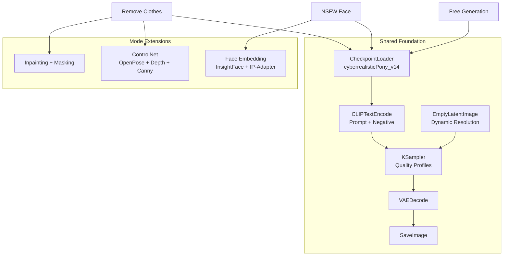

### Request Flow

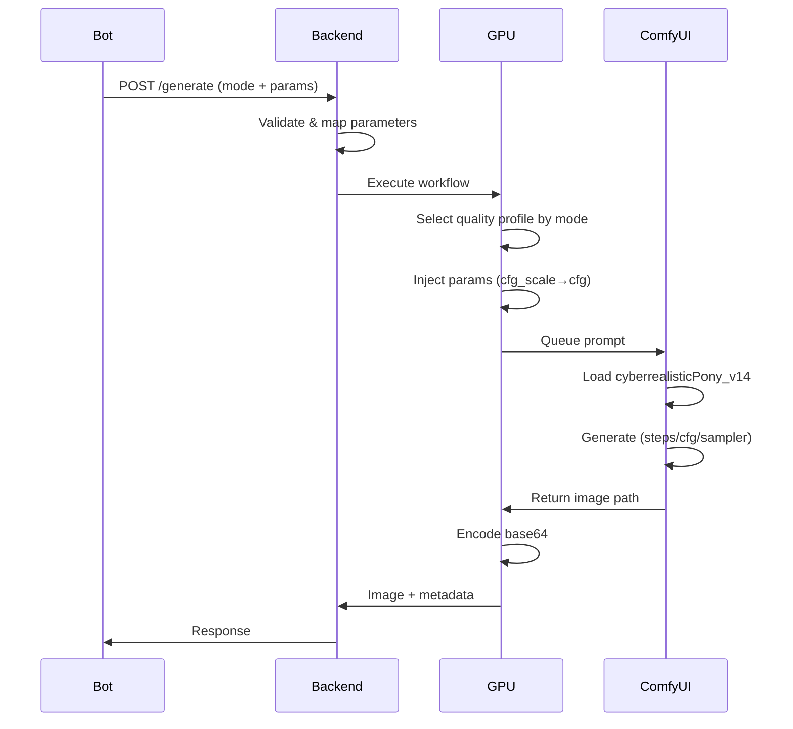

## 1. Unified Model and Quality System

### 1.1 Model Base

**Primary Checkpoint:** `cyberrealisticPony_v14.safetensors`

- **Location:** `/workspace/models/checkpoints/cyberrealisticPony_v14.safetensors`
- **Used by:** All three modes (free, remove_clothes, nsfw_face)
- **Purpose:** Consistent realistic visual style
- **Future:** Anime checkpoint can be added; model selection via config without changing business logic

### 1.2 Quality Profiles

Three profiles balance speed vs quality with precise parameter specifications:

| Profile | Steps | CFG | Sampler | Width | Height | Generation Time | Use Case |
|---------|-------|-----|---------|-------|--------|-----------------|----------|
| **fast** | 18 | 6.5 | euler | 704 | 1024 | ~15-20s | Testing, drafts, rapid iteration |
| **balanced** | 26 | 7.5 | euler | 832 | 1216 | ~30-45s | Free generation default |
| **high_quality** | 32 | 8.0 | dpmpp_2m | 896 | 1344 | ~50-75s | Remove clothes, NSFW face default |

**Profile Assignment by Mode:**
- `mode: "free"` → `balanced` profile (unless overridden)
- `mode: "remove_clothes"` → `high_quality` profile
- `mode: "nsfw_face"` → `high_quality` profile

**Parameter Override Logic:**
1. If `extra_params` explicitly specifies `steps`, `cfg_scale`, `width`, `height`, or `sampler` → use those values
2. If `extra_params.quality_profile` is set → use that profile's defaults
3. Otherwise → use mode's default profile
4. Individual parameters always override profile defaults

**Implementation in GPU Server:**

```python
QUALITY_PROFILES = {
    "fast": {
        "steps": 18,
        "cfg": 6.5,
        "resolution": "portrait",
        "width": 704,
        "height": 1024,
        "sampler": "euler"
    },
    "balanced": {
        "steps": 26,
        "cfg": 7.5,
        "resolution": "portrait",
        "width": 832,
        "height": 1216,
        "sampler": "euler"
    },
    "high_quality": {
        "steps": 32,
        "cfg": 8.0,
        "resolution": "portrait",
        "width": 896,
        "height": 1344,
        "sampler": "dpmpp_2m"
    }
}
```

### 1.3 Style Configuration System

**Location:** Backend service (`backend/config_styles.py` or within `services/free_generation.py`)

Each style defines model selection, prompt enhancements, negative prompts, and default quality settings:

```python
STYLE_CONFIG = {
    "noir": {
        "name": "Noir cinematic",
        "model": "cyberrealisticPony_v14.safetensors",
        "negative_prompt": (
            "low quality, bad anatomy, jpeg artifacts, cartoon, anime, 3d, "
            "overexposed, underexposed, extra limbs, bad hands, bad face"
        ),
        "prompt_prefix": (
            "noir style, high contrast black and white, cinematic lighting, film grain, "
            "moody atmosphere, dramatic shadows, "
        ),
        "default_quality_profile": "balanced",
        "default_sampler": "euler",
        "default_steps": 26,
        "default_cfg": 7.5,
        "default_resolution": {"width": 832, "height": 1216}
    },

    "super_realism": {
        "name": "Super Realism",
        "model": "cyberrealisticPony_v14.safetensors",
        "negative_prompt": (
            "cartoon, anime, 3d, illustration, painting, cgi, lowres, bad anatomy, "
            "bad hands, bad face, blurry, out of focus, plastic skin"
        ),
        "prompt_prefix": (
            "ultra realistic, 8k, detailed skin texture, realistic lighting, "
            "photorealistic, sharp focus, "
        ),
        "default_quality_profile": "high_quality",
        "default_sampler": "dpmpp_2m",
        "default_steps": 32,
        "default_cfg": 8.0,
        "default_resolution": {"width": 896, "height": 1344}
    },

    "anime": {
        "name": "Anime",
        "model": "animeModelXL.safetensors",  # Replace with actual anime checkpoint
        "negative_prompt": (
            "photo, realistic, 3d, lowres, bad anatomy, bad hands, blurry, "
            "distorted face, extra limbs"
        ),
        "prompt_prefix": (
            "anime illustration, highly detailed, clean lineart, vibrant colors, "
            "beautiful anime style, "
        ),
        "default_quality_profile": "balanced",
        "default_sampler": "euler",
        "default_steps": 24,
        "default_cfg": 7.0,
        "default_resolution": {"width": 768, "height": 1152}
    }
}
```

**Backend Processing Logic:**

When request arrives with `{"mode": "free", "style": "super_realism", "prompt": "girl on the beach at sunset"}`:

1. **Load style config:** `style_cfg = STYLE_CONFIG[style]`
2. **Construct full prompt:** `full_prompt = style_cfg["prompt_prefix"] + user_prompt`
3. **Get negative prompt:** `negative = style_cfg["negative_prompt"]`
4. **Resolve quality profile:**
   - If `extra_params.quality_profile` specified → use it
   - Else use `style_cfg["default_quality_profile"]`
5. **Resolve individual parameters** (steps/cfg/width/height/sampler):
   - If explicit in `extra_params` → use explicit value
   - Else if profile specified → use profile value
   - Else use style defaults
6. **Map cfg_scale → cfg:** Backend must convert `cfg_scale` field to `cfg` before sending to GPU
7. **Send to GPU server:**
   ```json
   {
     "workflow": "free_generation",
     "params": {
       "prompt": "ultra realistic, 8k, detailed skin texture... girl on beach...",
       "negative_prompt": "cartoon, anime, 3d...",
       "steps": 32,
       "cfg": 8.0,
       "width": 896,
       "height": 1344,
       "sampler": "dpmpp_2m",
       "seed": -1
     }
   }
   ```

### 1.4 Extra Parameters Format

**Unified format for all three modes:**

```json
{
  "extra_params": {
    "quality_profile": "fast" | "balanced" | "high_quality",
    
    "steps": 30,
    "cfg_scale": 7.5,
    "sampler": "euler" | "dpmpp_2m" | "dpmpp_2m_karras" | "dpmpp_3m_sde",
    "seed": 42,
    
    "resolution": "portrait" | "landscape" | "square",
    "width": 832,
    "height": 1216,
    
    "hires_fix": false,
    "denoise": 1.0,
    
    "face_strength": 0.75,
    "keep_face_details": true
  }
}
```

**Field Descriptions:**

| Field | Type | Purpose | Override Behavior |
|-------|------|---------|-------------------|
| `quality_profile` | string | Select preset (fast/balanced/high_quality) | Overrides style defaults |
| `steps` | int | Sampling steps | Overrides profile/style |
| `cfg_scale` | float | Classifier-free guidance | **Mapped to `cfg` by backend** |
| `sampler` | string | Sampling algorithm | Overrides profile/style |
| `seed` | int | Random seed (-1 = random) | Direct injection |
| `resolution` | string | Preset resolution | Ignored if width/height specified |
| `width` | int | Image width (must be multiple of 64) | Overrides profile/style |
| `height` | int | Image height (must be multiple of 64) | Overrides profile/style |
| `hires_fix` | bool | Two-stage generation (future) | Not implemented yet |
| `denoise` | float | KSampler denoise parameter | Direct injection |
| `face_strength` | float | IP-Adapter strength (nsfw_face mode) | Face embedding weight (0.0-1.0) |
| `keep_face_details` | bool | Face restoration (future) | GFPGAN/CodeFormer toggle |

**Critical: cfg_scale → cfg Mapping**

Backend MUST convert `cfg_scale` to `cfg` before sending to GPU server:
- User/bot sends: `"cfg_scale": 7.5`
- Backend converts to: `"cfg": 7.5`
- GPU server injects into KSampler node 3 field `cfg` (not `cfg_scale`)

### 1.5 Resolution Presets

Optimized for realistic vertical portraits and full-body:

| Preset | Resolution | Aspect | Use Case |
|--------|------------|--------|----------|
| **Portrait** | 768×1152 | 2:3 | Head/shoulders, upper body |
| **Full Body** | 832×1216 | ~2:3 | Standing, sitting, full figure |

- Injected into EmptyLatentImage node (node 5)
- Overrideable via `extra_params.width`/`height`
- Must be multiples of 64

### 1.6 Shared Workflow Components

Standard node IDs reused across all workflows:

| Node | Type | Purpose | Key Inputs |
|------|------|---------|------------|
| **4** | CheckpointLoaderSimple | Load model | `ckpt_name: "cyberrealisticPony_v14.safetensors"` |
| **6** | CLIPTextEncode | Positive prompt | `text`, `clip: [4,1]` |
| **7** | CLIPTextEncode | Negative prompt | `text`, `clip: [4,1]` |
| **5** | EmptyLatentImage | Canvas | `width`, `height`, `batch_size: 1` |
| **3** | KSampler | Generation | `seed`, `steps`, `cfg`, `sampler_name`, `scheduler`, connections to 4/5/6/7 |
| **8** | VAEDecode | Decode latent | `samples: [3,0]`, `vae: [4,2]` |
| **9** | SaveImage | Save output | `filename_prefix`, `images: [8,0]` |

**Node Connections (Base Pipeline):**

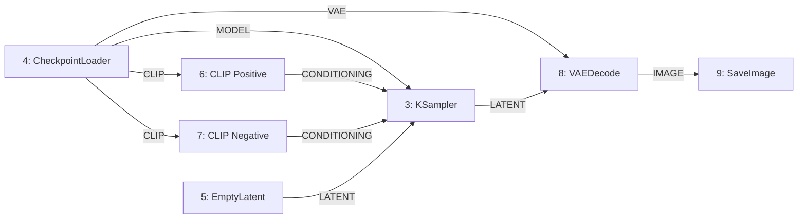

**Extension Strategy:**
- **Free generation:** Uses only these 7 base nodes
- **Remove clothes:** Adds LoadImage (1,2), ControlNet loaders (14,15,16), preprocessors (11,12,13), segmentation (10), inpainting nodes
- **NSFW Face:** Adds LoadImage for faces (20,21), FaceEmbed (22), IPAdapterFaceID (24)

## 2. Mode 1: Free Generation

### 2.1 Purpose

Generate images from text prompts with style selection. Foundation for other modes.

**User Interaction:**
1. User provides text prompt (character, location, pose, atmosphere)
2. User selects style: `noir`, `super_realism`, or `anime`
3. (Future) Optional face photos for face integration
4. System generates and returns image

### 2.2 Workflow: free_generation.json

**Current Status:**
- Exists at `/workspace/gpu_server/workflows/free_generation.json`
- Currently configured for Pony Diffusion XL
- Needs update to CyberRealisticPony v14

**Required Updates:**

1. **CheckpointLoader (node 4):**
   - Change `ckpt_name` from `"sd_xl_base_1.0.safetensors"` to `"cyberrealisticPony_v14.safetensors"`

2. **Verify VAE:**
   - Ensure VAE is compatible with CyberRealisticPony (typically embedded in checkpoint)

3. **Confirm Node Structure:**
   - Node 3 = KSampler with correct connections
   - Node 5 = EmptyLatentImage
   - Node 6 = CLIPTextEncode (positive)
   - Node 7 = CLIPTextEncode (negative)
   - Node 8 = VAEDecode
   - Node 9 = SaveImage

4. **Parameter Injection:**
   - Ensure `comfy_client.inject_parameters()` maps:
     - `cfg_scale` → node 3 `cfg` (critical: field is `cfg`, not `cfg_scale`)
     - `steps` → node 3 `steps`
     - `seed` → node 3 `seed`
     - `sampler_name` → node 3 `sampler_name`
     - `prompt` → node 6 `text`
     - `negative_prompt` → node 7 `text`
     - `width` → node 5 `width`
     - `height` → node 5 `height`

### 2.3 Quality Settings

**Default Profile:** `balanced`
- Steps: 28-32
- CFG: 7.5-8.5
- Sampler: dpmpp_2m_karras (fallback: euler)
- Resolution: 832×1216 (versatile vertical)

**Style-Specific Adjustments:**

| Style | Prompt Enhancement | Negative Prompt Additions |
|-------|-------------------|---------------------------|
| **noir** | Add: film noir, dramatic shadows, cinematic lighting, monochrome atmosphere | colorful, bright, cartoon, anime |
| **super_realism** | Add: photorealistic, detailed skin, professional photography, 8k | illustration, painting, anime, drawing, cartoon |
| **anime** | Add: anime art style, character design, cel shading | realistic, photograph, 3d render |

### 2.4 Backend API Integration

**Request Format:**

```json
{
  "mode": "free",
  "prompt": "portrait of a woman at sunset, detailed skin, warm light",
  "style": "super_realism",
  "extra_params": {
    "steps": 30,
    "cfg_scale": 8.0,
    "seed": -1,
    "width": 832,
    "height": 1216
  }
}
```

**Backend Processing:**
1. Receive request at `/generate` endpoint
2. Validate `mode`, `prompt`, `style`
3. Apply style-specific prompt enhancements and negative prompts
4. Map `cfg_scale` → `cfg` (GPU server expects `cfg`, not `cfg_scale`)
5. Send to GPU server with workflow `"free_generation"`
6. Return base64-encoded image

**Response Format:**

```json
{
  "status": "done",
  "task_id": "uuid-here",
  "image": "base64_encoded_png_data",
  "metadata": {
    "seed": 12345,
    "steps": 30,
    "cfg": 8.0,
    "execution_time": 42.3
  }
}
```

### 2.5 Testing Requirements

**After implementing free_generation updates:**

1. **SSH to POD:**
   ```bash
   ssh runpod-pod
   cd /workspace
   ```

2. **Verify services running:**
   ```bash
   ps aux | grep -E "main.py|server.py"
   # Or restart all:
   ./startup.sh
   ```

3. **Test request:**
   ```bash
   curl -X POST http://localhost:8000/generate \
     -H "Content-Type: application/json" \
     -d '{
       "mode": "free",
       "style": "super_realism",
       "prompt": "portrait of a girl at sunset, detailed skin, warm light",
       "extra_params": {
         "steps": 30,
         "cfg_scale": 8.0,
         "width": 832,
         "height": 1216
       }
     }'
   ```

4. **Verify success:**
   - Response `status` = `"done"`
   - `image` field contains base64 string
   - New PNG in `/workspace/ComfyUI/output/` (e.g., `pony_output_00003_.png`)
   - No tracebacks in `/workspace/logs/backend.log` or `/workspace/logs/gpu_server.log`

5. **Visual check:**
   ```bash
   ls -lt /workspace/ComfyUI/output/ | head -5
   # Download and inspect latest image
   ```

**Do not proceed to remove_clothes until free_generation tests pass.**

## 3. Mode 2: Remove Clothes

### 3.1 Purpose

Remove clothing from photos while preserving pose, anatomy, and lighting. Most quality-critical mode for body accuracy.

**User Interaction:**
1. User uploads 1 photo (full body or upper body)
2. User selects style: `super_realism` (primary) or `artistic`
3. System processes:
   - Segments clothing regions
   - Extracts pose via ControlNet OpenPose
   - Preserves depth and edges
   - Inpaints body in clothing regions
4. Returns result

### 3.2 Workflow: clothes_removal.json

**Status:** New workflow required

**Location:** `/workspace/gpu_server/workflows/clothes_removal.json`

**Architecture:**

**Base Shared Nodes:**
- Node 4: CheckpointLoaderSimple (`cyberrealisticPony_v14.safetensors`)
- Node 6: CLIPTextEncode (positive)
- Node 7: CLIPTextEncode (negative)
- Node 3: KSampler
- Node 8: VAEDecode
- Node 9: SaveImage

**Mode-Specific Additions:**

| Node Range | Purpose | Components |
|------------|---------|------------|
| **10-12** | Image input | LoadImage, ImageScale (normalize to target resolution) |
| **13-15** | Segmentation | Clothing mask generation (segment-anything or custom) |
| **16-18** | ControlNet OpenPose | Pose extraction and conditioning |
| **19-21** | ControlNet Depth | Depth map extraction and conditioning |
| **22-24** | ControlNet Canny | Edge detection and conditioning |
| **25-27** | Inpainting | Mask application, VAE encoding, latent combine |

**ControlNet Models Required:**
- `control_v11p_sd15_openpose.pth` (or SDXL equivalent)
- `control_v11f1p_sd15_depth.pth`
- `control_v11p_sd15_canny.pth`

**Verify models exist on POD:**
```bash
ls /workspace/models/controlnet/
```

### 3.3 Processing Pipeline

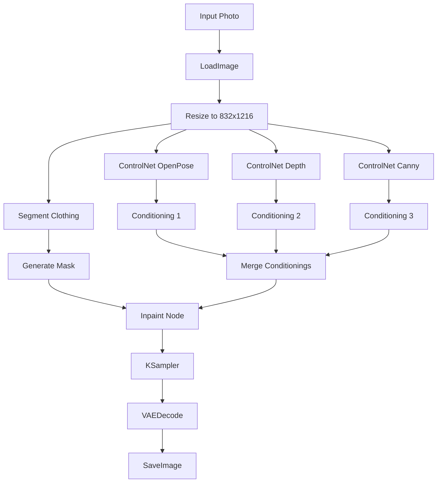

### 3.4 Quality Settings

**Default Profile:** `high_quality`
- Steps: 36-40
- CFG: 8.0-10.0
- Sampler: dpmpp_2m_karras
- Resolution: Upscale input to 768×1152 or 832×1216 (preserve aspect, don't exceed)

**ControlNet Strengths:**

| ControlNet | Strength | Purpose |
|------------|----------|---------|
| **OpenPose** | 0.8 | Preserve exact body pose and proportions |
| **Depth** | 0.6 | Maintain 3D spatial relationships |
| **Canny** | 0.5 | Preserve important edge details |

**Inpainting Parameters:**
- `denoise`: 0.7 (balance preservation vs generation)
- `inpaint_mode`: "only masked" regions

### 3.5 Backend API Integration

**Request Format:**

```json
{
  "mode": "remove_clothes",
  "target_image": "base64_encoded_input_photo",
  "style": "super_realism",
  "extra_params": {
    "quality_profile": "high_quality",
    "controlnet_strength": {
      "openpose": 0.8,
      "depth": 0.6,
      "canny": 0.5
    },
    "inpaint_denoise": 0.7
  }
}
```

**Backend Processing:**
1. Validate mode and target_image (base64)
2. Decode image, verify size (≤10MB)
3. Apply appropriate negative prompt (avoid artifacts, maintain realism)
4. Send to GPU server with workflow `"clothes_removal"`
5. Return base64 result

**Prompt Construction:**
- Positive: "detailed realistic body, natural skin texture, anatomically correct, professional lighting"
- Negative: "clothing, dressed, covered, deformed, extra limbs, bad anatomy, watermark, text"

### 3.6 Testing Requirements

**Preparation:**

1. **Prepare test image:**
   ```bash
   ssh runpod-pod
   mkdir -p /workspace/test_images
   # Upload test photo via SCP or create sample
   ```

2. **Encode to base64:**
   ```python
   # Temporary script: /workspace/test_encode.py
   import base64
   with open("/workspace/test_images/remove_input.png", "rb") as f:
       encoded = base64.b64encode(f.read()).decode()
       print(encoded)
   ```

3. **Create test JSON:**
   ```bash
   cat > /workspace/test_remove_clothes.json << 'EOF'
   {
     "mode": "remove_clothes",
     "style": "super_realism",
     "target_image": "PASTE_BASE64_HERE",
     "extra_params": {
       "quality_profile": "high_quality"
     }
   }
   EOF
   ```

**Execute Test:**

```bash
curl -X POST http://localhost:8000/generate \
  -H "Content-Type: application/json" \
  --data @/workspace/test_remove_clothes.json
```

**Verify:**
- No validation errors
- GPU server logs show ControlNet models loading
- ComfyUI executes without node mismatch errors
- Output image exists in `/workspace/ComfyUI/output/`
- Generation completes in 30-90 seconds (acceptable for this mode)
- Visual check: pose preserved, anatomy plausible

**Do not proceed to nsfw_face until remove_clothes tests pass.**

## 4. Mode 3: NSFW Face

### 4.1 Purpose

Generate adult-oriented content with user's face accurately embedded. Highest quality requirements for face accuracy.

**User Interaction:**
1. User uploads 1-5 face photos (first is primary)
2. User provides scene prompt (body, pose, environment—no face description)
3. User selects style: `noir`, `super_realism`, or `anime`
4. System:
   - Stage 1: Generate body + scene
   - Stage 2: Embed face via IP-Adapter
   - Stage 3: Optional face refinement (GFPGAN/CodeFormer if available)
5. Returns result

### 4.2 Required Models

**Face Processing:**
- **InsightFace:** Face detection and embedding extraction
- **IP-Adapter FaceID:** Face condition injection into diffusion process

**Verify models on POD:**
```bash
ls /workspace/models/insightface/
ls /workspace/models/ipadapter/
# Expected: buffalo_l or antelopev2 for InsightFace
# Expected: ip-adapter-faceid_sdxl.bin or similar
```

If missing, download and install before proceeding.

### 4.3 Workflow: nsfw_face.json

**Status:** New workflow required

**Location:** `/workspace/gpu_server/workflows/nsfw_face.json`

**Architecture:**

**Shared Base Nodes:**
- Node 4: CheckpointLoaderSimple (`cyberrealisticPony_v14.safetensors`)
- Node 6: CLIPTextEncode (positive - body/scene description)
- Node 7: CLIPTextEncode (negative)
- Node 5: EmptyLatentImage (768×1152 or 832×1216)
- Node 3: KSampler
- Node 8: VAEDecode
- Node 9: SaveImage

**Face-Specific Nodes:**

| Node Range | Purpose | Components |
|------------|---------|------------|
| **10-12** | Face input | LoadImage (multiple face photos), FaceAnalysis (InsightFace) |
| **13-15** | Face embedding | Extract embeddings, average/select primary |
| **16-18** | IP-Adapter | IPAdapterFaceID node, weight control, conditioning merge |

**Workflow Flow:**

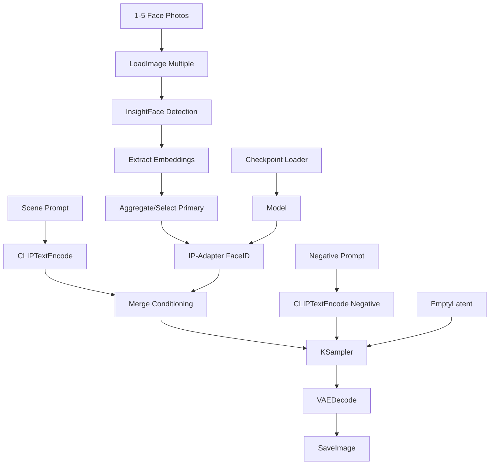

### 4.4 Face Embedding Process

**Multi-Photo Handling:**

1. **Detection:**
   - Run InsightFace on each uploaded photo
   - Validate: at least 1 face detected per photo
   - Extract bounding box and landmarks

2. **Embedding Extraction:**
   - Generate 512-d embedding vector per face
   - Normalize embeddings

3. **Aggregation Strategy:**
   - If 1 photo: use that embedding
   - If 2-5 photos: 
     - Option A: Average embeddings (simple, stable)
     - Option B: Use first photo as primary, others as reference (higher weight to first)

4. **IP-Adapter Integration:**
   - Pass aggregated embedding to IP-Adapter FaceID node
   - Set `weight` (face strength): 0.7-0.9 (default 0.8)
   - Set `start_step`/`end_step` for when face conditioning applies

**Fallback:**
- If face detection fails on any photo: reject that photo, continue with others
- If all photos fail detection: return error to user

### 4.5 Quality Settings

**Default Profile:** `high_quality`
- Steps: 34-40
- CFG: 8.0-9.0
- Sampler: dpmpp_2m_karras
- Resolution: 768×1152 (portrait) or 832×1216 (full body scenes)

**Face-Specific Parameters:**

| Parameter | Value | Purpose |
|-----------|-------|---------|
| `face_strength` | 0.8 | Balance between face accuracy and scene coherence |
| `start_step` | 0 | Apply face conditioning from beginning |
| `end_step` | 0.8 | Stop face conditioning before final details (prevents overfit) |

**Style Adjustments:**

| Style | Scene Prompt Additions | Negative Prompt |
|-------|------------------------|-----------------|
| **noir** | dramatic lighting, shadows, cinematic noir | bright, colorful, cheerful |
| **super_realism** | photorealistic skin, detailed body, professional photography | illustration, cartoon, anime |
| **anime** | anime style body, character design | realistic, photograph |

### 4.6 Backend API Integration

**Request Format:**

```json
{
  "mode": "nsfw_face",
  "face_images": [
    "base64_face_photo_1",
    "base64_face_photo_2"
  ],
  "prompt": "woman in lingerie on bed, cinematic lighting, detailed skin, realistic body",
  "style": "super_realism",
  "extra_params": {
    "quality_profile": "high_quality",
    "face_strength": 0.8,
    "width": 768,
    "height": 1152
  }
}
```

**Backend Processing:**

1. Validate `face_images` array (1-5 items)
2. Decode each base64 image, verify format (JPEG/PNG)
3. Validate face detection (send to GPU for preprocessing or do in backend)
4. Construct NSFW-appropriate prompt based on user input + style
5. Apply strong negative prompt against artifacts# Telegram Bot Implementation - Three Core Generation Modes

## Overview

This design document specifies the implementation of three high-quality image generation modes with comprehensive testing protocols. The system uses a unified model base (CyberRealisticPony v14) across all modes, with detailed ComfyUI workflow graphs and mandatory testing at each implementation stage.

**Core Principles:**
- **Unified Model Base:** All modes use `cyberrealisticPony_v14.safetensors`
- **Test-Driven Development:** Every feature must pass real POD tests before proceeding
- **Quality Over Speed:** Prioritize output quality, especially for face and clothes removal
- **Maximum Component Reuse:** Share CheckpointLoader, CLIP, KSampler, VAE nodes
- **All work performed on RunPod server at `/workspace`**

**Three Generation Modes:**
1. **Free Generation** - Text-to-image with style selection (noir/super_realism/anime)
2. **Remove Clothes** - ControlNet-based clothing removal with pose preservation
3. **NSFW Face** - Face-embedded adult content generation via IP-Adapter

## System Architecture

### Request Flow

```mermaid
sequenceDiagram
    participant Bot
    participant Backend
    participant GPU
    participant ComfyUI
    
    Bot->>Backend: POST /generate (mode + extra_params)
    Backend->>Backend: Map cfg_scale→cfg
    Backend->>Backend: Apply quality profile
    Backend->>GPU: Execute workflow
    GPU->>GPU: inject_parameters() into JSON
    GPU->>ComfyUI: Queue prompt
    ComfyUI->>ComfyUI: Load cyberrealisticPony_v14
    ComfyUI->>ComfyUI: Execute (steps/cfg/sampler)
    ComfyUI->>GPU: /workspace/ComfyUI/output/image.png
    GPU->>GPU: Encode base64
    GPU->>Backend: {status, image, metadata}
    Backend->>Bot: JSON response
# Telegram Bot Implementation - Three Core Generation Modes

## Overview

This design document describes the implementation of three high-quality image generation modes within the existing architecture (Backend → GPU Server → ComfyUI). The focus is on delivering excellent visual quality, particularly for face-based modes, while maintaining reasonable generation speed through configurable quality profiles.

**Key Objectives:**
- Implement 3 core generation modes with maximum component reuse
- Establish unified model base (CyberRealisticPony v14) across all modes
- Create quality/speed profiles (fast, balanced, high_quality) for different use cases
- Build test-driven: verify each component on real RunPod POD before proceeding
- Prioritize quality over speed for face and clothes removal modes
- All work must be performed on RunPod server at `/workspace`

**Three Generation Modes:**
1. **Free Generation** - Text-to-image with style selection (optional face support)
2. **Remove Clothes** - Clothing removal with pose preservation via ControlNet
3. **NSFW Face** - Adult content generation with face embedding integration

## Context and Constraints

### Current Implementation Status

The project currently has:
- Working backend API with `/generate` endpoint
- Operational GPU server with ComfyUI integration
- MVP Telegram bot with basic conversation flows
- Single workflow: `free_generation.json` (currently using Pony Diffusion XL)
- Model available: `cyberrealisticPony_v14.safetensors` at `/workspace/models/checkpoints`
- Basic conversation state management using in-memory sets

### Technical Environment

- **Deployment Location:** RunPod POD server at `/workspace`
- **SSH Access:** `ssh runpod-pod`
- **Python Version:** 3.10+
- **Bot Framework:** python-telegram-bot (async)
- **Backend Framework:** FastAPI
- **GPU Service:** ComfyUI with CyberRealisticPony v14
- **Primary Checkpoint:** `cyberrealisticPony_v14.safetensors`

### Critical Constraints

1. **Server-Only Operations:** All modifications, file creation, and testing must occur on the RunPod server
2. **No Markdown Files on Server:** Only executable code, configurations, and workflows are deployed
3. **Backward Compatibility:** Must not break existing backend and GPU server functionality
4. **Workflow Compatibility:** All workflows must follow established node ID conventions (node 6 = prompt, node 7 = negative_prompt, etc.)
5. **Test-Driven Development:** Every workflow, endpoint, and parameter change must be tested on real POD before proceeding to next feature
6. **Unified Model Base:** All three modes use `cyberrealisticPony_v14.safetensors` for consistent visual style
7. **Component Reuse:** Maximize sharing of CheckpointLoader, CLIP, KSampler, VAE nodes across all workflows

## System Architecture

### Unified Component Strategy

All three generation modes share a common foundation to ensure consistent visual style, simplified maintenance, and efficient resource usage.

```mermaid
graph TB
    subgraph "Shared Components"
        Checkpoint[CheckpointLoader<br/>cyberrealisticPony_v14]
        CLIP[CLIPTextEncode<br/>Prompt & Negative]
        Latent[EmptyLatentImage<br/>Dynamic Resolution]
        Sampler[KSampler<br/>Quality Profiles]
        VAE[VAEDecode]
        Save[SaveImage]
    end
    
    subgraph "Mode-Specific Extensions"
        FaceEmbed[Face Embedding<br/>InsightFace + IP-Adapter]
        ControlNet[ControlNet Stack<br/>OpenPose + Depth + Canny]
        Inpaint[Inpainting<br/>Mask + Segmentation]
    end
    
    Free[Free Generation] --> Checkpoint
    NSFWFace[NSFW Face] --> Checkpoint
    NSFWFace --> FaceEmbed
    RemoveClothes[Remove Clothes] --> Checkpoint
    RemoveClothes --> ControlNet
    RemoveClothes --> Inpaint
    
    Checkpoint --> CLIP
    CLIP --> Sampler
    Latent --> Sampler
    Sampler --> VAE
    VAE --> Save
```

### Data Flow Architecture

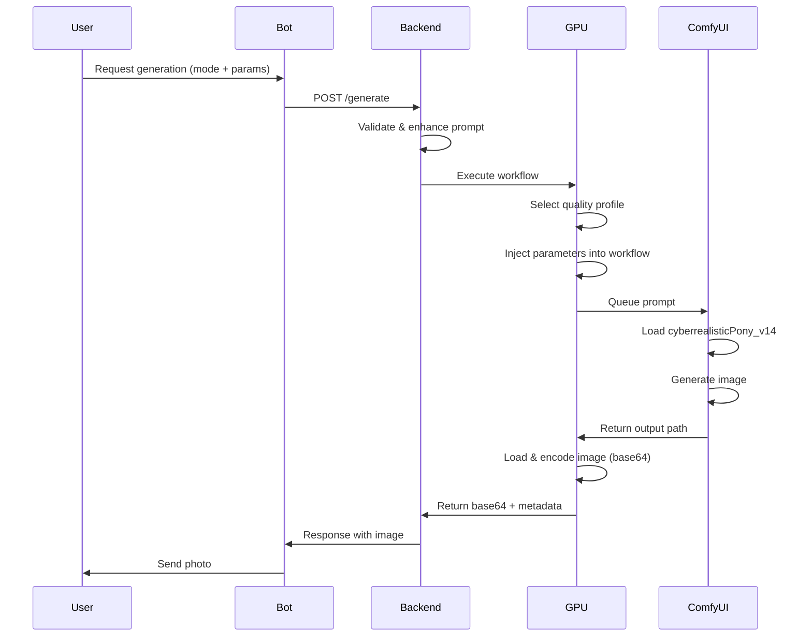

## Feature Specifications

### 1. Unified Model and Quality System

#### 1.1 Model Base

**Primary Checkpoint:** `cyberrealisticPony_v14.safetensors`

- **Location:** `/workspace/models/checkpoints/cyberrealisticPony_v14.safetensors`
- **Usage:** All three modes (free_generation, remove_clothes, nsfw_face)
- **Purpose:** Provides consistent realistic visual style across all generation types
- **Configuration:** Specified in workflow JSON via CheckpointLoaderSimple node

**Future Extensibility:**
- Anime checkpoint can be added later for anime style
- Model selection should be configurable via `sd_models.json` or workflow parameters
- Business logic should remain unchanged when adding new checkpoints

#### 1.2 Quality Profiles

Three quality/speed profiles balance generation time against output quality:

| Profile | Use Case | Steps | Sampler | CFG | Priority |
|---------|---------|-------|---------|-----|----------|
| `fast` | Testing, drafts | 20-24 | euler | 6.5-7.0 | Speed over quality |
| `balanced` | Default for free_generation | 28-32 | dpmpp_2m_karras (fallback: euler) | 7.5-8.5 | Balanced |
| `high_quality` | Default for remove_clothes, nsfw_face | 34-40 | dpmpp_2m_karras | 8.0-10.0 | Quality over speed |

**Profile Selection Strategy:**

- **Free Generation:** Default = `balanced` (acceptable speed, good quality)
- **Remove Clothes:** Default = `high_quality` (quality critical for anatomy)
- **NSFW Face:** Default = `high_quality` (face accuracy paramount)

**Implementation:**
- Profile can be specified via `extra_params.quality_profile` in API request
- GPU server maps profile name to concrete parameters (steps, sampler, cfg)
- Current implementation: hardcoded mapping based on mode
- Future: expose profile selection to users

#### 1.3 Resolution Presets

Optimized for realistic portrait and full-body generation:

| Preset | Resolution | Aspect Ratio | Use Case |
|--------|------------|--------------|----------|
| Portrait | 768 x 1152 | 2:3 | Head and shoulders, upper body |
| Full Body | 832 x 1216 | ~2:3 | Standing or sitting, full figure |

**Implementation:**
- Width and height injected into EmptyLatentImage node (node 5)
- Can be overridden via `extra_params.width` and `extra_params.height`
- Values must be multiples of 64 for stable diffusion compatibility

#### 1.4 Shared Workflow Components

All workflows reuse these core ComfyUI nodes:

| Node ID | Type | Purpose | Inputs |
|---------|------|---------|--------|
| 4 | CheckpointLoaderSimple | Load model | `ckpt_name: "cyberrealisticPony_v14.safetensors"` |
| 6 | CLIPTextEncode | Positive prompt | `text: <prompt>`, `clip: [4,1]` |
| 7 | CLIPTextEncode | Negative prompt | `text: <negative_prompt>`, `clip: [4,1]` |
| 5 | EmptyLatentImage | Canvas size | `width`, `height`, `batch_size: 1` |
| 3 | KSampler | Generation | `seed`, `steps`, `cfg`, `sampler_name`, `scheduler`, `model: [4,0]`, `positive: [6,0]`, `negative: [7,0]`, `latent_image: [5,0]` |
| 8 | VAEDecode | Decode latent | `samples: [3,0]`, `vae: [4,2]` |
| 9 | SaveImage | Save output | `filename_prefix`, `images: [8,0]` |

**Note:** Mode-specific workflows extend this base by adding:
- **NSFW Face:** Face embedding nodes (InsightFace, IP-Adapter)
- **Remove Clothes:** ControlNet nodes, segmentation, inpainting

### 2. Mode 1: Free Generation

#### 2.1 Purpose and Behavior

Generate images from text descriptions with style selection. Optionally support face integration (future enhancement).

**User Flow:**
1. User writes text prompt describing desired image:
   - Character description (who, age, appearance)
   - Location and environment
   - Pose and action
   - Atmosphere and mood
2. User selects style:
   - `noir` - Film noir aesthetic, dramatic shadows, cinematic
   - `super_realism` - Photorealistic, detailed
   - `anime` - Anime art style (via prompt/negative adjustments initially)
3. (Future) User optionally provides 1-5 face photos for face integration
4. System generates image and returns result

#### 2.2 Workflow: free_generation.json

**Current State:**
- Workflow already exists, currently configured for Pony Diffusion XL
- Located at `/workspace/gpu_server/workflows/free_generation.json`

**Required Changes:**
1. Update CheckpointLoader (node 4) to use `cyberrealisticPony_v14.safetensors`
2. Verify VAE matches the checkpoint
3. Confirm node IDs match expected structure:
   - Node 3: KSampler
   - Node 5: EmptyLatentImage  
   - Node 6: CLIPTextEncode (positive)
   - Node 7: CLIPTextEncode (negative)
4. Ensure `comfy_client.inject_parameters()` correctly maps to these nodes

**Workflow Structure:**

**Conversation Flow:**

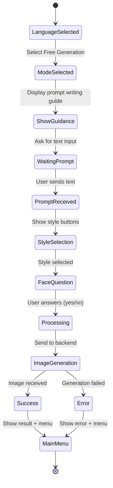

**Steps:**
1. User selects "Free Generation" from main menu
2. Bot displays prompt writing guide (localized)
   - Shows "How to write a prompt" tips
   - Provides example prompts
   - Explains style options
3. User sends text description
4. Bot validates prompt (minimum 3 characters)
5. Bot presents style selection:
   - 🕶 Noir (ChatGPT style)
   - 📸 Super Realism
   - 🧧 Anime
6. Bot asks: "Add face?" (optional feature for future)
7. Bot shows "Generating..." status message
8. Backend processes request through prompt enhancer
9. GPU server generates image
10. Bot sends result image with caption
11. Bot returns to main menu

**Backend Integration:**

Request payload to `/generate` endpoint:
```
{
  "mode": "free",
  "prompt": "<user text>",
  "style": "noir|super_realism|anime",
  "add_face": false,
  "extra_params": {
    "steps": 30,
    "cfg": 7.0,
    "seed": -1,
    "width": 1024,
    "height": 1024
  }
}
```

**Prompt Enhancement Requirements:**

The backend must enhance user prompts by:
- Expanding vague descriptions with stylistic details
- Adding appropriate artistic tags based on selected style
- Applying style-specific negative prompts
- Maintaining user intent while improving clarity

Style-specific enhancements:

| Style | Enhancement Strategy | Negative Prompt Additions |
|-------|---------------------|---------------------------|
| Noir | Add film noir lighting, dramatic shadows, monochrome atmosphere | "colorful, bright, cartoon" |
| Super Realism | Add photorealistic details, camera specs, lighting setup | "illustration, painting, anime, drawing" |
| Anime | Add anime art style tags, character design elements | "realistic, photograph, 3d" |

#### 3.2 NSFW with Face Mode

**Purpose:** Generate adult-oriented images incorporating user's face photos

**Required Models and Components:**
- Pony Diffusion XL (base model)
- IP-Adapter FaceID (face embedding)
- InsightFace (face detection and encoding)

**Conversation Flow:**

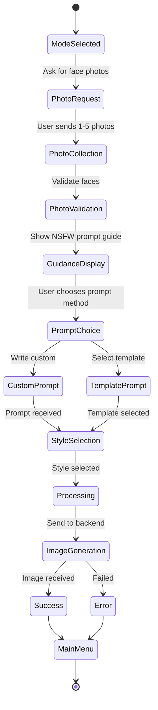

**Steps:**
1. User selects "NSFW with Face" from main menu
2. Bot requests 1-5 face photos
   - First photo is primary reference
   - Additional photos improve face embedding quality
3. User sends photo(s)
4. Bot validates each photo:
   - Must contain detectable face
   - Minimum resolution: 512x512
   - Clear face visibility
5. Bot displays NSFW prompt writing guide
6. Bot offers two input methods:
   - Custom text prompt
   - Pre-written template selection
7. User provides prompt (via text or template button)
8. Bot presents style selection (same as Free Generation)
9. Bot processes face embeddings and generates image
10. Bot sends result and returns to main menu

**Face Photo Handling:**
- Download photos to temporary storage
- Extract face embeddings using InsightFace
- Pass embeddings to IP-Adapter FaceID
- Clean up temporary files after generation
- Maximum file size: 10MB per photo

**Backend Integration:**

Request payload to `/generate` endpoint:
```
{
  "mode": "nsfw_face",
  "faces": ["<base64_image_1>", "<base64_image_2>", ...],
  "prompt": "<scene description>",
  "style": "noir|super_realism|anime",
  "extra_params": {
    "face_strength": 0.8,
    "steps": 35,
    "cfg": 7.5,
    "seed": -1
  }
}
```

**Template Prompts:**

The bot must provide pre-written soft NSFW prompts for users who prefer not to write their own:

Example templates (to be localized):
- "Elegant figure in soft warm lighting, standing by window in bedroom, morning light, romantic cinematic atmosphere"
- "Silhouette in twilight, neon light from window, urban night scene behind, noir style, emphasis on atmosphere and shadows"
- "Sophisticated evening look, sitting on bed in luxury hotel, soft warm light, romantic cinematic style"

Templates must be:
- Suggestive but not explicit
- Focused on atmosphere and composition
- Appropriate for diverse artistic interpretations

#### 3.3 Face Swap Mode

**Purpose:** Replace face in a generated or uploaded image with user's face

**Required Components:**
- IP-Adapter FaceID
- CyberRealisticPony_v14 or Pony XL base model
- Face detection and alignment

**Conversation Flow:**

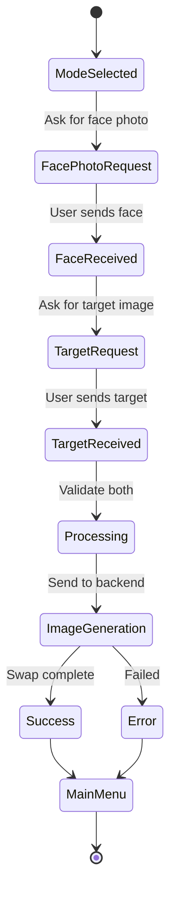

**Steps:**
1. User selects "Face Swap" from main menu
2. Bot requests face photo (source face)
3. User sends face photo
4. Bot validates face detection
5. Bot requests target image (where face will be placed)
6. User sends target image
7. Bot validates target has detectable face
8. Bot performs face swap
9. Bot sends result and returns to main menu

**Face Swap Requirements:**
- Preserve target image composition
- Match lighting and skin tone
- Maintain facial expression from target
- Blend seamlessly at face boundary
- Support both generated and uploaded target images

**Backend Integration:**

Request payload to `/generate` endpoint:
```
{
  "mode": "face_swap",
  "source_face": "<base64_face_photo>",
  "target_image": "<base64_target_image>",
  "extra_params": {
    "blend_strength": 0.85,
    "preserve_expression": true
  }
}
```

#### 3.4 Clothes Removal Mode

**Purpose:** Remove clothing from photos while preserving pose and anatomy

**Required Components:**
- Segmentation model for clothing detection
- Mask generation for inpainting regions
- ControlNet: OpenPose + Depth + Canny
- Inpainting model

**Conversation Flow:**

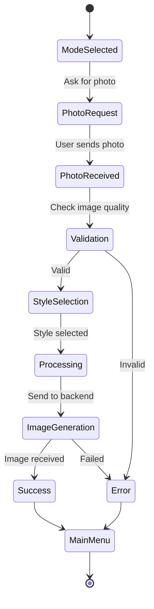

**Steps:**
1. User selects "Remove Clothes" from main menu
2. Bot requests photo with following requirements:
   - Full body or upper body visible
   - Clear, well-lit image
   - Single person in frame
3. User sends photo
4. Bot validates photo quality
5. Bot presents style selection (optional: realism vs artistic)
6. Bot processes image:
   - Detects clothing regions
   - Generates segmentation mask
   - Extracts pose via OpenPose
   - Extracts depth information
   - Extracts edges via Canny
   - Inpaints clothing regions
7. Bot sends result and returns to main menu

**Processing Pipeline:**

The backend orchestrates these steps:
1. **Segmentation:** Identify clothing regions to remove
2. **Pose Extraction:** Use ControlNet OpenPose to preserve body structure
3. **Depth Mapping:** Maintain 3D spatial relationships
4. **Edge Detection:** Preserve important contours via Canny
5. **Inpainting:** Generate anatomically correct content
6. **Refinement:** Blend and polish final result

**Backend Integration:**

Request payload to `/generate` endpoint:
```
{
  "mode": "clothes_removal",
  "image": "<base64_input_photo>",
  "style": "realistic|artistic",
  "extra_params": {
    "controlnet_strength": {
      "openpose": 0.8,
      "depth": 0.6,
      "canny": 0.5
    },
    "inpaint_denoise": 0.7,
    "steps": 40,
    "cfg": 7.0
  }
}
```

**Quality Assurance Criteria:**
- Anatomical correctness (proper proportions, realistic anatomy)
- Pose preservation (maintain original body position)
- Lighting consistency (match source photo lighting)
- Skin tone continuity (match visible skin areas)
- Natural transitions (smooth boundaries between original and generated)

### 4. User Guidance System

#### 4.1 Prompt Writing Guides

Each generation mode requires context-appropriate guidance to help users write effective prompts.

**Free Generation Prompt Guide:**

Content structure:
- **Title:** "How to write a request for generation"
- **Introduction:** Explain what makes a good prompt
- **Step-by-step breakdown:**
  1. Character description (who, age, appearance)
  2. Pose and action (sitting, standing, leaning, looking)
  3. Location (city night, bedroom, beach, rooftop)
  4. Atmosphere and style (cinematic, neon cyberpunk, noir, soft light)
  5. Details (hairstyle, clothing, accessories, facial expression, color palette)
  6. Camera and lighting (optional: portrait closeup, full body, low angle, 35mm lens)
  7. Fallback suggestion: Use template prompts if stuck
- **Example:** Concrete prompt demonstrating all elements

Example prompt:
> "Young woman on rooftop at night, long hair flowing in wind, neon city in background, cinematic shot, soft side lighting, atmospheric noir"

**NSFW Face Prompt Guide:**

Content structure:
- **Title:** "How to write a request for generation with face"
- **Introduction:** Explain face photos will be used; no need to describe facial features
- **Step-by-step breakdown:**
  1. Body and pose description (standing, sitting, lying, playful, relaxed)
  2. Location (bedroom, studio, bathroom, balcony, luxury hotel)
  3. Atmosphere (romantic, passionate, playful, soft, cinematic)
  4. Clothing/appearance (evening dress, lingerie, shirt, robe, towel - keep tasteful)
  5. Lighting and style (soft warm light, backlight, noir, cinematic, super realism, anime)
  6. Fallback: Select from template prompts
- **Example:** Demonstrates tasteful scene description

Example prompt:
> "Female figure in soft dim lighting, sitting on edge of bed in luxury bedroom, romantic atmosphere, warm light, cinematic style"

#### 4.2 Example Prompt Library

The bot must provide ready-to-use example prompts for each mode.

**Free Generation Examples (3-5 per language):**
- Noir/atmospheric scene
- Realistic portrait
- Anime character scene

**NSFW Face Examples (3-5 per language):**
- Soft romantic scene
- Atmospheric noir scene
- Elegant luxury setting

Examples must be:
- Localized for each language
- Selectable via inline buttons
- Applied as-is or editable by user
- Demonstrate best practices

#### 4.3 Guidance Display Strategy

When user enters a mode:
1. Show brief mode description
2. Offer "💡 How to write a prompt" button
3. Offer "📋 See examples" button
4. User can proceed directly or view guidance first

Guidance presentation:
- Displayed in user's selected language
- Formatted with Markdown for readability
- Can be shown multiple times if needed
- Dismissible with "Continue" button

### 5. Workflow Specifications

The implementation requires 5 ComfyUI workflow JSON files to support all generation modes.

#### 5.1 Workflow File Locations

All workflows must be stored in:
```
/workspace/gpu_server/workflows/
```

Required workflow files:
1. `free_generation.json` - Basic text-to-image (already exists, may need updates)
2. `free_generation_face.json` - Text-to-image with optional face merge
3. `nsfw_face.json` - Adult content with face embeddings
4. `face_swap.json` - Face replacement in existing images
5. `clothes_removal.json` - Clothing removal with ControlNet

#### 5.2 Workflow Node ID Conventions

To maintain consistency with the existing system, all workflows must follow these node ID assignments:

| Node ID | Function | Inputs |
|---------|----------|--------|
| 3 | KSampler | seed, steps, cfg, sampler_name, scheduler, model, positive, negative, latent_image |
| 4 | CheckpointLoaderSimple | ckpt_name |
| 5 | EmptyLatentImage | width, height, batch_size |
| 6 | CLIPTextEncode (positive) | text, clip |
| 7 | CLIPTextEncode (negative) | text, clip |
| 8 | VAEDecode | samples, vae |
| 9 | SaveImage | filename_prefix, images |

Additional nodes for specific workflows:
- **10-15:** Reserved for ControlNet nodes (OpenPose, Depth, Canny)
- **16-20:** Reserved for IP-Adapter and FaceID nodes
- **21-25:** Reserved for segmentation and masking nodes
- **26-30:** Reserved for LoRA and model enhancement nodes

#### 5.3 Workflow Parameter Injection

The GPU server's `comfy_client.py` must inject parameters into workflow JSON before execution.

**Injection Points for Each Workflow:**

**free_generation.json:**
- Node 6 → `inputs.text` = enhanced_prompt
- Node 7 → `inputs.text` = negative_prompt
- Node 3 → `inputs.seed` = seed_value
- Node 3 → `inputs.cfg` = cfg_value
- Node 3 → `inputs.steps` = steps_value
- Node 5 → `inputs.width` = width_value
- Node 5 → `inputs.height` = height_value

**nsfw_face.json:**
- All injection points from free_generation.json
- FaceID node → `inputs.image` = face_embedding_data
- IP-Adapter node → `inputs.weight` = face_strength_value

**face_swap.json:**
- FaceID source node → `inputs.image` = source_face_data
- LoadImage node → `inputs.image` = target_image_data
- IP-Adapter node → `inputs.weight` = blend_strength_value

**clothes_removal.json:**
- LoadImage node → `inputs.image` = input_photo_data
- ControlNet OpenPose → `inputs.strength` = openpose_strength
- ControlNet Depth → `inputs.strength` = depth_strength
- ControlNet Canny → `inputs.strength` = canny_strength
- Inpaint node → `inputs.denoise` = denoise_strength

#### 5.4 Workflow Creation Strategy

Workflows must be created using the ComfyUI web interface running on the RunPod server:

1. Access ComfyUI at the GPU server endpoint
2. Build workflow with required nodes
3. Test workflow with sample inputs
4. Verify output quality
5. Export workflow JSON
6. Save to `/workspace/gpu_server/workflows/`
7. Document model requirements and parameters

Each workflow should be:
- **Minimally Complex:** Only essential nodes, no redundant processing
- **Parameterizable:** All user-controllable values injectable
- **Stable:** Tested with various inputs to ensure reliability
- **Documented:** Comments in JSON or separate README explaining node purposes

### 6. State Management

#### 6.1 User State Structure

Each user's conversation state must track:

| Field | Type | Purpose |
|-------|------|---------|
| `user_id` | Integer | Telegram user identifier |
| `language` | String | Selected language code (ru, en, de, etc.) |
| `mode` | String | Current generation mode |
| `step` | String | Current step in conversation flow |
| `prompt` | String | User's text prompt |
| `style` | String | Selected style |
| `photos` | List[bytes] | Uploaded photo data |
| `last_activity` | Datetime | Timestamp of last interaction |

#### 6.2 State Storage Options

**MVP Approach (Current):**
- In-memory sets and dictionaries
- Stored in `context.user_data` provided by python-telegram-bot
- Lost on bot restart
- Suitable for single-instance deployment

**Production Recommendation (Future):**
- Redis-backed session storage
- Persistent across bot restarts
- Supports multi-instance deployment
- TTL-based cleanup of stale sessions

For this implementation, continue using `context.user_data` with these enhancements:
- Clear state after each operation completion
- Implement timeout mechanism (5 minutes of inactivity)
- Provide explicit "Cancel" buttons in all flows
- Store language preference persistently (separate from conversation state)

#### 6.3 Language Preference Persistence

User language selection must persist across sessions:

**Simple File-Based Approach:**
- Create `user_languages.json` file
- Structure: `{"user_id": "lang_code", ...}`
- Load on bot startup
- Save on each language change
- Check on every `/start` command

**Storage Location:**
```
/workspace/telegram_bot/data/user_languages.json
```

This ensures users don't need to re-select language every time they restart conversation.

### 7. Error Handling and User Feedback

#### 7.1 Error Categories

| Error Type | User Message Strategy | Recovery Action |
|------------|----------------------|-----------------|
| Invalid input | Explain what's wrong, show requirements | Allow retry in same flow |
| Generation timeout | Apologize, suggest simpler prompt | Return to main menu |
| Backend unavailable | Generic service error message | Return to main menu |
| Invalid photo | Explain photo requirements | Allow re-upload |
| Face not detected | Explain face must be visible | Allow re-upload |
| Workflow failure | Generic generation error | Return to main menu |

#### 7.2 User Feedback Messages

All error messages must:
- Be localized to user's selected language
- Avoid technical jargon
- Provide actionable guidance
- Include emoji for visual clarity
- Offer navigation back to main menu

**Example Error Messages (to be localized):**

Photo validation failure:
> "❌ No face detected in photo. Please send a clear photo where the face is fully visible and well-lit."

Prompt too short:
> "❌ Prompt is too short. Please provide a more detailed description (at least 3 words)."

Generation timeout:
> "⏱ Generation took too long. This can happen with very complex prompts. Try a simpler description or different style."

Backend unavailable:
> "❌ Service temporarily unavailable. Please try again in a few moments."

#### 7.3 Progress Indicators

For long-running operations (image generation), provide clear progress feedback:

1. Immediate acknowledgment: "🎨 Starting generation..."
2. Processing status: "⚙️ Generating image with [style] style... This may take 30-60 seconds."
3. Completion: "✅ Generated successfully!"
4. Result display: Send image with descriptive caption

Progress messages should:
- Use animated emoji (🔄, ⏳) where appropriate
- Set realistic time expectations
- Be editable (replace with next status)
- Disappear upon completion (replaced by result)

### 8. External Links and Information

#### 8.1 Information Buttons

The main menu includes several information and link buttons that currently serve as placeholders.

**Referral Program Button:**
- Action: Display referral system explanation
- Content: Description of how users can earn through referrals
- Link: `https://telegra.ph/REFERRAL_[lang]` (to be created)

**My Referral Bots Button:**
- Action: Show user's referral statistics
- Content: List of bots created, earnings, active referrals
- Implementation: Placeholder for now (future database integration)

**Partners Chat Button:**
- Action: Open external Telegram chat link
- URL: `https://t.me/your_partners_chat` (to be provided)
- Behavior: Opens in Telegram

**Channel Button:**
- Action: Open announcement channel
- URL: `https://t.me/your_channel` (to be provided)
- Behavior: Opens in Telegram

**Instructions Button:**
- Action: Display comprehensive usage guide
- Link: `https://telegra.ph/INSTRUCTION_[lang]` (to be created)
- Content: Step-by-step usage guide for all features

#### 8.2 Placeholder Implementation

For initial deployment, information buttons should:
- Display localized "Coming soon" message
- Include placeholder link (to be updated)
- Log user interaction for analytics
- Provide "Back to menu" button

Example placeholder response:
> "📖 Detailed instructions will be available soon. For now, use the main menu options to explore features. Need help? Contact support at [contact info]."

## Technical Implementation Guidelines

### 9. Bot Structure and Organization

#### 9.1 File and Directory Structure

Recommended organization for telegram_bot directory:

```
telegram_bot/
  ├── bot.py                      # Main entry point
  ├── config.py                   # Configuration management
  ├── requirements.txt            # Python dependencies
  ├── .env                        # Environment variables (not in git)
  ├── .env.template               # Environment template
  │
  ├── locales/                    # Localization files
  │   ├── schema.json
  │   ├── ru.json
  │   ├── en.json
  │   ├── de.json
  │   ├── tr.json
  │   ├── es.json
  │   ├── fr.json
  │   └── ar.json
  │
  ├── handlers/                   # Conversation handlers
  │   ├── __init__.py
  │   ├── start.py               # Start command and main menu
  │   ├── language.py            # Language selection
  │   ├── free.py                # Free generation flow
  │   ├── nsfw_face.py           # NSFW with face flow
  │   ├── face_swap.py           # Face swap flow
  │   ├── clothes.py             # Clothes removal flow
  │   └── info.py                # Information and links handler
  │
  ├── utils/                      # Utility modules
  │   ├── __init__.py
  │   ├── encode.py              # Image encoding/decoding
  │   ├── locale.py              # Locale management
  │   ├── state.py               # State management helpers
  │   └── validation.py          # Input validation
  │
  └── data/                       # Runtime data
      └── user_languages.json     # Persistent language preferences
```

#### 9.2 Handler Registration Pattern

In `bot.py`, handlers should be registered in this order:

1. **Command Handlers:**
   - `/start` → `start.start_command`

2. **Callback Query Handlers:**
   - Language selection callbacks → `language.handle_language_selection`
   - Mode selection callbacks → `start.button_handler`
   - Style selection callbacks → mode-specific style handlers
   - Info button callbacks → `info.handle_info_buttons`

3. **Message Handlers (with filters):**
   - Photo messages → route to active flow handler
   - Text messages → route to active flow handler

4. **Error Handler:**
   - Global error handler → `error_handler`

Handler registration must use appropriate filters to prevent conflicts between different conversation flows.

#### 9.3 Conversation State Machine

Each generation mode operates as a state machine:

**State Transition Pattern:**

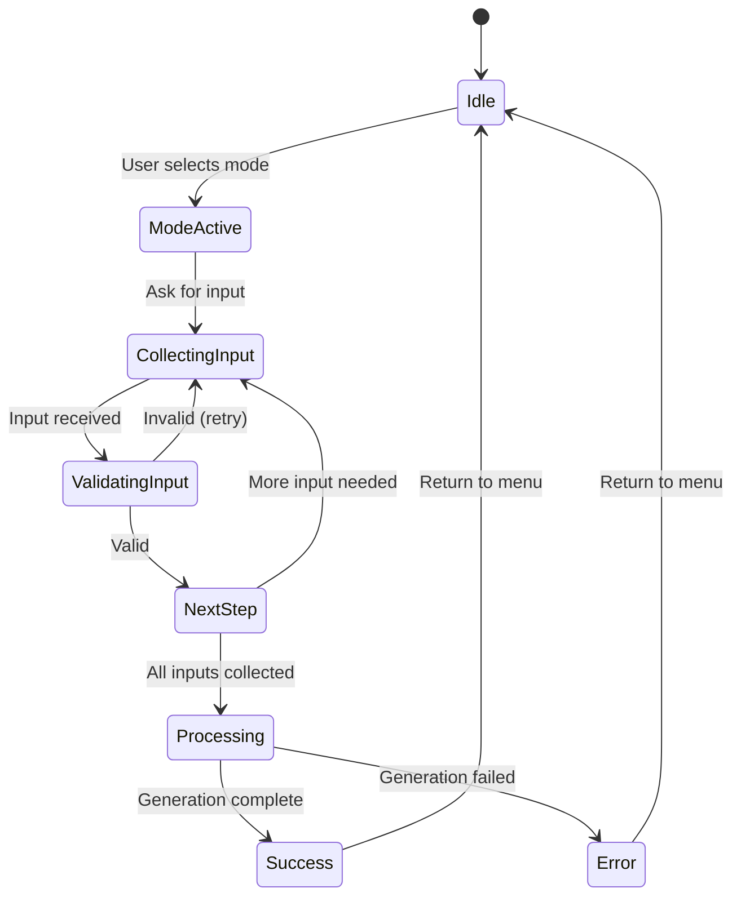

**State Storage Pattern:**

Store state in `context.user_data` with this structure:
```python
context.user_data = {
    'mode': 'free|nsfw_face|face_swap|clothes',
    'step': 'waiting_prompt|waiting_style|waiting_photo|processing',
    'data': {
        'prompt': str,
        'style': str,
        'photos': [bytes],
        # mode-specific fields
    },
    'last_activity': datetime
}
```

### 10. Backend Integration Specifications

#### 10.1 API Request Format

All generation requests to backend `/generate` endpoint must follow this structure:

**Common Fields:**
```python
{
    "mode": str,              # Required: "free", "nsfw_face", "face_swap", "clothes"
    "extra_params": {         # Optional: generation parameters
        "seed": int,          # -1 for random
        "steps": int,         # Sampling steps
        "cfg": float,         # Classifier-free guidance scale
        "width": int,         # Image width (multiple of 64)
        "height": int         # Image height (multiple of 64)
    }
}
```

**Mode-Specific Fields:**

Free Generation:
```python
{
    "mode": "free",
    "prompt": str,            # User's text prompt
    "style": str,             # "noir", "super_realism", "anime"
    "add_face": bool          # Future feature flag
}
```

NSFW with Face:
```python
{
    "mode": "nsfw_face",
    "faces": [str],           # List of base64-encoded images
    "prompt": str,            # Scene description
    "style": str,
    "extra_params": {
        "face_strength": float  # 0.0-1.0, default 0.8
    }
}
```

Face Swap:
```python
{
    "mode": "face_swap",
    "source_face": str,       # Base64-encoded source face
    "target_image": str,      # Base64-encoded target image
    "extra_params": {
        "blend_strength": float,      # 0.0-1.0, default 0.85
        "preserve_expression": bool   # Default true
    }
}
```

Clothes Removal:
```python
{
    "mode": "clothes",
    "image": str,             # Base64-encoded input photo
    "style": str,             # "realistic" or "artistic"
    "extra_params": {
        "controlnet_strength": {
            "openpose": float,   # 0.0-1.0, default 0.8
            "depth": float,      # 0.0-1.0, default 0.6
            "canny": float       # 0.0-1.0, default 0.5
        },
        "inpaint_denoise": float  # 0.0-1.0, default 0.7
    }
}
```

#### 10.2 API Response Format

Expected response structure from `/generate` endpoint:

**Success Response:**
```python
{
    "status": "done",
    "task_id": str,           # UUID for tracking
    "image": str,             # Base64-encoded PNG/JPEG
    "metadata": {
        "seed": int,          # Actual seed used
        "steps": int,
        "cfg": float,
        "execution_time": float  # Seconds
    }
}
```

**Error Response:**
```python
{
    "status": "error",
    "task_id": str,
    "error": str,             # User-friendly error message
    "error_code": str         # Machine-readable error code
}
```

#### 10.3 Timeout and Retry Strategy

Generation requests can take significant time. Implement these timeout policies:

| Operation | Timeout | Retry Policy |
|-----------|---------|--------------|
| Free Generation | 120 seconds | No retry (user can retry manually) |
| NSFW Face | 180 seconds | No retry |
| Face Swap | 90 seconds | No retry |
| Clothes Removal | 180 seconds | No retry |

Use `httpx.AsyncClient` with configured timeout:
```python
async with httpx.AsyncClient(timeout=180.0) as client:
    response = await client.post(...)
```

If timeout occurs:
- Display user-friendly timeout message
- Log timeout event
- Return user to main menu
- Do not block bot for other users

### 11. Image Handling

#### 11.1 Photo Upload Processing

When user uploads photos:

1. **Download:** Use `await photo.get_file()` and `await file.download_as_bytearray()`
2. **Validation:**
   - Check file size (max 10MB)
   - Verify image format (JPEG, PNG)
   - Check minimum resolution (512x512)
3. **Encoding:** Convert to base64 for API transmission
4. **Storage:** Keep in memory during conversation, discard after generation
5. **Cleanup:** Clear from memory on completion or timeout

**Photo Validation Rules:**

| Check | Requirement | Error Message Key |
|-------|-------------|-------------------|
| File size | ≤ 10 MB | `error_photo_too_large` |
| Format | JPEG or PNG | `error_invalid_format` |
| Resolution | ≥ 512x512 | `error_resolution_too_low` |
| Face detection (mode-specific) | At least 1 face | `error_no_face_detected` |

#### 11.2 Image Result Handling

When receiving generated image from backend:

1. **Decode:** Convert base64 string to bytes
2. **Validation:** Verify not corrupted
3. **Send:** Use `await message.reply_photo()` with BytesIO
4. **Caption:** Include generation metadata (style, prompt snippet)
5. **Cleanup:** Release memory after sending

**Caption Format:**

For Free Generation:
> "✅ Generated with **[Style]** style!
> 
> Prompt: _[first 100 chars of prompt]_"

For NSFW Face:
> "✅ Generated with your face in **[Style]** style!
> 
> Scene: _[prompt snippet]_"

For Face Swap:
> "✅ Face swap complete!"

For Clothes Removal:
> "✅ Processing complete!"

### 12. Logging Strategy

#### 12.1 Log Levels and Content

Implement structured logging with these levels:

**INFO Level:**
- User interactions (start, mode selection, prompt submission)
- Generation requests sent to backend
- Successful generation completions
- Language changes

**WARNING Level:**
- Input validation failures (recoverable)
- Photo upload issues (size, format)
- API response delays (> 60 seconds)

**ERROR Level:**
- Backend API failures
- Generation errors
- Unexpected exceptions
- State management errors

#### 12.2 Log Format

Use consistent log format:
```
TIMESTAMP - MODULE - LEVEL - user_id=ID lang=LANG - MESSAGE
```

Example:
```
2024-01-15 14:23:01 - handlers.free - INFO - user_id=123456 lang=ru - Free generation started, prompt="beautiful landscape..."
2024-01-15 14:23:45 - handlers.free - INFO - user_id=123456 lang=ru - Generation completed, task_id=abc-123, time=44.2s
```

#### 12.3 Log File Location

Logs should be written to:
```
/workspace/logs/telegram_bot.log
```

Use rotating file handler:
- Max file size: 10 MB
- Keep last 5 files
- Format: `telegram_bot.log`, `telegram_bot.log.1`, etc.

### 13. Testing and Validation Requirements

#### 13.1 Functional Testing Checklist

Before deployment, verify each feature:

**Language System:**
- [ ] All 7 languages selectable
- [ ] Language persists across bot restarts
- [ ] All UI elements display in correct language
- [ ] Fallback to English works for missing translations

**Free Generation:**
- [ ] Prompt guide displays correctly
- [ ] Example prompts selectable
- [ ] Style selection works
- [ ] Image generation completes
- [ ] Result sent to user
- [ ] Returns to main menu

**NSFW Face:**
- [ ] 1-5 photos uploadable
- [ ] Face detection validates photos
- [ ] Custom and template prompts work
- [ ] Face embedding integrated in generation
- [ ] Result shows correct face

**Face Swap:**
- [ ] Source and target photos accepted
- [ ] Face swap completes
- [ ] Result quality acceptable

**Clothes Removal:**
- [ ] Photo upload and validation works
- [ ] ControlNet preserves pose
- [ ] Anatomical correctness maintained
- [ ] Style selection applies correctly

**Error Handling:**
- [ ] Invalid inputs show appropriate errors
- [ ] Timeouts handled gracefully
- [ ] Backend errors don't crash bot
- [ ] Users always return to main menu

#### 13.2 Test Execution Protocol

For each mode, perform three test runs with:
1. Simple case (minimal complexity)
2. Complex case (multiple features, long prompt)
3. Edge case (boundary conditions, unusual inputs)

Document results:
- Screenshot of successful execution
- Log excerpts showing request/response
- Generation time
- Image quality assessment

#### 13.3 Acceptance Criteria

Deployment is ready when:
- All 5 generation modes functional
- All 7 languages display correctly
- Error messages localized and helpful
- Image quality meets minimum standards
- Response times under maximum thresholds
- Logs capture all important events
- No critical bugs in 10 consecutive test runs

## Deployment and Operations

### 14. Deployment Steps

#### 14.1 Pre-Deployment Checklist

Before starting implementation:

1. **Verify RunPod Access:**
   - [ ] SSH connection working: `ssh runpod-pod`
   - [ ] Write access to `/workspace`
   - [ ] Python 3.10+ available
   - [ ] pip install functional

2. **Check Existing Services:**
   - [ ] Backend running and healthy
   - [ ] GPU server responding
   - [ ] ComfyUI accessible
   - [ ] Pony XL model loaded

3. **Backup Current State:**
   - [ ] Copy existing telegram_bot directory
   - [ ] Save current bot.py state
   - [ ] Document current functionality

#### 14.2 Implementation Sequence

Implement features in this order to minimize risk:

**Phase 1: Localization Foundation**
1. Create `locales/` directory structure
2. Populate all 7 locale JSON files
3. Implement locale manager module
4. Test locale loading and fallback

**Phase 2: Enhanced Main Menu**
1. Update start.py with language selection
2. Implement language persistence (user_languages.json)
3. Expand main menu buttons
4. Test all menu navigations

**Phase 3: Free Generation Enhancement**
1. Add prompt guide displays
2. Implement example prompt selection
3. Test with existing backend integration
4. Verify prompt enhancement

**Phase 4: NSFW Face Mode**
1. Create nsfw_face.py handler
2. Implement photo upload and validation
3. Build nsfw_face.json workflow in ComfyUI
4. Integrate backend support
5. Test end-to-end

**Phase 5: Face Swap Mode**
1. Create face_swap.py handler
2. Build face_swap.json workflow
3. Integrate backend support
4. Test face detection and swap quality

**Phase 6: Clothes Removal Enhancement**
1. Update clothes.py with new workflow
2. Build clothes_removal.json with ControlNet
3. Test pose preservation
4. Validate anatomical correctness

**Phase 7: Information Features**
1. Implement info.py handler
2. Create placeholder responses
3. Add external link buttons
4. Test link navigation

**Phase 8: Final Integration**
1. Update requirements.txt
2. Configure logging
3. Run comprehensive tests
4. Document all changes

#### 14.3 Rollback Plan

If critical issues arise during deployment:

1. **Stop Bot:**
   ```
   ssh runpod-pod "pkill -f 'python.*bot.py'"
   ```

2. **Restore Backup:**
   ```
   ssh runpod-pod "cp -r /workspace/telegram_bot.backup /workspace/telegram_bot"
   ```

3. **Restart Original Bot:**
   ```
   ssh runpod-pod "cd /workspace/telegram_bot && python bot.py > telegram.log 2>&1 &"
   ```

4. **Verify Service:**
   ```
   ssh runpod-pod "ps aux | grep bot.py"
   ```

### 15. Post-Deployment Monitoring

#### 15.1 Health Check Procedures

After deployment, verify:

1. **Bot Responsiveness:**
   - Send `/start` command
   - Verify language selection appears
   - Test each mode selection

2. **Backend Integration:**
   - Trigger one generation per mode
   - Verify successful completion
   - Check logs for errors

3. **Log Analysis:**
   - Review telegram_bot.log for errors
   - Check backend.log for API calls
   - Monitor gpu_server.log for workflow execution

#### 15.2 Performance Metrics

Monitor these metrics:

| Metric | Target | Warning Threshold |
|--------|--------|-------------------|
| Bot response time | < 1 second | > 3 seconds |
| Free generation time | 30-60 seconds | > 120 seconds |
| NSFW/Face generation | 45-90 seconds | > 180 seconds |
| Face swap time | 20-40 seconds | > 90 seconds |
| Clothes removal time | 60-120 seconds | > 180 seconds |
| Error rate | < 5% | > 10% |

#### 15.3 Log Monitoring Commands

To view logs in real-time:

```bash
# Telegram bot logs
ssh runpod-pod "tail -f /workspace/logs/telegram_bot.log"

# Backend API logs
ssh runpod-pod "tail -f /workspace/logs/backend.log"

# GPU server logs
ssh runpod-pod "tail -f /workspace/logs/gpu_server.log"

# All logs combined
ssh runpod-pod "tail -f /workspace/logs/*.log"
```

To check for errors:

```bash
# Recent errors in telegram bot
ssh runpod-pod "grep ERROR /workspace/logs/telegram_bot.log | tail -20"

# Count error frequency
ssh runpod-pod "grep ERROR /workspace/logs/telegram_bot.log | wc -l"
```

### 16. Documentation Requirements

#### 16.1 Code Documentation

All new modules must include:

**Module-Level Docstrings:**
- Purpose of the module
- Key functions/classes overview
- Usage examples

**Function/Method Docstrings:**
- Purpose description
- Parameter types and meanings
- Return value description
- Exceptions raised

**Inline Comments:**
- Complex logic explanations
- Non-obvious design decisions
- References to external resources

#### 16.2 Operational Documentation

Create these documentation files:

**TELEGRAM_BOT_GUIDE.md:**
- How to start/stop the bot
- How to change configuration
- How to add new languages
- How to update prompts and templates

**WORKFLOW_GUIDE.md:**
- Description of each workflow
- Parameter ranges and effects
- Model requirements
- How to modify workflows

**TROUBLESHOOTING.md:**
- Common error scenarios
- Resolution procedures
- Log interpretation guide
- Contact escalation path

#### 16.3 Deployment Report Format

After completing implementation, provide:

1. **File Tree:**
   ```
   /workspace/telegram_bot/
   /workspace/gpu_server/workflows/
   ```

2. **Changed Files List:**
   - Full path of each modified file
   - Brief description of changes

3. **New Files List:**
   - Full path of each created file
   - Purpose of the file

4. **Test Results:**
   - Three successful runs per mode
   - Screenshots or log excerpts
   - Execution times

5. **Localization Structure:**
   - Confirmation all 7 languages present
   - Sample text from each locale file

6. **Known Issues:**
   - Any limitations or incomplete features
   - Planned future enhancements
   - Temporary workarounds

## Dependencies and Requirements

### 17. Python Dependencies

Required packages in `requirements.txt`:

```
python-telegram-bot==20.7
httpx==0.25.2
python-dotenv==1.0.0
pydantic==2.5.0
pydantic-settings==2.1.0
pillow==10.1.0
```

### 18. Environment Variables

Required in `.env` file:

| Variable | Purpose | Example |
|----------|---------|---------|
| `TELEGRAM_BOT_TOKEN` | Bot API token | `8420116928:AAEg1qPoL...` |
| `BACKEND_API_URL` | Backend endpoint | `http://localhost:8000` |
| `MAX_IMAGE_SIZE_MB` | Upload size limit | `10` |
| `CONVERSATION_TIMEOUT` | Session timeout | `300` |
| `LOG_LEVEL` | Logging verbosity | `INFO` |

### 19. External Model Requirements

Models needed on GPU server:

| Model | Purpose | Location |
|-------|---------|----------|
| Pony Diffusion XL | Base generation | `/workspace/models/checkpoints/` |
| CyberRealisticPony_v14 | Face swap | `/workspace/models/checkpoints/` |
| IP-Adapter FaceID | Face embedding | `/workspace/models/ipadapter/` |
| InsightFace | Face detection | `/workspace/models/insightface/` |
| ControlNet OpenPose | Pose preservation | `/workspace/models/controlnet/` |
| ControlNet Depth | Depth preservation | `/workspace/models/controlnet/` |
| ControlNet Canny | Edge preservation | `/workspace/models/controlnet/` |

Verify model availability before implementing dependent features.

## Risk Assessment and Mitigation

### 20. Identified Risks

| Risk | Probability | Impact | Mitigation |
|------|------------|--------|------------|
| Model files missing | Medium | High | Verify before workflow creation; document downloads |
| Locale files incomplete | Low | Medium | Use schema validation; test all languages |
| Generation timeout frequent | Medium | Medium | Set realistic timeouts; guide users on prompt complexity |
| Face detection failures | Medium | Low | Clear photo requirements; validation feedback |
| Backend overload | Low | High | Implement request queuing (future); limit concurrent users |
| State loss on restart | High | Low | Persist language preferences; graceful degradation |
| Memory leaks from photos | Medium | Medium | Aggressive cleanup; limit photo count |

### 21. Mitigation Strategies

**For Model Missing:**
- Before creating workflows, list all models in ComfyUI
- Document exact checkpoint names
- Provide download links if models need installation

**For Translation Quality:**
- Use professional translation service or native speakers
- Test each language with native speaker
- Provide easy update mechanism for corrections

**For Performance Issues:**
- Monitor generation times in logs
- Implement per-user cooldown (future)
- Provide queue position feedback (future)

**For State Management:**
- Persist critical data (language preference)
- Accept ephemeral conversation state
- Provide easy restart via `/start`

## Success Criteria

### 22. Completion Checklist

Implementation is complete when:

**Functional Requirements:**
- [ ] Language selection works for all 7 languages
- [ ] All UI text properly localized
- [ ] Free generation mode enhanced with guides
- [ ] NSFW face mode fully implemented
- [ ] Face swap mode functional
- [ ] Clothes removal mode enhanced with ControlNet
- [ ] All information buttons present (placeholder content acceptable)

**Integration Requirements:**
- [ ] All modes call backend API correctly
- [ ] Backend routes requests to appropriate workflows
- [ ] GPU server executes all 5 workflows
- [ ] Results return to users successfully

**Quality Requirements:**
- [ ] No critical bugs in manual testing
- [ ] Error messages helpful and localized
- [ ] Generation times within acceptable ranges
- [ ] Image quality meets minimum standards
- [ ] Logs capture important events

**Documentation Requirements:**
- [ ] All code documented with docstrings
- [ ] Operational guides created
- [ ] Deployment report delivered
- [ ] Known issues documented

### 23. Acceptance Testing

Final acceptance requires:

1. **Demonstration of All Modes:**
   - Record successful generation from each mode
   - Show localization working in at least 3 languages
   - Demonstrate error recovery

2. **Performance Validation:**
   - Provide timing data for 10 generations
   - Show average, min, max times per mode
   - Confirm within acceptable ranges

3. **Code Quality:**
   - No critical linting errors
   - Consistent formatting
   - Comprehensive docstrings

4. **Deployment Evidence:**
   - File tree showing structure
   - Log excerpts showing successful operations
   - Screenshots of bot interface

## Future Enhancements

### 24. Planned Improvements

**Phase 2 Features (Post-MVP):**
- User account system with usage tracking
- Referral program database integration
- Advanced parameter customization UI
- Image history and favorites
- Batch generation support
- Custom style training

**Infrastructure Improvements:**
- Redis-backed state management
- Request queuing system
- Multi-instance bot deployment
- Prometheus metrics export
- Automated monitoring alerts

**UX Enhancements:**
- Inline query support
- Web app interface
- Progress bars for generation
- Premium features and subscriptions
- Community gallery

These enhancements should be prioritized based on user feedback and usage analytics after initial deployment.

---

## Implementation Notes

### Priority Order

Implement features in this priority order:
1. **Critical:** Language system, Free Generation enhancement
2. **High:** NSFW Face mode, state management improvements
3. **Medium:** Face Swap, Clothes Removal enhancements
4. **Low:** Information placeholders, external links

### Development Approach

- Work incrementally: complete one mode fully before starting next
- Test thoroughly after each feature addition
- Commit working code frequently
- Document as you build, not after
- Validate against real ComfyUI workflows, not assumptions

### Collaboration Points

Clarify with stakeholders before proceeding:
- Exact external link URLs for channel, chat, instructions
- Content for referral program explanation
- Approval of example prompts (especially NSFW templates)
- Acceptable generation time thresholds
- Budget for translation services (if needed)

---

## Appendix A: Detailed ComfyUI Workflow Specifications

### A.1 Workflow 1: free_generation.json

**Purpose:** Pure text-to-image generation. Foundation for all modes.

**File:** `/workspace/gpu_server/workflows/free_generation.json`

**Node Structure:**

| ID | Type | Inputs | Outputs |
|----|------|--------|--------|
| 4 | CheckpointLoaderSimple | `ckpt_name: "cyberrealisticPony_v14.safetensors"` | MODEL→3, CLIP→6/7, VAE→8 |
| 6 | CLIPTextEncode (positive) | `text: <dynamic>`, `clip: [4,1]` | CONDITIONING→3 |
| 7 | CLIPTextEncode (negative) | `text: <dynamic>`, `clip: [4,1]` | CONDITIONING→3 |
| 5 | EmptyLatentImage | `width: <dynamic>`, `height: <dynamic>`, `batch_size: 1` | LATENT→3 |
| 3 | KSampler | `model: [4,0]`, `positive: [6,0]`, `negative: [7,0]`, `latent_image: [5,0]`, `seed: <dynamic>`, `steps: <dynamic>`, `cfg: <dynamic>`, `sampler_name: <dynamic>`, `scheduler: "normal"`, `denoise: 1.0` | LATENT→8 |
| 8 | VAEDecode | `samples: [3,0]`, `vae: [4,2]` | IMAGE→9 |
| 9 | SaveImage | `images: [8,0]`, `filename_prefix: "free_gen"` | Saves to `/workspace/ComfyUI/output/` |

**Modification Requirements:**
1. Update node 4 `ckpt_name` to `"cyberrealisticPony_v14.safetensors"`
2. Verify `comfy_client.inject_parameters()` maps correctly to nodes 3,5,6,7
3. Confirm VAE is compatible with CyberRealisticPony

### A.2 Workflow 2: clothes_removal.json

**Purpose:** Inpainting-based clothing removal with ControlNet pose/depth/edge preservation.

**File:** `/workspace/gpu_server/workflows/clothes_removal.json` (new)

**Node Structure:**

| ID | Type | Purpose | Key Connections |
|----|------|---------|------------------|
| **1** | LoadImage | Input photo | IMAGE→10/11/12/13 |
| **2** | LoadImage | Mask (optional) | MASK→25 |
| **10** | SegmentClothes / MaskNode | Generate clothing mask | MASK→25 |
| **11** | CannyEdgeDetector | Extract edges | IMAGE→14 |
| **12** | DepthMapEstimator | Extract depth | IMAGE→15 |
| **13** | OpenPosePreprocessor | Extract pose | IMAGE→16 |
| **14** | ControlNetLoader | Load Canny ControlNet | `control_net_name: "control_v11p_sd15_canny.pth"` |
| **15** | ControlNetLoader | Load Depth ControlNet | `control_net_name: "control_v11f1p_sd15_depth.pth"` |
| **16** | ControlNetLoader | Load OpenPose ControlNet | `control_net_name: "control_v11p_sd15_openpose.pth"` |
| **4** | CheckpointLoaderSimple | Load model | Same as free_generation |
| **6** | CLIPTextEncode (positive) | Prompt | CONDITIONING→3 |
| **7** | CLIPTextEncode (negative) | Negative prompt | CONDITIONING→3 |
| **5** | EmptyLatentImage | Base latent (fallback) | LATENT (if needed) |
| **25** | InpaintLatent / LatentComposite | Combine image + mask | LATENT→3 |
| **3** | KSampler (with ControlNet) | Main sampling | With ControlNet conditioning from 14/15/16 |
| **8** | VAEDecode | Decode | IMAGE→9 |
| **9** | SaveImage | Save output | |

**ControlNet Integration:**
- Node 14 (Canny) applies with `strength: 0.5`
- Node 15 (Depth) applies with `strength: 0.6`
- Node 16 (OpenPose) applies with `strength: 0.8`
- All three conditioning streams merge before KSampler

**Parameter Injection Points:**
- Node 3: `seed`, `steps`, `cfg`, `sampler_name`, `denoise: 0.7-1.0`
- Node 6: `text` (prompt: "detailed realistic body, natural skin texture...")
- Node 7: `text` (negative: "clothing, dressed, deformed, bad anatomy...")
- ControlNet strengths: via `extra_params.controlnet_strength`

### A.3 Workflow 3: nsfw_face.json

**Purpose:** Generate NSFW content with face embedding via IP-Adapter FaceID.

**File:** `/workspace/gpu_server/workflows/nsfw_face.json` (new)

**Node Structure:**

| ID | Type | Purpose | Connections |
|----|------|---------|-------------|
| **20** | LoadImage | Face photo 1 (primary) | IMAGE→22 |
| **21** | LoadImage | Face photo 2-5 (optional) | IMAGE→22 |
| **22** | FaceEmbed / InsightFaceEmbed | Extract face embeddings | FACE_EMBED→24 |
| **4** | CheckpointLoaderSimple | Load model | MODEL→3, CLIP→6/7, VAE→8 |
| **6** | CLIPTextEncode (positive) | Scene prompt (body/pose/environment) | CONDITIONING→24 |
| **7** | CLIPTextEncode (negative) | Negative prompt | CONDITIONING→3 |
| **24** | IPAdapterFaceID | Merge face embedding into conditioning | positive_conditioning_out→3 |
| **5** | EmptyLatentImage | Canvas | LATENT→3 |
| **3** | KSampler | Main sampling | LATENT→8 |
| **8** | VAEDecode | Decode | IMAGE→9 |
| **9** | SaveImage | Save | |

**Face Processing Logic:**
1. LoadImage (20/21) loads 1-5 face photos
2. InsightFace (22) detects faces and extracts 512-d embeddings
3. If multiple photos: average embeddings or weight first photo higher
4. IPAdapterFaceID (24) receives:
   - `face_embed` from node 22
   - `positive_conditioning_in` from node 6 (scene prompt)
   - `strength` parameter (default 0.8)
   - Outputs modified conditioning to KSampler
5. KSampler generates image with face-aware conditioning

**Parameter Injection:**
- Node 3: `seed`, `steps`, `cfg`, `sampler_name`
- Node 5: `width`, `height` (768x1152 or 832x1216)
- Node 6: Scene prompt (no face description)
- Node 7: Negative prompt
- Node 24: `face_strength` from `extra_params.face_strength`

---

## Appendix B: Comprehensive Testing Protocols

### B.1 Multi-Language Bot Testing

**Objective:** Verify language selection, persistence, and UI localization for all 7 languages.

**Test Matrix:**

| Language | Code | Test Actions | Success Criteria |
|----------|------|--------------|------------------|
| Russian | ru | Send `/start`, select 🇷🇺 Русский | Menu displays in Russian, no corrupted characters |
| English | en | Send `/start`, select 🇬🇧 English | Menu displays in English |
| German | de | Send `/start`, select 🇩🇪 Deutsch | Menu displays in German |
| Turkish | tr | Send `/start`, select 🇹🇷 Türkçe | Menu displays in Turkish |
| Spanish | es | Send `/start`, select 🇪🇸 Español | Menu displays in Spanish |
| French | fr | Send `/start`, select 🇫🇷 Français | Menu displays in French |
| Arabic | ar | Send `/start`, select 🇦🇪 العربية | Menu displays in Arabic (RTL if supported) |

**For Each Language:**

1. **Initial Selection:**
   - Send `/start` to bot
   - Verify language selection menu appears
   - Verify all 7 language names display correctly (no mojibake)
   - Select target language
   - Verify main menu appears in selected language

2. **Persistence Test:**
   - After selecting language, send `/start` again
   - Verify language is remembered (doesn't ask again)
   - Or verify language can be changed if that's the design

3. **UI Element Localization:**
   - Verify all buttons are translated
   - Verify all system messages (errors, confirmations) are translated
   - Verify prompt guides and examples are in target language

4. **Error Message Localization:**
   - Trigger validation error (send non-image when image expected)
   - Verify error message displays in selected language

### B.2 End-to-End Mode Testing

#### B.2.1 Free Generation Mode Test

**Test Case 1: Simple Prompt (Russian)**

1. In bot, select "🎨 Свободная генерация" (if Russian) or equivalent
2. Verify bot asks for prompt with guidance
3. Send prompt: `"красивая девушка на пляже, закат, мягкий свет"`
4. Verify bot shows style selection: Nuar / Superrealizm / Anime
5. Select "Суперреализм"
6. Verify bot shows "Генерирую..." message
7. Wait for generation

**Success Criteria:**
- Backend receives request with `mode="free"`, `style="super_realism"`, correct prompt
- Backend logs show request to GPU server
- GPU server logs show workflow execution
- Bot sends image back to user within 30-60 seconds
- No Python tracebacks in logs

**Test Case 2: Simple Prompt (English)**

1. Select "🎨 Free Generation"
2. Send prompt: `"beautiful girl on the beach at sunset, soft warm light"`
3. Select "Super Realism"
4. Verify image generation completes

**Test Case 3: Error Handling**

1. Enter mode
2. Send very short prompt (< 3 characters): `"hi"`
3. Verify bot shows error: "Prompt too short, please provide detailed description"
4. Verify bot doesn't crash, allows retry

#### B.2.2 Remove Clothes Mode Test

**Test Case 1: Valid Photo**

1. Select "🩳 Удалить одежду" (or localized equivalent)
2. Verify bot requests 1 photo with clear instructions
3. Send valid JPEG/PNG photo (full body or upper body)
4. Verify bot processes photo (converts to base64)
5. Bot may show style selection or proceed directly
6. Wait for generation (30-90 seconds acceptable)

**Success Criteria:**
- Bot correctly encodes photo to base64
- Backend receives `mode="remove_clothes"`, `target_image=<base64>`
- GPU server executes `clothes_removal` workflow
- ControlNet models load without errors
- Output image maintains pose from input
- Bot sends result back

**Test Case 2: Invalid Input (Sticker)**

1. Enter mode
2. Send Telegram sticker instead of photo
3. Verify bot responds: "Это не картинка. Отправьте фото в формате JPG или PNG"
4. Verify bot doesn't crash, waits for valid photo

**Test Case 3: Invalid Input (Non-Image File)**

1. Enter mode
2. Send text file or document
3. Verify bot rejects gracefully

#### B.2.3 NSFW Face Mode Test

**Test Case 1: Single Face Photo**

1. Select "🔥 NSFW с лицом"
2. Verify bot requests 1-5 face photos, explains first is primary
3. Send 1 clear face photo
4. Verify bot requests scene prompt
5. Send prompt: `"woman in lingerie on bed, cinematic lighting, detailed skin"`
6. Select style: Super Realism
7. Wait for generation (45-90 seconds)

**Success Criteria:**
- Bot validates face detection in photo
- Backend receives `mode="nsfw_face"`, `face_images=[<base64>]`, prompt
- GPU server executes `nsfw_face` workflow
- InsightFace and IP-Adapter nodes execute
- Generated image shows face from input photo
- Quality is acceptable

**Test Case 2: Multiple Face Photos**

1. Enter mode
2. Send 3 face photos sequentially
3. Bot acknowledges each
4. After 3rd photo, send prompt
5. Verify aggregation of face embeddings

**Test Case 3: No Face Detected**

1. Enter mode
2. Send photo without clear face (landscape, object)
3. Verify bot responds: "No face detected. Please send clear face photo"
4. Allows retry

**Test Case 4: Wrong Input After Faces**

1. Send face photos
2. When bot asks for prompt, send voice message or sticker
3. Verify bot responds: "Please send text prompt describing scene"
4. Doesn't crash

### B.3 API Integration Testing

**Objective:** Verify bot → backend HTTP communication.

**Setup:**
- Enable request logging in bot code:
  ```python
  logger.info(f"Sending to backend: URL={url}, payload_size={len(json)}, mode={data['mode']}")
  logger.info(f"Backend response: status={response.status_code}, has_image={bool(result.get('image'))}")
  ```

**Test Procedure:**

1. Run through all 3 modes in Russian language
2. For each interaction, verify in bot logs:
   - HTTP POST request sent to `http://localhost:8000/generate`
   - Payload contains correct `mode`, `style`, `prompt`, `extra_params`
   - Response status 200
   - Response contains `status`, `image`, `metadata` fields
3. Verify no silent failures (button click but no request)

### B.4 Fallback and Error Testing

#### B.4.1 Backend Unavailable Test

**Setup:**
1. SSH to POD: `ssh runpod-pod`
2. Stop backend: `pkill -f 'uvicorn.*main:app'`
3. Verify backend down: `curl http://localhost:8000/health` (should fail)

**Test:**
1. In bot, try to generate image (any mode)
2. Verify bot shows: "Сервис временно недоступен. Попробуйте позже" (or localized)
3. Bot doesn't hang showing "typing..."
4. Bot doesn't crash
5. User can retry with `/start`

**Cleanup:**
1. Restart backend: `cd /workspace && ./startup.sh`

#### B.4.2 Backend Validation Error Test

**Setup:**
- Modify bot to send invalid request (e.g., missing required field)

**Test:**
1. Send malformed request
2. Backend returns 400/422 with error details
3. Bot shows user-friendly message in selected language
4. Bot does NOT show raw JSON error to user
5. Logs contain full error for debugging

#### B.4.3 Generation Timeout Test

**Setup:**
- Temporarily increase steps to very high number (e.g., 200) to force timeout

**Test:**
1. Trigger generation
2. After httpx timeout (180s), verify bot shows timeout message
3. Bot returns to main menu
4. Bot remains functional for other requests

### B.5 Workflow-Specific GPU Server Tests

#### B.5.1 Free Generation Workflow Test

**Direct GPU Server Test (bypassing backend):**

```bash
ssh runpod-pod
cd /workspace

# Create test request JSON
cat > test_free.json << 'EOF'
{
  "workflow": "free_generation",
  "params": {
    "prompt": "portrait of a girl at sunset, detailed skin, warm light",
    "negative_prompt": "cartoon, anime, lowres, bad anatomy",
    "steps": 30,
    "cfg": 8.0,
    "width": 832,
    "height": 1216,
    "sampler": "euler",
    "seed": -1
  }
}
EOF

# Send to GPU server
curl -X POST http://localhost:7860/generate \
  -H "Content-Type: application/json" \
  --data @test_free.json

# Verify response contains image
# Check ComfyUI output
ls -lt /workspace/ComfyUI/output/ | head -5
```

**Success Criteria:**
- Response status 200
- Response contains `{"status": "done", "image": "<base64>", ...}`
- New PNG file in `/workspace/ComfyUI/output/`
- No errors in `/workspace/logs/gpu_server.log`

#### B.5.2 Clothes Removal Workflow Test

```bash
# Prepare test image
mkdir -p /workspace/test_images
# Upload or create test photo at /workspace/test_images/remove_test.png

# Encode to base64
python3 << 'PYEOF'
import base64
with open("/workspace/test_images/remove_test.png", "rb") as f:
    encoded = base64.b64encode(f.read()).decode()
    print(encoded[:100] + "...")  # Print first 100 chars
    # Save full encoding to file
    with open("/workspace/test_images/remove_test_b64.txt", "w") as out:
        out.write(encoded)
PYEOF

# Create request JSON (insert base64)
cat > test_remove.json << 'EOF'
{
  "workflow": "clothes_removal",
  "params": {
    "target_image": "PASTE_BASE64_HERE",
    "prompt": "detailed realistic body, natural skin, anatomically correct",
    "negative_prompt": "clothing, dressed, deformed, extra limbs",
    "steps": 36,
    "cfg": 8.5,
    "sampler": "dpmpp_2m",
    "seed": 42,
    "controlnet_strength": {
      "openpose": 0.8,
      "depth": 0.6,
      "canny": 0.5
    }
  }
}
EOF

# Manually insert base64 into JSON or use script

# Test
curl -X POST http://localhost:7860/generate \
  -H "Content-Type: application/json" \
  --data @test_remove.json
```

**Success Criteria:**
- No ControlNet model loading errors
- Workflow executes without node mismatch
- Output preserves pose from input
- Generation time 30-90 seconds

#### B.5.3 NSFW Face Workflow Test

```bash
# Prepare face photos
# /workspace/test_images/face1.png, face2.png

# Encode faces
python3 << 'PYEOF'
import base64
faces = []
for i in [1, 2]:
    with open(f"/workspace/test_images/face{i}.png", "rb") as f:
        encoded = base64.b64encode(f.read()).decode()
        faces.append(encoded)
        print(f"Face {i}: {len(encoded)} chars")
# Save to JSON array format
import json
with open("/workspace/test_images/faces_b64.json", "w") as out:
    json.dump(faces, out)
PYEOF

# Create request
cat > test_nsfw_face.json << 'EOF'
{
  "workflow": "nsfw_face",
  "params": {
    "face_images": ["BASE64_FACE1", "BASE64_FACE2"],
    "prompt": "woman in lingerie, cinematic lighting, realistic body",
    "negative_prompt": "cartoon, anime, deformed, bad anatomy",
    "steps": 34,
    "cfg": 8.0,
    "width": 768,
    "height": 1152,
    "sampler": "dpmpp_2m",
    "face_strength": 0.8,
    "seed": -1
  }
}
EOF

# Insert base64 arrays, then test
curl -X POST http://localhost:7860/generate \
  -H "Content-Type: application/json" \
  --data @test_nsfw_face.json
```

**Success Criteria:**
- InsightFace detects faces in all input photos
- IP-Adapter loads and applies face embedding
- Generated image shows recognizable face from inputs
- No "face not detected" errors if photos are valid

---

## Appendix D: Structured JSON Logging System

### D.1 Overview and Purpose

**Objective:** Enable rapid troubleshooting through structured, parsable logs. Any failure or edge case should be identifiable with 2-3 console commands.

**Log File Location:** `/workspace/logs/tg_bot.log`

**Format:** One-line JSON per event (no line breaks)

```json
{"ts":"2025-12-09T20:12:34.123Z","level":"INFO","event":"user_message", ...}
```

**Log Levels:**

| Level | Purpose | Examples |
|-------|---------|----------|
| **DEBUG** | Detailed debugging info (can disable in production) | Parameter injection details, validation steps |
| **INFO** | Normal flow events | User starts mode, generation request sent, success |
| **WARN** | Unusual situations without failure | Face detection failed but recoverable, slow response |
| **ERROR** | Errors, timeouts, generation failures | Backend unavailable, CUDA out of memory, exceptions |

### D.2 Base Event Schema

Every log event includes these common fields:

```json
{
  "ts": "2025-12-09T20:12:34.123Z",
  "level": "INFO",
  "env": "prod",
  "service": "tg_bot",
  "bot_username": "xxx_bot",
  
  "event": "user_message",
  "request_id": "uuid-...",
  "generation_id": "uuid-...",
  
  "user_id": 123456789,
  "chat_id": 123456789,
  "username": "nickname",
  "language": "ru",
  
  "mode": "free|clothes|nsfw_face|face_swap",
  "step": "await_prompt|await_face|await_image|generating|done|error",
  "style": "noir|super_realism|anime|null",
  "ref_source": "organic|referral|partner_bot",
  
  "backend_status": 200,
  "backend_latency_ms": 1243,
  "workflow": "free_generation",
  "quality_profile": "balanced",
  "resolution": "832x1216",
  "retry": 0,
  
  "user_input": "девушка на пляже...",
  "error_code": null,
  "error_message": null
}
```

**Field Descriptions:**

| Field | Type | Required | Description |
|-------|------|----------|-------------|
| `ts` | ISO 8601 | Yes | Timestamp in UTC with milliseconds |
| `level` | string | Yes | DEBUG/INFO/WARN/ERROR |
| `env` | string | Yes | Environment: prod/stage/dev |
| `service` | string | Yes | Always "tg_bot" |
| `bot_username` | string | Yes | Bot's @username |
| `event` | string | Yes | Event type (see D.3) |
| `request_id` | UUID | Context | Unique ID per user request |
| `generation_id` | UUID | Context | Unique ID per generation attempt |
| `user_id` | int | Yes | Telegram user ID |
| `chat_id` | int | Yes | Telegram chat ID |
| `username` | string | Optional | User's @username or null |
| `language` | string | Context | Selected interface language (ru/en/de/tr/es/fr/ar) |
| `mode` | string | Context | Current generation mode |
| `step` | string | Context | Current conversation step |
| `style` | string | Context | Selected style |
| `ref_source` | string | Optional | User acquisition source |
| `backend_status` | int | API events | HTTP status code from backend |
| `backend_latency_ms` | int | API events | Backend response time in milliseconds |
| `workflow` | string | Generation | ComfyUI workflow name |
| `quality_profile` | string | Generation | fast/balanced/high_quality |
| `resolution` | string | Generation | Image dimensions (e.g., "832x1216") |
| `retry` | int | Context | Retry attempt number (0 = first try) |
| `user_input` | string | Input events | User's text input (truncated to 200-300 chars) |
| `error_code` | string | Error events | Machine-readable error code |
| `error_message` | string | Error events | Human-readable error description |

### D.3 Event Types

#### D.3.1 Event: user_message

**When:** Every incoming message from user, before backend call

**Purpose:** Track what user actually wrote in problematic cases

```json
{
  "event": "user_message",
  "level": "INFO",
  "ts": "2025-12-09T20:12:34.123Z",
  "user_id": 123456789,
  "chat_id": 123456789,
  "message_id": 456,
  "language": "ru",
  "mode": "free",
  "step": "await_prompt",
  "text_raw": "Сделай мне девушку на пляже...",
  "has_photo": false,
  "has_document": false,
  "command": "/start"
}
```

**Additional Fields:**
- `message_id`: Telegram message ID
- `text_raw`: Raw message text (truncated if > 300 chars)
- `has_photo`: Boolean, true if message contains photo
- `has_document`: Boolean, true if message contains document/file
- `command`: Telegram command if message is a command, else null

#### D.3.2 Event: start_mode

**When:** User selects mode from menu (button click)

**Purpose:** Track mode selection patterns

```json
{
  "event": "start_mode",
  "level": "INFO",
  "ts": "2025-12-09T20:12:35.456Z",
  "user_id": 123456789,
  "mode": "free",
  "language": "en",
  "from_button": "main_menu"
}
```

**Additional Fields:**
- `from_button`: Source button identifier (main_menu, ref_menu, etc.)

#### D.3.3 Event: start_generation

**When:** Bot is ready to send request to backend (has all inputs: prompt, photos, style, mode)

**Purpose:** Track generation attempts with full context

```json
{
  "event": "start_generation",
  "level": "INFO",
  "ts": "2025-12-09T20:12:40.789Z",
  "request_id": "550e8400-e29b-41d4-a716-446655440000",
  "generation_id": "7c9e6679-7425-40de-944b-e07fc1f90ae7",
  "user_id": 123456789,
  "mode": "free",
  "style": "super_realism",
  "language": "ru",
  "quality_profile": "balanced",
  "resolution": "832x1216",
  "images_count": 0,
  "faces_count": 0,
  "user_prompt": "девушка на пляже, закат, мягкий свет...",
  "workflow": "free_generation"
}
```

**Additional Fields:**
- `images_count`: Number of photos user uploaded (for clothes removal)
- `faces_count`: Number of face photos (for nsfw_face/face_swap modes)
- `user_prompt`: User's prompt text (truncated to 200-300 chars)

**Analytics Use:**
- Filter by mode to see which modes are most active
- Filter by style to see user preferences
- Track quality_profile usage

#### D.3.4 Event: backend_request

**When:** Sending HTTP request to backend `/generate`

**Purpose:** Track API call initiation

```json
{
  "event": "backend_request",
  "level": "DEBUG",
  "ts": "2025-12-09T20:12:40.800Z",
  "request_id": "550e8400-e29b-41d4-a716-446655440000",
  "generation_id": "7c9e6679-7425-40de-944b-e07fc1f90ae7",
  "mode": "free",
  "style": "noir",
  "backend_url": "http://backend:8000/generate",
  "payload_size_kb": 512,
  "timeout_sec": 180
}
```

**Additional Fields:**
- `backend_url`: Full URL being called
- `payload_size_kb`: Approximate request payload size in KB (len(json)/1024)
- `timeout_sec": HTTP client timeout setting

#### D.3.5 Event: backend_response

**When:** Received response from backend (success or error)

**Purpose:** Track backend performance and failures

**Success Response:**

```json
{
  "event": "backend_response",
  "level": "INFO",
  "ts": "2025-12-09T20:13:23.456Z",
  "request_id": "550e8400-e29b-41d4-a716-446655440000",
  "generation_id": "7c9e6679-7425-40de-944b-e07fc1f90ae7",
  "mode": "free",
  "style": "noir",
  "backend_status": 200,
  "backend_latency_ms": 42656,
  "result_status": "done",
  "image_size_kb": 430,
  "error_code": null,
  "error_message": null
}
```

**Error Response:**

```json
{
  "event": "backend_response",
  "level": "ERROR",
  "ts": "2025-12-09T20:13:25.789Z",
  "request_id": "550e8400-e29b-41d4-a716-446655440000",
  "generation_id": "7c9e6679-7425-40de-944b-e07fc1f90ae7",
  "mode": "free",
  "style": "noir",
  "backend_status": 500,
  "backend_latency_ms": 2134,
  "result_status": "failed",
  "image_size_kb": 0,
  "error_code": "GPU_ERROR",
  "error_message": "CUDA out of memory"
}
```

**Additional Fields:**
- `result_status`: done / failed / timeout
- `image_size_kb`: Size of base64-decoded image in KB (if successful)

#### D.3.6 Event: send_result

**When:** Bot successfully sent image to user via Telegram

**Purpose:** Confirm delivery to user

```json
{
  "event": "send_result",
  "level": "INFO",
  "ts": "2025-12-09T20:13:24.123Z",
  "request_id": "550e8400-e29b-41d4-a716-446655440000",
  "generation_id": "7c9e6679-7425-40de-944b-e07fc1f90ae7",
  "user_id": 123456789,
  "mode": "free",
  "style": "super_realism",
  "language": "ru",
  "telegram_message_id": 98765,
  "caption_length": 120
}
```

**Additional Fields:**
- `telegram_message_id`: Telegram's message ID for sent photo
- `caption_length`: Length of photo caption in characters

#### D.3.7 Event: error_user_visible

**When:** Error that user saw as a message (e.g., "Face not detected")

**Purpose:** Track user-facing errors for UX improvement

```json
{
  "event": "error_user_visible",
  "level": "WARN",
  "ts": "2025-12-09T20:14:10.456Z",
  "request_id": "660f9511-f39c-52e5-b827-557766551111",
  "generation_id": "8d0f7780-8536-51f0-c938-f18gd2g01bf8",
  "user_id": 123456789,
  "mode": "nsfw_face",
  "language": "ru",
  "error_code": "NO_FACE_DETECTED",
  "error_message": "Face detection failed in uploaded photo",
  "user_message_sent": "❌ Не удалось распознать лицо. Пришлите более четкое фото."
}
```

**Additional Fields:**
- `error_code`: Machine-readable error code
- `user_message_sent`: Actual message text shown to user

**Common Error Codes:**
- `NO_FACE_DETECTED`: Face detection failed
- `INVALID_IMAGE_FORMAT`: Wrong file format
- `IMAGE_TOO_LARGE`: Exceeds size limit
- `PROMPT_TOO_SHORT`: Prompt validation failed
- `BACKEND_UNAVAILABLE`: Backend service down
- `GENERATION_TIMEOUT`: Request exceeded timeout
- `INVALID_PHOTO_COUNT`: Wrong number of photos (e.g., >5 faces)

#### D.3.8 Event: error_internal

**When:** Something broke in bot code (exception, bug)

**Purpose:** Track bot crashes and bugs for fixing

```json
{
  "event": "error_internal",
  "level": "ERROR",
  "ts": "2025-12-09T20:15:33.789Z",
  "user_id": 123456789,
  "mode": "free",
  "step": "await_prompt",
  "exception_type": "ValueError",
  "exception_message": "Invalid extra_params structure",
  "stack_trace": "Traceback (most recent call last):\n  File ..."
}
```

**Additional Fields:**
- `exception_type`: Python exception class name
- `exception_message`: Exception message
- `stack_trace`: Full traceback (can truncate or write to separate debug log)

### D.4 Quick Analysis Commands

With JSON logs, troubleshooting becomes trivial:

#### D.4.1 Find All Errors

```bash
cd /workspace/logs
grep '"level": "ERROR"' tg_bot.log
```

#### D.4.2 Find Failed Generations

```bash
grep '"event": "backend_response"' tg_bot.log | grep '"result_status": "failed"'
```

#### D.4.3 Find Face Mode Issues

```bash
grep '"mode": "nsfw_face"' tg_bot.log | grep '"level": "ERROR"'
```

#### D.4.4 Find Face Detection Failures

```bash
grep '"error_code": "NO_FACE_DETECTED"' tg_bot.log
```

#### D.4.5 Find All Clothes Removal Generations

```bash
grep '"event": "start_generation"' tg_bot.log | grep '"mode": "clothes"'
```

#### D.4.6 Count Generations by Mode (Last Hour)

```bash
# Get logs from last hour
grep '"event": "start_generation"' tg_bot.log | tail -1000 | \
  grep -o '"mode": "[^"]*"' | sort | uniq -c
```

#### D.4.7 Find Slow Backend Responses (>60s)

```bash
grep '"event": "backend_response"' tg_bot.log | \
  grep -E '"backend_latency_ms": [6-9][0-9]{4}|"backend_latency_ms": [0-9]{6}'
```

#### D.4.8 Track Specific User's Activity

```bash
grep '"user_id": 123456789' tg_bot.log | tail -50
```

#### D.4.9 Find All Timeouts

```bash
grep '"result_status": "timeout"' tg_bot.log
```

### D.5 Python Implementation

**Logger Setup Module:** `telegram_bot/utils/logger.py`

```python
import json
import logging
from datetime import datetime, timezone
from typing import Any
from pathlib import Path

# Ensure log directory exists
LOG_DIR = Path("/workspace/logs")
LOG_DIR.mkdir(parents=True, exist_ok=True)

# Configure base logger
logger = logging.getLogger("tg_bot")
handler = logging.FileHandler(LOG_DIR / "tg_bot.log", encoding="utf-8")
handler.setFormatter(logging.Formatter("%(message)s"))
logger.addHandler(handler)
logger.setLevel(logging.INFO)

# Also log to console for development
console_handler = logging.StreamHandler()
console_handler.setFormatter(logging.Formatter(
    "%(asctime)s - %(levelname)s - %(message)s"
))
logger.addHandler(console_handler)


def log_event(level: str, event: str, **payload: Any) -> None:
    """
    Log structured JSON event.
    
    Args:
        level: Log level (DEBUG, INFO, WARN, ERROR)
        event: Event type (user_message, start_generation, etc.)
        **payload: Additional fields for the event
    """
    record = {
        "ts": datetime.now(timezone.utc).isoformat(),
        "level": level.upper(),
        "service": "tg_bot",
        "event": event,
        **payload,
    }
    
    # Convert to JSON string (ensure_ascii=False for proper UTF-8)
    log_line = json.dumps(record, ensure_ascii=False)
    
    # Log at appropriate level
    log_level = getattr(logging, level.upper(), logging.INFO)
    logger.log(log_level, log_line)
```

**Usage Examples:**

```python
from utils.logger import log_event
import uuid

# When user sends message
log_event(
    "info",
    "user_message",
    user_id=update.effective_user.id,
    chat_id=update.effective_chat.id,
    message_id=update.message.message_id,
    language=context.user_data.get("language", "en"),
    mode=context.user_data.get("mode"),
    step=context.user_data.get("step"),
    text_raw=update.message.text[:300] if update.message.text else None,
    has_photo=bool(update.message.photo),
    has_document=bool(update.message.document),
    command=update.message.text if update.message.text and update.message.text.startswith("/") else None
)

# When starting generation
request_id = str(uuid.uuid4())
generation_id = str(uuid.uuid4())

log_event(
    "info",
    "start_generation",
    request_id=request_id,
    generation_id=generation_id,
    user_id=update.effective_user.id,
    mode=context.user_data["mode"],
    style=context.user_data["style"],
    language=context.user_data["language"],
    quality_profile=extra_params.get("quality_profile", "balanced"),
    resolution=f"{width}x{height}",
    images_count=len(context.user_data.get("photos", [])),
    faces_count=len(context.user_data.get("faces", [])),
    user_prompt=context.user_data["prompt"][:300],
    workflow=workflow_name
)

# Before backend request
log_event(
    "debug",
    "backend_request",
    request_id=request_id,
    generation_id=generation_id,
    mode=mode,
    style=style,
    backend_url=f"{backend_url}/generate",
    payload_size_kb=len(json.dumps(request_data)) // 1024,
    timeout_sec=180
)

# After backend response (success)
import time
start_time = time.time()
# ... make request ...
latency_ms = int((time.time() - start_time) * 1000)

log_event(
    "info",
    "backend_response",
    request_id=request_id,
    generation_id=generation_id,
    mode=mode,
    style=style,
    backend_status=response.status_code,
    backend_latency_ms=latency_ms,
    result_status=result.get("status"),
    image_size_kb=len(base64.b64decode(result["image"])) // 1024 if result.get("image") else 0,
    error_code=result.get("error_code"),
    error_message=result.get("error")
)

# When sending result to user
log_event(
    "info",
    "send_result",
    request_id=request_id,
    generation_id=generation_id,
    user_id=update.effective_user.id,
    mode=mode,
    style=style,
    language=context.user_data["language"],
    telegram_message_id=sent_message.message_id,
    caption_length=len(caption)
)

# User-visible error
log_event(
    "warn",
    "error_user_visible",
    request_id=request_id,
    generation_id=generation_id,
    user_id=update.effective_user.id,
    mode=mode,
    language=context.user_data["language"],
    error_code="NO_FACE_DETECTED",
    error_message="Face detection failed in uploaded photo",
    user_message_sent=error_messages[lang]["no_face_detected"]
)

# Internal exception
try:
    # ... code ...
except Exception as e:
    import traceback
    log_event(
        "error",
        "error_internal",
        user_id=update.effective_user.id,
        mode=context.user_data.get("mode"),
        step=context.user_data.get("step"),
        exception_type=type(e).__name__,
        exception_message=str(e),
        stack_trace=traceback.format_exc()
    )
```

### D.6 Log Rotation and Retention

**Automatic Rotation:**

Use Python's `RotatingFileHandler` to prevent logs from growing indefinitely:

```python
from logging.handlers import RotatingFileHandler

handler = RotatingFileHandler(
    LOG_DIR / "tg_bot.log",
    maxBytes=50 * 1024 * 1024,  # 50 MB per file
    backupCount=10,  # Keep 10 old files (total 500 MB)
    encoding="utf-8"
)
```

**Manual Cleanup:**

```bash
# Archive logs older than 7 days
find /workspace/logs -name "tg_bot.log.*" -mtime +7 -exec gzip {} \;

# Delete logs older than 30 days
find /workspace/logs -name "tg_bot.log.*.gz" -mtime +30 -delete
```

### D.7 Integration with Monitoring Systems

**Future: Export to ELK Stack**

Since logs are in JSON format, they can be easily ingested by:
- Elasticsearch + Logstash + Kibana (ELK)
- Grafana Loki
- Datadog
- CloudWatch Logs

Simple Logstash config example:

```json
input {
  file {
    path => "/workspace/logs/tg_bot.log"
    codec => "json"
    type => "tg_bot"
  }
}

filter {
  # Logs are already JSON, no parsing needed
}

output {
  elasticsearch {
    hosts => ["localhost:9200"]
    index => "tg-bot-logs-%{+YYYY.MM.dd}"
  }
}
```

### D.8 Dashboard Queries (Future)

Once in Elasticsearch/Kibana, useful queries:

```json
// Error rate by mode (last 24h)
GET tg-bot-logs-*/_search
{
  "query": {
    "bool": {
      "must": [
        {"match": {"event": "backend_response"}},
        {"match": {"result_status": "failed"}},
        {"range": {"ts": {"gte": "now-24h"}}}
      ]
    }
  },
  "aggs": {
    "by_mode": {
      "terms": {"field": "mode.keyword"}
    }
  }
}

// Average latency by mode
GET tg-bot-logs-*/_search
{
  "query": {
    "bool": {
      "must": [
        {"match": {"event": "backend_response"}},
        {"match": {"result_status": "done"}}
      ]
    }
  },
  "aggs": {
    "by_mode": {
      "terms": {"field": "mode.keyword"},
      "aggs": {
        "avg_latency": {
          "avg": {"field": "backend_latency_ms"}
        }
      }
    }
  }
}
```

---

## 11. Observability & Logging

### 11.1 General Principles

**Centralized Log Location:** All project services (backend, gpu_server, telegram bot, ComfyUI) MUST write structured logs to the RunPod POD filesystem under `/workspace/logs/`.

**Log Format Standards:**

- **Preferred Format:** JSON Lines (one JSON object per event)
- **Minimum Requirement:** Structured text with clear, parseable fields
- **Each log entry MUST include:**
  - `ts` (timestamp in ISO 8601 format)
  - `level` (DEBUG, INFO, WARNING, ERROR, CRITICAL)
  - `service` (backend, gpu_server, tg_bot, comfyui)
  - `event` (event type identifier)
  - Context-specific fields

**Request Tracing:**

- **request_id:** Unique identifier for each generation request at backend level
  - Generated by backend when request arrives
  - Propagated through entire request lifecycle
  - Format: UUID v4
  - Included in all log entries related to that request
  
- **generation_id:** Unique identifier for each GPU execution
  - Generated by GPU server when workflow execution starts
  - May differ from request_id if backend retries
  - Included in all GPU-level log entries

**Security & Privacy:**

- **NEVER log:**
  - Telegram bot tokens, API keys, credentials
  - User passwords or authentication tokens
  - Full base64-encoded images (log metadata only: size, dimensions, format)
  - Personally identifiable information without hashing

- **Log only metadata for images:**
  - File size in bytes
  - Dimensions (width × height)
  - Format (PNG, JPEG)
  - Hash or request_id reference

### 11.2 Telegram Bot Logging

**Log File:** `/workspace/logs/tg_bot.log`

**Format:** JSON Lines (one JSON object per line)

**Core Events:**

| Event Type | Description | Key Fields |
|------------|-------------|------------|
| `user_message` | User sends any message | `user_id`, `username`, `message_type`, `text_length`, `has_photo` |
| `start_mode` | User selects generation mode | `user_id`, `mode` (free/remove_clothes/nsfw_face) |
| `style_selection` | User selects style | `user_id`, `mode`, `style` (noir/super_realism/anime) |
| `start_generation` | User initiates generation | `user_id`, `request_id`, `mode`, `style`, `prompt_length`, `photo_count` |
| `backend_request` | Bot sends request to backend | `request_id`, `endpoint`, `payload_summary`, `timestamp` |
| `backend_response` | Bot receives backend response | `request_id`, `status_code`, `result_status`, `duration_ms`, `error_code` |
| `send_result` | Bot sends result to user | `request_id`, `user_id`, `success`, `image_size_bytes` |
| `error_user_visible` | User-facing error occurred | `request_id`, `user_id`, `error_type`, `user_message` |
| `error_internal` | Internal error occurred | `request_id`, `error_type`, `traceback`, `context` |

**Example Log Entries:**

```json
{"ts": "2025-12-09T03:45:12.123Z", "level": "INFO", "service": "tg_bot", "event": "user_message", "user_id": 123456789, "username": "user123", "message_type": "text", "text_length": 45, "has_photo": false}

{"ts": "2025-12-09T03:45:15.456Z", "level": "INFO", "service": "tg_bot", "event": "start_mode", "user_id": 123456789, "mode": "free"}

{"ts": "2025-12-09T03:45:18.789Z", "level": "INFO", "service": "tg_bot", "event": "start_generation", "user_id": 123456789, "request_id": "a1b2c3d4-e5f6-7890-abcd-ef1234567890", "mode": "free", "style": "super_realism", "prompt_length": 67, "photo_count": 0}

{"ts": "2025-12-09T03:45:19.012Z", "level": "INFO", "service": "tg_bot", "event": "backend_request", "request_id": "a1b2c3d4-e5f6-7890-abcd-ef1234567890", "endpoint": "http://localhost:8000/generate", "payload_summary": {"mode": "free", "style": "super_realism", "prompt_length": 67}}

{"ts": "2025-12-09T03:45:52.345Z", "level": "INFO", "service": "tg_bot", "event": "backend_response", "request_id": "a1b2c3d4-e5f6-7890-abcd-ef1234567890", "status_code": 200, "result_status": "done", "duration_ms": 33333, "error_code": null}

{"ts": "2025-12-09T03:45:53.678Z", "level": "INFO", "service": "tg_bot", "event": "send_result", "request_id": "a1b2c3d4-e5f6-7890-abcd-ef1234567890", "user_id": 123456789, "success": true, "image_size_bytes": 1245678}
```

**Error Logging Example:**

```json
{"ts": "2025-12-09T03:46:10.111Z", "level": "ERROR", "service": "tg_bot", "event": "error_user_visible", "request_id": "xyz-123-456", "user_id": 987654321, "error_type": "backend_timeout", "user_message": "Generation took too long, please try again"}

{"ts": "2025-12-09T03:46:10.222Z", "level": "ERROR", "service": "tg_bot", "event": "error_internal", "request_id": "xyz-123-456", "error_type": "RequestTimeout", "traceback": "Traceback (most recent call last)...\n  File...", "context": {"endpoint": "http://localhost:8000/generate", "timeout": 120}}
```

**Diagnostic Value:**

Operators can quickly answer:
- What did user X do in the last hour?
- Which mode/style is failing most often?
- What requests are timing out?
- What was the exact prompt and parameters for request Y?

### 11.3 Backend Logging (FastAPI)

**Log File:** `/workspace/logs/backend.log`

**Format:** JSON Lines (parseable structured logs)

**Core Events:**

| Event Type | Description | Key Fields |
|------------|-------------|------------|
| `generate_request` | Incoming request to /generate | `request_id`, `client`, `mode`, `style`, `prompt_length`, `images_count`, `extra_params` |
| `validation_error` | Request validation failed | `request_id`, `error_type`, `field`, `message`, `status_code` |
| `gpu_request` | Sending request to GPU server | `request_id`, `generation_id`, `workflow`, `params_summary`, `endpoint` |
| `gpu_response` | Received response from GPU | `request_id`, `generation_id`, `status`, `duration_ms`, `success`, `error_code` |
| `timeout_error` | GPU request timed out | `request_id`, `generation_id`, `timeout_seconds`, `workflow` |
| `response_sent` | Response sent to client | `request_id`, `status_code`, `result_status`, `image_size_bytes` |

**Example Log Entries:**

```json
{"ts": "2025-12-09T03:45:19.100Z", "level": "INFO", "service": "backend", "event": "generate_request", "request_id": "a1b2c3d4-e5f6-7890-abcd-ef1234567890", "client": "tg_bot", "mode": "free", "style": "super_realism", "prompt_length": 120, "images_count": 0, "extra_params": {"steps": 30, "cfg_scale": 7.5, "width": 832, "height": 1216}}

{"ts": "2025-12-09T03:45:19.250Z", "level": "INFO", "service": "backend", "event": "gpu_request", "request_id": "a1b2c3d4-e5f6-7890-abcd-ef1234567890", "generation_id": "gen-11223344-5566-7788-99aa-bbccddeeff00", "workflow": "free_generation", "params_summary": {"steps": 30, "cfg": 7.5, "width": 832, "height": 1216, "sampler": "euler"}, "endpoint": "http://localhost:8001/execute"}

{"ts": "2025-12-09T03:45:52.200Z", "level": "INFO", "service": "backend", "event": "gpu_response", "request_id": "a1b2c3d4-e5f6-7890-abcd-ef1234567890", "generation_id": "gen-11223344-5566-7788-99aa-bbccddeeff00", "status": "done", "duration_ms": 32950, "success": true, "error_code": null}

{"ts": "2025-12-09T03:45:52.300Z", "level": "INFO", "service": "backend", "event": "response_sent", "request_id": "a1b2c3d4-e5f6-7890-abcd-ef1234567890", "status_code": 200, "result_status": "done", "image_size_bytes": 1245678}
```

**Validation Error Example:**

```json
{"ts": "2025-12-09T03:50:10.500Z", "level": "WARNING", "service": "backend", "event": "validation_error", "request_id": "bad-request-001", "error_type": "ValidationError", "field": "mode", "message": "mode must be one of: free, remove_clothes, nsfw_face", "status_code": 422}
```

**Timeout Error Example:**

```json
{"ts": "2025-12-09T03:52:30.000Z", "level": "ERROR", "service": "backend", "event": "timeout_error", "request_id": "timeout-123", "generation_id": "gen-timeout-456", "timeout_seconds": 120, "workflow": "remove_clothes"}
```

**Diagnostic Value:**

Operators can quickly:
- Find all failed requests in the last hour
- Identify which workflows are timing out
- Track request→GPU→response latency
- Debug validation issues

### 11.4 GPU Server Logging

**Log File:** `/workspace/logs/gpu_server.log`

**Format:** JSON Lines

**Core Events:**

| Event Type | Description | Key Fields |
|------------|-------------|------------|
| `execute_request` | Incoming execution request | `request_id`, `generation_id`, `workflow`, `params_summary` |
| `workflow_loaded` | Workflow JSON loaded | `generation_id`, `workflow`, `node_count` |
| `comfyui_prompt_sent` | Sent prompt to ComfyUI | `generation_id`, `prompt_id`, `workflow`, `endpoint` |
| `comfyui_polling` | Polling /history for completion | `generation_id`, `prompt_id`, `attempt`, `status` |
| `comfyui_complete` | Generation completed | `generation_id`, `prompt_id`, `duration_ms`, `output_files` |
| `image_retrieved` | Retrieved image from ComfyUI | `generation_id`, `filename`, `file_size_bytes`, `format` |
| `error_comfyui` | ComfyUI error | `generation_id`, `error_type`, `message`, `node_id` |
| `error_workflow` | Workflow loading/injection error | `generation_id`, `workflow`, `error_type`, `message` |

**Example Log Entries:**

```json
{"ts": "2025-12-09T03:45:19.300Z", "level": "INFO", "service": "gpu_server", "event": "execute_request", "request_id": "a1b2c3d4-e5f6-7890-abcd-ef1234567890", "generation_id": "gen-11223344-5566-7788-99aa-bbccddeeff00", "workflow": "free_generation", "params_summary": {"steps": 30, "cfg": 7.5, "width": 832, "height": 1216}}

{"ts": "2025-12-09T03:45:19.450Z", "level": "INFO", "service": "gpu_server", "event": "workflow_loaded", "generation_id": "gen-11223344-5566-7788-99aa-bbccddeeff00", "workflow": "free_generation", "node_count": 7}

{"ts": "2025-12-09T03:45:19.600Z", "level": "INFO", "service": "gpu_server", "event": "comfyui_prompt_sent", "generation_id": "gen-11223344-5566-7788-99aa-bbccddeeff00", "prompt_id": "comfy-prompt-xyz", "workflow": "free_generation", "endpoint": "http://localhost:8188/prompt"}

{"ts": "2025-12-09T03:45:25.100Z", "level": "DEBUG", "service": "gpu_server", "event": "comfyui_polling", "generation_id": "gen-11223344-5566-7788-99aa-bbccddeeff00", "prompt_id": "comfy-prompt-xyz", "attempt": 3, "status": "running"}

{"ts": "2025-12-09T03:45:51.800Z", "level": "INFO", "service": "gpu_server", "event": "comfyui_complete", "generation_id": "gen-11223344-5566-7788-99aa-bbccddeeff00", "prompt_id": "comfy-prompt-xyz", "duration_ms": 32200, "output_files": ["pony_output_00042_.png"]}

{"ts": "2025-12-09T03:45:52.100Z", "level": "INFO", "service": "gpu_server", "event": "image_retrieved", "generation_id": "gen-11223344-5566-7788-99aa-bbccddeeff00", "filename": "pony_output_00042_.png", "file_size_bytes": 1245678, "format": "PNG"}
```

**Error Logging Examples:**

```json
{"ts": "2025-12-09T04:10:30.000Z", "level": "ERROR", "service": "gpu_server", "event": "error_comfyui", "generation_id": "gen-error-123", "error_type": "CUDAOutOfMemory", "message": "CUDA out of memory. Tried to allocate 2048 MiB", "node_id": 3}

{"ts": "2025-12-09T04:12:15.000Z", "level": "ERROR", "service": "gpu_server", "event": "error_comfyui", "generation_id": "gen-error-456", "error_type": "ModelNotFound", "message": "Failed to load checkpoint: cyberrealisticPony_v14.safetensors not found", "node_id": 4}

{"ts": "2025-12-09T04:15:00.000Z", "level": "ERROR", "service": "gpu_server", "event": "error_workflow", "generation_id": "gen-error-789", "workflow": "remove_clothes", "error_type": "WorkflowLoadError", "message": "Failed to load workflow JSON: File not found"}
```

**Diagnostic Value:**

Operators can:
- Track GPU execution time per workflow
- Identify model loading issues
- Debug CUDA out-of-memory errors
- Trace ComfyUI internal failures
- Correlate backend request_id with GPU generation_id

### 11.5 ComfyUI Logging

**Log File:** `/workspace/logs/comfyui.log`

**Purpose:** Capture ComfyUI's native stdout/stderr output for low-level debugging

**Collection Method:**

Redirect ComfyUI's output when starting the service:

```bash
# In startup.sh or service launcher:
cd /workspace/ComfyUI
python main.py --listen 0.0.0.0 --port 8188 >> /workspace/logs/comfyui.log 2>&1 &
```

**Content:**

- Model loading messages
- Node execution traces
- CUDA/GPU errors
- Python tracebacks from ComfyUI internals
- Custom node errors

**Usage:**

- Primarily for debugging ComfyUI crashes
- Analyzing model compatibility issues
- Understanding workflow execution failures when GPU server logs are insufficient

**Note:** This log is unstructured (plain text). Use for forensic debugging only.

### 11.6 Quick Diagnostic Scenarios

**Scenario 1: Check Service Health**

```bash
ssh runpod-pod

# Check backend health
curl http://localhost:8000/health

# Check GPU server health
curl http://localhost:8001/health

# Check ComfyUI health
curl http://localhost:8188/system_stats
```

**Scenario 2: Find Recent Generation Failures**

```bash
cd /workspace/logs

# Last 50 failed backend responses
grep '"event": "gpu_response"' backend.log | grep '"success": false' | tail -50

# Last 50 backend errors
grep '"level": "ERROR"' backend.log | tail -50

# Last 50 GPU server errors
grep '"level": "ERROR"' gpu_server.log | tail -50
```

**Scenario 3: Track Specific User's Activity**

```bash
cd /workspace/logs

# All actions by user_id 123456789 in last 100 events
grep '"user_id": 123456789' tg_bot.log | tail -100
```

**Scenario 4: Analyze Request Lifecycle**

```bash
cd /workspace/logs

# Given request_id: a1b2c3d4-e5f6-7890-abcd-ef1234567890
REQUEST_ID="a1b2c3d4-e5f6-7890-abcd-ef1234567890"

# Telegram bot events for this request
grep "$REQUEST_ID" tg_bot.log

# Backend events for this request
grep "$REQUEST_ID" backend.log

# GPU server events (need to find generation_id first)
GEN_ID=$(grep "$REQUEST_ID" backend.log | grep '"generation_id"' | head -1 | sed -E 's/.*"generation_id": "([^"]+)".*/\1/')
grep "$GEN_ID" gpu_server.log
```

**Scenario 5: Find ComfyUI Crashes**

```bash
cd /workspace/logs

# Find tracebacks in ComfyUI log
grep -A 20 "Traceback" comfyui.log | tail -100

# Find CUDA errors
grep -i "cuda" comfyui.log | tail -50
```

**Scenario 6: Performance Analysis**

```bash
cd /workspace/logs

# Average generation time for free_generation workflow
grep '"event": "comfyui_complete"' gpu_server.log | grep '"workflow": "free_generation"' | grep -o '"duration_ms": [0-9]*' | awk '{sum+=$2; count++} END {print "Average:", sum/count, "ms"}'

# Find slow generations (>60 seconds)
grep '"event": "comfyui_complete"' gpu_server.log | grep -E '"duration_ms": [6-9][0-9]{4}' | tail -50
```

**Scenario 7: Check What User Tried to Generate**

```bash
cd /workspace/logs

# Last 50 user messages received by bot
grep '"event": "user_message"' tg_bot.log | tail -50

# Last 50 generation starts with mode/style
grep '"event": "start_generation"' tg_bot.log | tail -50
```

### 11.7 Log Rotation and Retention

**Implementation:** Use logrotate or similar mechanism to prevent logs from filling disk

**Recommended Configuration:**

- **Rotation trigger:** Daily or when file size exceeds 100MB
- **Retention:** Keep last 14 days of logs
- **Compression:** Compress rotated logs (gzip)
- **Location:** Rotated logs in `/workspace/logs/archive/`

**Example logrotate configuration:**

```
/workspace/logs/*.log {
    daily
    rotate 14
    compress
    delaycompress
    missingok
    notifempty
    create 0644 root root
    sharedscripts
    postrotate
        # Optional: signal services to reopen log files if needed
    endscript
}
```

**Manual cleanup if needed:**

```bash
# Archive logs older than 14 days
find /workspace/logs -name "*.log" -mtime +14 -exec gzip {} \;
mv /workspace/logs/*.gz /workspace/logs/archive/
```

### 11.8 Implementation Checklist

**Telegram Bot:**
- [ ] Configure JSON logger writing to `/workspace/logs/tg_bot.log`
- [ ] Implement all 9 event types listed in section 11.2
- [ ] Include `request_id` in all generation-related events
- [ ] Sanitize user data (no tokens, only metadata for images)
- [ ] Test: Generate sample events and verify JSON format

**Backend:**
- [ ] Configure JSON logger writing to `/workspace/logs/backend.log`
- [ ] Generate `request_id` (UUID v4) for each incoming request
- [ ] Log all 6 event types listed in section 11.3
- [ ] Include `request_id` and `generation_id` in all relevant events
- [ ] Convert image metadata only (size, dimensions) instead of full base64
- [ ] Test: Send test request and verify log chain

**GPU Server:**
- [ ] Configure JSON logger writing to `/workspace/logs/gpu_server.log`
- [ ] Generate `generation_id` (UUID v4) for each execution
- [ ] Log all 8 event types listed in section 11.4
- [ ] Include `request_id` (from backend) and `generation_id`
- [ ] Log ComfyUI interaction details (prompt_id, polling, completion)
- [ ] Test: Execute workflow and verify log entries

**ComfyUI:**
- [ ] Redirect stdout/stderr to `/workspace/logs/comfyui.log`
- [ ] Update `startup.sh` to include log redirection
- [ ] Test: Restart ComfyUI and verify log capture

**Log Directory:**
- [ ] Create `/workspace/logs/` directory on POD
- [ ] Ensure writable by all services
- [ ] Set up log rotation (optional but recommended)
- [ ] Test: All services can write to their log files

**Diagnostic Scripts:**
- [ ] Document quick diagnostic commands in operator runbook
- [ ] Create helper script: `/workspace/scripts/check_logs.sh` (optional)
- [ ] Test: Run all diagnostic scenarios from section 11.6

### 11.9 Integration with Existing Workflow

**Phase Integration:**

Logging should be implemented **incrementally** alongside feature development:

1. **Phase 1 (Free Generation):**
   - Set up log directory structure
   - Implement backend logging (request/response)
   - Implement GPU server logging (workflow execution)
   - Redirect ComfyUI output
   - **Test:** Verify complete log chain for free generation requests

2. **Phase 2 (Remove Clothes):**
   - Add mode-specific logging for ControlNet operations
   - Log image upload metadata
   - **Test:** Verify logs capture ControlNet-specific events

3. **Phase 3 (NSFW Face):**
   - Add face detection logging
   - Log IP-Adapter operations
   - **Test:** Verify multi-photo upload logging

4. **Phase 4 (Telegram Bot):**
   - Implement all 9 telegram bot event types
   - Connect bot logging to backend request_id
   - **Test:** Verify end-to-end logging from user message to result delivery

5. **Phase 5 (Final Validation):**
   - Run full diagnostic scenario suite
   - Verify log retention and rotation
   - Review logs for any security issues (leaked credentials)
   - Document final diagnostic procedures

**No Delays:** Logging does not block main execution path; all log writes are asynchronous or use buffered I/O.

---

## Appendix C: Implementation Checklist

### C.1 Phase 1: Quality Profiles & Style System

- [ ] Create `QUALITY_PROFILES` dict in GPU server config
- [ ] Create `STYLE_CONFIG` dict in backend config
- [ ] Implement parameter resolution logic in backend:
  - [ ] Style → default profile
  - [ ] `extra_params.quality_profile` override
  - [ ] Individual parameter overrides
  - [ ] `cfg_scale` → `cfg` mapping
- [ ] Test with curl requests to backend
- [ ] Verify GPU server receives correct `cfg` (not `cfg_scale`)

### C.2 Phase 2: Free Generation Workflow

- [ ] Update `/workspace/gpu_server/workflows/free_generation.json`:
  - [ ] Change node 4 checkpoint to `cyberrealisticPony_v14.safetensors`
  - [ ] Verify node IDs 3,4,5,6,7,8,9
  - [ ] Confirm connections match specification
- [ ] Update `comfy_client.inject_parameters()` if needed
- [ ] **TEST:** Run curl test from POD (Appendix B.5.1)
- [ ] **TEST:** Generate via backend API
- [ ] **TEST:** Generate via Telegram bot
- [ ] Verify all 3 styles (noir/super_realism/anime) work
- [ ] Visual quality check of outputs

**Do not proceed until all tests pass.**

### C.3 Phase 3: Remove Clothes Workflow

- [ ] Create `/workspace/gpu_server/workflows/clothes_removal.json`
- [ ] Verify ControlNet models exist:
  - [ ] `ls /workspace/models/controlnet/control_v11p_sd15_openpose.pth`
  - [ ] `ls /workspace/models/controlnet/control_v11f1p_sd15_depth.pth`
  - [ ] `ls /workspace/models/controlnet/control_v11p_sd15_canny.pth`
- [ ] Build workflow in ComfyUI interface:
  - [ ] Add LoadImage (node 1)
  - [ ] Add segmentation/mask nodes (node 10)
  - [ ] Add preprocessors (nodes 11,12,13)
  - [ ] Add ControlNet loaders (nodes 14,15,16)
  - [ ] Add inpainting nodes (node 25)
  - [ ] Connect to base nodes (3,4,5,6,7,8,9)
- [ ] Export workflow JSON
- [ ] Implement backend route for `mode="remove_clothes"`
- [ ] **TEST:** Direct GPU server test (Appendix B.5.2)
- [ ] **TEST:** Via backend with base64 image
- [ ] **TEST:** Via Telegram bot with photo upload
- [ ] Visual check: pose preserved, anatomy correct

**Do not proceed until all tests pass.**

### C.4 Phase 4: NSFW Face Workflow

- [ ] Verify InsightFace and IP-Adapter models:
  - [ ] `ls /workspace/models/insightface/`
  - [ ] `ls /workspace/models/ipadapter/`
- [ ] Install if missing (document download URLs)
- [ ] Create `/workspace/gpu_server/workflows/nsfw_face.json`:
  - [ ] Add LoadImage for faces (nodes 20,21)
  - [ ] Add FaceEmbed node (node 22)
  - [ ] Add IPAdapterFaceID node (node 24)
  - [ ] Connect to base pipeline
- [ ] Implement face embedding aggregation logic (1-5 photos)
- [ ] Implement backend route for `mode="nsfw_face"`
- [ ] **TEST:** Direct GPU server test (Appendix B.5.3)
- [ ] **TEST:** Via backend with 1 face photo
- [ ] **TEST:** Via backend with 3 face photos
- [ ] **TEST:** Via Telegram bot
- [ ] Visual check: face accuracy, scene quality

**Do not proceed until all tests pass.**

### C.5 Phase 5: Telegram Bot Integration

- [ ] Implement multi-language system:
  - [ ] Create `locales/` directory
  - [ ] Create all 7 locale JSON files
  - [ ] Implement locale loader
  - [ ] Implement language persistence
- [ ] Update bot handlers:
  - [ ] Language selection handler
  - [ ] Main menu with all modes
  - [ ] Free generation flow
  - [ ] Remove clothes flow (photo upload)
  - [ ] NSFW face flow (multi-photo upload)
- [ ] Implement error handling:
  - [ ] Backend unavailable
  - [ ] Validation errors
  - [ ] Timeouts
  - [ ] Invalid file types
- [ ] **TEST:** All tests from Appendix B.1, B.2, B.3, B.4

### C.6 Phase 6: Final Validation

- [ ] Run complete test suite (all Appendix B tests)
- [ ] Performance check: all modes within time thresholds
- [ ] Error rate check: < 5% across 20 test runs
- [ ] Visual quality check: outputs meet standards
- [ ] Log review: no critical errors in any service
- [ ] Documentation: update deployment guide with findings

---

This design provides a comprehensive, test-driven specification for implementing three high-quality image generation modes with unified configuration, detailed ComfyUI workflows, and mandatory testing protocols at each stage.
